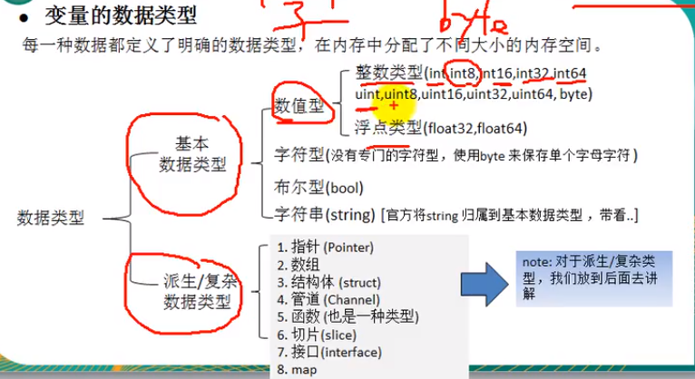

# Golang基础

> Golang的应用方向:
> 区块链技术:简称BT
> Blockchain technoglogy,也被称为分布式账本技术，是一-种互联网数据库技术，其特点是去中心化，公开透明，让每个人均可参与数据库记录。后端服务器应用:
> 支撑主站后台流量(排序，推荐，搜索等)，提供负载均衡， cache, 容错，按条件分流，统计运行指标美团
> 云计算/云服务的后台应用
> CDN的调度系统，分发系统，监控系统，短域名服务，CDN内部开放平台，运营报表系统以及其他一些小工具等。京东云
> Golang的计算能力很强

### 下载地址

- 官方：https://gomirrors.org/

- 镜像：https://studygolang.com/dl

### 目录结构

GOPROJECT

----src

--------go_code

------------project1

----------------main

--------------------hello.go

go文件的后缀是.go


### 第一个helloworld

1. 代码

```go
package main  // 包
import "fmt"  // 引入的包

func main() {
    fmt.Println("hello world")
}
```

2. 编译命令

```powershell
go build hello.go
```

### 注意事项

- go build -o 你好世界.exe hello.go    编译时指定名称
- go run 也可以，但真正工作中不用
- Go的入口是main
- 定义的变量或者import导入的包没有使用会编译不通过
- 严格区分大小写
- 可加分号也可以不加，编译器会自动加分号
- 大括号不能使用对称的风格

```go
func main() {
    // right
}
func main()
{
    // error
}
```

### 注释

跟C语言差不多

- 行注释  //
- 块注释  /**/

### 变量

#### 变量声明

```go
// 第一种  指定变量类型
var i int 
i = 10
var c1 byte = 'a'
var c2 byte = '0'
fmt.Printf("%d %c %c", i, c1, c2)  // 用Printf格式化输出

// 第二种  根据值自行判断变量类型
var v1 = 1
var f1 = 1.63
var s1 = "string"
var b1 = true
fmt.Println(v1, f1, s1, b1)

// 第三种  省略var 注意是不能在此之前已经声明了的变量名
name := "john"
```

#### 多变量声明

```go
// 1:
var i, j int
fmt.Println(i, j)

// 2:
var i, s, j = 100, "johm", 99
fmt.Println(i, s, j)

// 3:
num, name, mark := 1, "numberOne", 98
fmt.Println(num, name, mark)
```

#### 定义全局变量

```go
// 1:
var KM = 20
var LOG = 999

// 2:
var (
    num = 1
    name = "john"
    mark = 88
)
```


### 基础数据类型



#### 范围

| 类型    | 占用字节                    | 数值范围                                                     | 备注                                             |
| ------- | --------------------------- | ------------------------------------------------------------ | ------------------------------------------------ |
| int8    | 1                           | -128 ~ 127                                                   | 相当于C语言的byte                                |
| int16   | 2                           | -2<sup>15</sup> ~ 2<sup>15</sup>-1                           | 相当于C语言的short                               |
| int32   | 4                           | -2<sup>32</sup> ~ 2<sup>31</sup>-1                           | 相当于C语言的int                                 |
| int64   | 8                           | -2<sup>64</sup> ~ 2<sup>63</sup>-1                           | 相当于C语言的long long                           |
| int     | 32位系统4个<br>64位系统8个  | -2<sup>32</sup> ~ 2<sup>31</sup>-1<br>-2<sup>64</sup> ~ 2<sup>63</sup>-1 |                                                  |
| uint    | 32位系统4个<br/>64位系统8个 | 0 ~ 2<sup>32</sup>-1<br/>0 ~ 2<sup>64</sup>-1                |                                                  |
| rune    | 与int32等价                 | -2<sup>32</sup> ~ 2<sup>31</sup>-1                           | 存储Unicode                                      |
| byte    | 与uint8等价                 | 0-255                                                        | 存储字符时使用byte                               |
| float32 | 4                           | -3.403E38 ~ 3.403E38                                         | 浮点型都是有符号的，大概是(d.f)加起来不超过8位数 |
| float64 | 8                           | -1.798E308 ~ 1.798E308                                       |                                                  |
| bool    | 1                           | true/false                                                   | 不能用0或其他表示                                |

#### byte表示char

```go
import "unsafe"
var n = 100
fmt.Printf("n的类型是：%T,占用字节是：", n, unsafe.Sizeof(n))  // 查看变量的类型
```

#### 科学计数法

```go
num1 := 112.345e2  // 等于112.345 * 10的2次方
num1 := 112.345e+2  // 等于112.345 * 10的2次方
num1 := 112.345e-2  // 等于112.345 / 10的2次方
```

#### string字符串

```go
var name string = "小明"

str1 := "abc\n123"
var str2 string
str2 = "你好"
str3 := `
	我是反引号，我不会转义字符
	#include <iostream>
	int main() {
	    return 0;
	}
`
fmt.Println(str1)
fmt.Println(str2)
fmt.Println(str3)

gate := "克里斯塔娜"
fmt.Println(gate)
gate = "凤凰院凶真"
fmt.Println(gate)
// gate[0] = 'A'  不可以这样修改

// 字符串 ("")双引号 可以解析转义字符
// 字符串 (``)反引号 原生输出，不解析转义字符
```

- 字符串拼接

```go
str1 := "hello"
str2 := "world"
var text = str1 + str2
fmt.Println(text)
```

#### 类型的转换

golang和java/c不同，不能自动转换类型

```go
var num int = 10
fmt.Println(num)

var f float64 = float64(num)
fmt.Println(f)

f2 := 5.69
var n2 int = int(f2)
fmt.Println(n2)
```

