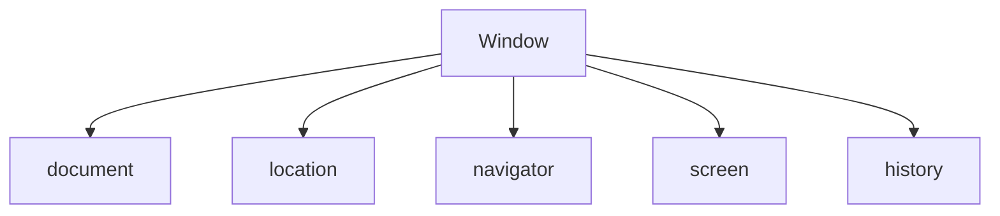

# JavaScript基础

### 语法

- 区分大小写
- 无特定的类型
- 结尾的分号(;) 可有可无，除了*( [ `* 这三个开头的语句
- 注释  

```javascript
// 单行注释
/*
  多行注释
*/
```


### 关键字

```javascript
break    else       new      var
case     finally    return   void
catch    for        switch   while
continue function   this     with
default  if         throw
delete   in         try
do       instanceof typeof
let      const
```

#### 定义变量

- var 定义的变量表示此域的变量，作用域：同一个函数

```javascript
var a = 3;
{
    var b = 5;
}
console.log(a, b);  // 可以

function area() {
    var ae = 96;
}
console.log(ae);  // 错误，ae未定义，ae是area对象的属性，当前是对象window
```

- let  定义的变量表示块级变量，作用域：同一块

```javascript
let a = 3;
{
    let b = 5;
}
console.log(a);  // 可以
console.log(b);  // 错误，let是块级作用域
```

- const  定义的是常量，作用域：同一块

#####  ${变量名} 

> 在es6的 ` 字符串中，可以使用 ${变量名} 引入变量

```javascript
var author = '红楼梦·第九十一回';
var longstr = 
`弱水三千，我只取一瓢饮。
                     by:${author}`;
console.log(longstr);
```


### 基本数据类型

#### String  字符串

```javascript
// 没有char类型，只有字符串类型,单引号双引号都一样
var str = "双引号";
var str2 = '单引号';
var longstr = `
<?php
    echo 'hello world';
?>
`;
```

#### Number  数值型

```javascript
// 不区分整型或浮点型
var num = 10;
var num2 = 070;  // 前面零(0)开头表示八进制
var num3 = 0x1f; // 前面零x(0x)开头表示十六进制
```

#### Boolean 布尔型

```javascript
var b = true/false;
```

- Null  空型
- Undefined 未定义

```javascript
var temp;  // 未定义类型就是Undefined
```

> undefined 是声明了变量但为初始化赋值，null 是表示不存在的对象，如果函数返回的是对象，那么找不到对象时就是null


#### 判断类型

- typeof

```javascript
var temp = "string"
alert(typeof(temp));
```

- 判断是否时数组类型 instanceof

```javascript
var a = new Array();
if (a instanceof Array) {
    alert("a时一个数组类型");
}
```


#### 类型转换

```javascript
Number()      转为数值型
String()      转为字符串型
Boolean()     转为布尔型，非0为true，0为false
parseFloat()  将变量转为浮点类型
parseInt()    将变量转为整数型
```


#### 逻辑运算符

&&  逻辑与

||   逻辑或

> 注意js不是"and"、"or" 


### 分支与循环

#### if 条件语句

```javascript
if (条件一) {
    // code
} else if (条件二) {
    // code
} else {
    // code
}
```


#### swithc 选择语句

```javascript
switch (n) {
    case 0:
        // code
        break;
    case 1:
        // code
        break;
    case "值1":
        // code
        break;
    default:
        // code
}

// n：是基本数据类型
```


#### for 循环语句

```javascript
for (语句一; 语句二; 语句三) {
    // code;
}
```

- 例子: 打印0-9

```javascript
for (var i = 0; i < 10; i++) {
    console.log(i);
}
```


#### for in 遍历对象

```javascript
for (key in object) {
    // code
}
```

- 例子: 打印对象数组的值

```javascript
var arr = {id: 1, name: "张三", age: 20};
for (key in arr) {
    console.log("key = " + key + "  value = " + arr[key]);
}
```


#### while 循环

```javascript
while (表达式) {
    // code
}
```


#### do while 循环

```javascript
do {
    // code
} while (表达式)
```


### 数组

#### 定义

1. 

```javascript
var myarr = new Array();
var myarr = new Array(3);
```

2. 

```javascript
var myarr = new Array("v1", "v2", "v3");
```

3. 

```javascript
var myarr = ["v1", "v2", "v3"];
```


#### 元素操作

##### 添加元素

1. 指定位置添加或修改

```javascript
myarr[0] = "v2";
```

2. 从尾部追加的方式添加

```javascript
myarr.push("v4");
```

3. 从头部插入元素

```javascript
myarr.unshift("v0");
```

4. splice 插入多个元素

```javascript
myarr.splice(1, 0, "v1.1", "v1.2");  // 索引1位置 删除0个元素 插入两个元素
```


##### 删除元素

1. pop  是从尾部开始删除

```javascript
var myarr = ["v1", "v2", "v3"];
myarr.pop();
```

2. shift  是从头部开始删除

```javascript
var myarr = ["v1", "v2", "v3"];
myarr.shift();
```

3. splice  指定位置删除

```javascript
var myarr = ["v1", "v2", "v3"];
myarr.splice(索引位置, 删除个数);
```

- 例：

```javascript
var myarr = ["v1", "v2", "v3"];
myarr.splice(1, 1);
// 得到["v1", "v3"]
```


##### 遍历元素

1. 

```javascript
var myarr = ["v1", "v2", "v3"];
var len = myarr.length;
for (i = 0; i < len; i++) {
    console.log(myarr[i]);
}
```

2. 

```javascript
var myarr = ["v1", "v2", "v3"];
for (key in myarr) {
    console.log(myarr[key]);
}
```


##### 查找元素

| 属性                | 描述                                       |
| ------------------- | ------------------------------------------ |
| findIndex(callback) | 根据值查找元素，返回元素下标，未找到返回-1 |

- 例： 查找值为3的下标是多少，

```javascript
var arr = [2,3,4,5];
var arrInd = arr.findIndex(function(ind) {
    return ind === 3;
});
```

- 例：查找对象name属性的值是tom的下标是多少

```javascript
var stu = [{"id":1,"name":"tim","sex":"男","age":22,"class":"19软件5班级"}, 
        {"id":2,"name":"tom","sex":"男","age":20,"class":"19软件1班级"},
        {"id":3,"name":"john","sex":"男","age":21,"class":"19软件3班级"}];
var stuInd = stu.findIndex(function(itemObj) {
    return itemObj.name === 'tom';
});
```


##### 合并数组

语法：

```javascript
arrayObject.concat(arrayX,arrayX,......,arrayX)
```

- 例子

```javascript
var myarr = ["v1", "v2", "v3"];
var vf = ["a1", "a2"];
var vb = ["l1", "l2"];
myarr.concat(vf, vb);  // 将vf vb的元素合并添加到myarr去
```


##### 数组转为字符串

语法：

```javascript
arrayObject.join(separator)
separator：可选，指定分隔符
返回值：字符串型
```

- 例子

```javascript
var myarr = ["v1", "v2", "v3"];
var str = myarr.join("|");
```

结果：

```javascript
v1|v2|v3
```


##### 元素排序

```javascript
var myarr = [5, 9, 8, 63, 2];
myarr.sort();     // 正序
myarr.reverse();  // 倒序
```


#### 二维数组

```javascript
var binarr = new Array();

for (i = 0; i < 5; i++) {
    binarr[i] = new Array();  // 生成5个数组元素
}

binarr[0][0] = 1;
binarr[0][1] = 2;
```


### 字符串

字符串对象常用属性和方法

| 属性   | 描述         |
| ------ | ------------ |
| length | 字符串的长度 |

| 方法          | 描述                             |
| ------------- | -------------------------------- |
| charAt()      | 返回指定位置的字符               |
| charCodeAt()  | 返回指定位置的字符的Unicode编码  |
| concat()      | 连接字符串                       |
| indexOf()     | 查看字符的索引下标               |
| lastIndexOf() | 查看字符的索引下标，从后面搜索   |
| replace()     | 替换匹配的子串                   |
| split()       | 字符串分割成数组                 |
| substr()      | 提取索引下标开始到指定数目的字符 |


#### 字符串连接

```javascript
var str1 = "Hello";
var str2 = "World";
var mystr = str1 + str2;       // 第1种
var mystr = str1.concat(str2); // 第2种
```


#### 字符串搜索

##### indexOf/lastIndexOf

```javascript
object.indexOf(搜索字符，起始位置)
返回值：整型，如果没找到返回 -1
```

- 例子

```javascript
var str = "html ul li abcde";
console.log(str.indexOf('u'));  // 返回5
console.log(str.lastIndexOf('u'))  // 返回5，不过，是从后面开始搜索的
```

##### search

```javascript
object.search(搜索词/正则表达式)
返回相匹配的子串的起始位置
```

```javascript
var str = "html ul li abcde";
console.log(str.search('li'));  // 返回8
console.log(str.search('$'));   // 返回16，$表示正则的最后一个
```

##### match

```javascript
object.math(搜素词/正则表达式)
返回值：null/数组
如果搜索到,数组[0]:查找的字符 数组[1]:匹配的位置 数组[2]: 原字符串
```

```javascript
var str = "html ul li abcde";
console.log(str.match('li'));  // 返回["li", index: 8, input: "html ul li abcde"]
```


#### 字符串截取/切割/替换

##### substring

```javascript
object.substring(截取开始位置， 截取结束位置)
返回字符串
```

- 例子:截取 11 到 16-1 的子串

```javascript
var str = "html ul li abcde";
console.log(str.substring(11, 16));  // 返回abcde
```


##### slice

slice 与 substring 类似，如果slice支持负数，负数表示从尾部开始

- 例子

```javascript
var str = "html ul li abcde";
console.log(str.slice(11, -1));  // 返回abcd
```


##### substr

```javascript
object.substr(截取开始位置, 截取长度)
```

- 例子:截取 11 开始的 5个字符

```javascript
var str = "html ul li abcde";
console.log(str.substr(11, 5));  // 返回abcde
```


##### split

````javascript
object.split(分隔符, 最大分割长度)
返回根据分隔符切割的数组
````

- 例子: 根据空格分隔

```javascript
var str = "html ul li abcde";
console.log(str.split(' '));  // 返回 ["html", "ul", "li", "abcde"]
```


##### replace

```javascript
object.replace(要被替换的字符串/正则, 替换的字符串)
返回替换后的字符串，不会改变原字符串
```

- 例子: 将abcd替换成1234

```javascript
var str = "html ul li abcde";
console.log(str.replace("abcd", "1234"));  // html ul li 1234e
```


### 对象

万物皆对象

#### 对象的声明

1. 创建对象后再实例化

```javascript
// 声明
var User = function(id, name) {
    this.id = id;
    this.name = name;
}

// 实例化
var u1 = new User(1, "tom");
var u2 = new User(2, "john");

console.log(u1.id + ":" + u1.name);
console.log(u2.id + ":" + u2.name);
```

2. 直接声明且实例化

```javascript
var u1 = {id:1, name: "tom"};
var u2 = {id:2, name: "john"};
var u3 = Object.create({id: 3, name: "micro"});

console.log(u1.id + ":" + u1.name);
console.log(u2.id + ":" + u2.name);
console.log(u3.id + ":" + u3.name);
```


#### 对象的属性

##### 添加属性

1. 

```javascript
var u1 = {};
u1.id = 1;
u1.name = "tom";
```

2. 

```javascript
var u2 = {};
u2["id"] = 2;
u2["name"] = "john";
```


##### 删除属性

```javascript
var u2 = {};
u2["id"] = 2;
u2["name"] = "john";

delete u2.name;  // delete关键字删除对象属性
```


##### 检测属性

 ```javascript
var u2 = {};
u2["id"] = 2;
u2["name"] = "john";

if ("name" in u2) {
    console.log("存在name属性");
} else {
    console.log("不存在name属性");
}
 ```


##### 添加方法

```javascript
var u2 = {};
u2["id"] = 2;
u2["name"] = "john";
u2.changeName = function(new_name) {  // 方法只能用 对象.方法名 创建
    this.name = new_name;
}
```


##### 遍历对象属性和方法

for in:

```javascript
var u2 = {};
u2["id"] = 2;
u2["name"] = "john";
u2.changeName = function(new_name) {
    this.name = new_name;
}

for (var key in u2) {
    console.log(u2[key]);
}
```


#### JSON

> JavaScript object notation


##### JSON.stringify()

> 将json对象转换为字符串

```javascript
var list = {'uname': 'root', 'pwd': 'toor', 'age': 22};
var tostring = JSON.stringify(list);
console.log(tostring);
```


##### JSON.parse()

> 将json字符串解析成json对象

```javascript
var str = '{"uname":"root","pwd":"toor","age":22}';
var tojson = JSON.parse(str);
console.log(tojson);
```


### 函数

#### 语法

```javascript
function 函数名(参数名1,[参数名2]) {
    // code
    return;
}
```

- 例子: 两数相加

```javascript
function add(a, b) {
    return a + b;
}

var res = add(5, 6);
console.log(res);
```

- 例子: 默认参数

```javascript
function person(id, name) {
    id = id || 1;
    name = name || "tom";
    console.log(id, name);
}

person();
person(1, "john");
```


#### 函数的调用

- 根据参数名调用函数

```javascript
function add() {
    // code
}
function times() {
    
}
function operation(fun_name) {
    return fun_name();
}

operation(times);  // 根据参数名调用函数
```


#### 闭包

闭包是指那些能够访问自由变量的函数

```javascript
var scope = "学校";
function bin() {
    console.log(scope);
}
bin();

// 上面的代码会打印出 “学校"  因为scope是全局变量,window的变量
// console.log(window.scope)  也是一样的
```

```javascript
var scope = "学校";
function bin() {
    var scope = "班级";
    return function() {
        console.log(scope);
    }
}

var a = bin();
a();

// 上面的代码会打印出 ”班级“  因为我bin里面还有一个函数，我返回的是里面的那个匿名函数，当我执行a(); 的时候其实是执行那个匿名函数，对匿名函数来说bin的scope才是全局变量
```

```javascript
var arr = [];
for (var i = 0; i < 3; i++) {
    arr[i] = function() {
        console.log(i);
    }
}
arr[0]();
arr[1]();
arr[2]();

// 上面的代码会打印出 3 3 3，因为es5没有块级作用域，所以它会去找 全局的 i，此时的i已经循环3次了，所以无论调不调用arr[0]()
// i 都等于 3
```

```javascript
var arr = [];
for (var i = 0; i < 3; i++) {
    arr[i] = (function(i){
        console.log(arguments);
        return function() {
            console.log(i);
        }
    })(i) 
}
arr[0]();
arr[1]();
arr[2]();

// 上面的代码会打印出 0 1 2，因为有return
```

#### 内置函数

##### 数学(Math)

| 方法      | 描述        |
| --------- | ----------- |
| ceil(n)   | 向上取整    |
| floor(n)  | 向下取整    |
| min(a, b) | 取最小      |
| max(a, b) | 取最大      |
| pow(a, n) | a 的 n 次方 |
| random()  | 随机数      |
| round(n)  | 四舍五入    |
| sqrt(n)   | 开平方      |

- 例子

```javascript
console.log(Math.ceil(4.1));                // 5
console.log(Math.floor(5.9));               // 5
console.log(parseInt(Math.random() * 10));  // 0 - 9的随机数
```


##### 日期(Date)

| 方法                 | 描述                                   |
| -------------------- | -------------------------------------- |
| getFullYear()        | 获取完整的年份(4位数)                  |
| getMonth()           | 获取当前月份(0~11)  0表示1月           |
| getDate()            | 获取当前日(1~31)                       |
| getDay()             | 获取当前星期(0~6)  0 表示星期天        |
| getTime()            | 时间戳                                 |
| getHours()           | 获取当前小时(0~23)                     |
| getMinutes()         | 获取当前分数(0~59)                     |
| getSecond()          | 获取当前秒(0~59)                       |
| toLocaleDateString() | 获取当前日期(2020/5/21)                |
| toLocaleTimeString() | 获取当前时间(下午10:21:17)             |
| toLocaleString()     | 获取日期和时间(2020/5/21 下午10:21:17) |

- 例子

```javascript
var mydate = new Date();                       // 基于当前时间
var defdate = new Date('2020-5-21 10:21:17');  // 自定义时间
console.log(mydate.toLocalString());
```


##### 定时器

setInterval(函数, 时间毫秒为单位);

setTimeout(函数, 时间毫秒为单位);

- 区别

setInterval 是循环执行的，停止使用：windows.clearInterval() 方法

setTimeout 只执行一遍

1.  匿名函数

```javascript
setInterval(function() {
    console.log(1);
}, 1000);
```

2.  自定义函数

```javascript
function print() {
    console.log(2);
}
setInterval(print, 2000);  // print不用带括号：setInterval(print(), 2000);
```

3.  带参数

```javascript
function echo(n) {
    console.log(n);
}

setInterval("echo(2)", 1000);  // 如果带参数的话要字符串型
setTimeout("echo(3)", 1000);
```

4. 停止定时器

```javascript
function print() {
    console.log(2);
}
var myVar = setInterval(print, 2000);  // 要给定时器一个变量名
clearInterval(myVar);
```


### 本章小结

1. 声明a，b，c，d四个变量，类型分布为整型、浮点型、布尔型、字符串型，分别判断并打印出4个变量的数据类型

```javascript
var a = parseInt(3);
var b = parseFloat(3.3);
var c = true;
var d = "hello";

console.log(typeof(a), typeof(b), typeof(c), typeof(d));
```

2. 定义两个变量，var a = 15 和 var b = 9，将两个不同类型的变量按整数相乘，打印结果

```javascript
var a = 15;
var b = 9;

console.log(a * b);
```

3. 

```javascript
var a = 11;
var b = 7;

console.log(a / b, a % b);
```

4. 

```javascript
for (i = 1; i <= 20; i += 2) {
    console.log(i);
}
```

5.

```javascript
var variable = 9;

switch(typeof(variable)) {
    case "number":
        console.log(variable * 2); break;
    case "string":
        console.log(variable); break;
    case "null":
        console.log("空");
}
```

6. 

```javascript
function check(n) {
    for (var i = 2; i <= parseInt(Math.sqrt(n)); i++) {
        if (n % i == 0) return false;
    }
    return true;
}
for (var i = 2; i <= 100; i++) {
    if (check(i)) {
        console.log(i);
    }
}
```

7. 

```javascript
var src_arr = [5, 6, 5, 9, 2, 6];
var new_arr = new Array();

function check(ind) {
    for (var i = ind + 1; i < src_arr.length; i++) {
        if (src_arr[ind] == src_arr[i]) return true;
    }
    return false;
}

for (var i = 0; i < src_arr.length; i++) {
    if (!check(i)) {
        new_arr.push(src_arr[i]);
    }
}
```

8. 

```javascript
var arr1 = [1, 2, 5, 9, 10];
var arr2 = [3, 4, 6, 9, 10];

for (var i = 0; i < arr1.length; i++) {
    let min = arr1[i] < arr2[i] ? arr1[i] : arr2[i];
    console.log(min);
}
```

9. 

```javascript
var str = "addddfffssdfsadfsdfsafjsd";

var cnt = -1;
for (var i = 0; i < str.length; i++) {
    var cur = 1;
    for (var j = i + 1; j < str.length; j++) {
        if (str[i] == str[j]) cur++;
    }
    cnt = cnt < cur ? cur : cnt;
}
console.log(cnt);
```

10. 

```javascript
var str1 = "They are students";
var str2 = "aeiou";
var new_str = "";

for (var i = 0; i < str1.length; i++) {
    isYuan = false;
    for (let j = 0; j < str2.length; j++) {
        if (str1[i] == str2[j]) {
            isYuan = true;
        }
    }
    if (!isYuan) {
        new_str += str1[i];
    }
}
console.log(new_str);
```

11. 

```javascript
var reg = /[0-9]{1,3}.[0-9]{1,3}.[0-9]{1,3}.[0-9]{1,3}/;
var str = "255.221.221.12";
console.log(reg.test(str));
```

12. 

```javascript

```

13. 

```javascript
var Goods = function(id, number) {
    this.id = id;
    this.number = number;
}

var goods_list = new Array();
function add_goods(id) {
    let exist = false;
    let ind;
    for (let i = 0; i < goods_list.length; i++) {
        if (id == goods_list[i].id) {
             exist = true;
            ind = i;
        }
    }
    
    if (exist) {
        goods_list[ind].number += 1;
    } else {
        goods_list.push(new Goods(id, 1));
    }
}

add_goods(1);
add_goods(2);
add_goods(1);

console.log(goods_list);
/*
0: Goods {id: 1, number: 2}
1: Goods {id: 2, number: 1}
*/
```

14. 

```javascript
function get_sum(a, b) {
    return a + b;
}

console.log(get_sum(2, 3));
```

15. 

```javascript
function getMax(arr) {
    let res = arr[0];
    for (let i = 0; i < arr.length; i++) {
        res = arr[i] > res ? arr[i] : res;
    }
    return res;
}

var arr = [5, 7, 2, 9, 22, 7];
console.log(getMax(arr));
```

16. 

```javascript
var obj = function(id) {
    this.id = id;
}

function flow(obj) {
    obj.id += 1;
}

var o1 = new obj(2);
var o2 = new obj(3);

flow(o1);
console.log(o1.id);
```

17. 

```javascript
function get_area(r) {
    return 3.14 * r * r;
}

console.log(get_area(5));
```

18. 

```javascript
function get_now() {
    let loc_time = new Date();
    let res = "";
    res = res.concat(loc_time.getFullYear(), "年", loc_time.getMonth() + 1, "月", loc_time.getDate(), "日", loc_time.getHours(), "时", loc_time.getMinutes(), "分");
    return res;
}

console.log(get_now());
```

19. 

```javascript
function get_day(def_date) {
    let t = new Date(def_date);
    return t.getDay();
}

console.log(get_day('2019-2-19'));
```


# js对象模型



### BOM对象

bom：browser object mode


#### window

```javascript
window.innerHeight;  // 浏览器窗口内部宽度
window.innerWidth;   // 高度
// 缩小浏览器     会变小
// 缩小js控制台   会变大
```


#### location

```javascript
location.href;  // 当前网页的url
location.port;  // 当前网页的端口
location.reload();  // 刷新当前页面
```


#### navigator

```javascript
navigator.appName;  // 浏览器名称
navigator.appVersion;  // 浏览器版本
navigator.cookieEnable;  // 是否启用cookie
navigator.platform;     // 浏览器操作系统
```


#### Screen

```javascript
screen.Height;  // 显示器高度
screen.Width;   // 显示器宽度
screen.availHeight;  // 屏幕高度，不含任务栏
screen.availWidth;   // 屏幕宽度，不含任务栏
```


#### history

```javascript
history.length;   // 历史列表数量
history.back();   // 返回上一个
history.forward();// 前进到下一个
history.go();     // 某个具体的页面
```


### DOM对象

dom：document object mode

| 属性和方法       | 描述                 |
| ---------------- | -------------------- |
| document.bgColor | 背景颜色             |
| document.fgColor | 前景颜色（文本颜色） |
| document.URL     | url属性              |

#### 获取节点

##### 根据ID

```javascript
document.getElementById(idName);
```

##### 根据class

```javascript
document.getElementsByClassName(className);
```

##### 根据name

```javascript
document.getElementsByName(name);
```

##### 根据标签名

```javascript
document.getElementsByTagName(tagName);
```

> 除了id，其他都是elements
>
> 根据标签名获取的时伪数组，不具备数组的方法
>
> 除了id，不管返回的是1个元素还是多个元素都是返回数组


#### 设置节点元素的属性值

```javascript
getAttribute(属性名);  // 获取属性值
setAttribate(属性名, 属性值);  // 设置属性
```

- 例子: 点击按钮改变div的颜色

```javascript
<!DOCTYPE html>
<html lang="zh-CN">
  <head>
    <meta charset="UTF-8">
    <meta name="viewport" content="width=device-width, initial-scale=1.0">
    <title>Document</title>
    <style>
        #testid {
            width: 200px;
            height: 200px;
            background-color: #66ccff;
        }
    </style>
    <script>
        function changeColor() {
            var t = document.getElementById('testid');  // 获取节点
            t.setAttribute('style', 'background-color:red');  // 设置属性
        }
    </script>
  </head>
  <body>
    <div id="testid"></div>
    <button type="submit" onclick="changeColor()">改变颜色</button>
  </body>
</html>
```


#### 节点

- 创建节点

```javascript
document.createElement("h3");
```

```javascript
document.createTextNode("创建文本节点");
```

```javascript
document.createAttribute("class");
```

- 追加节点

```javascript
element.appendChild(节点);
```

```javascript
element.insertBefore(nodeA, nodeB);  // 在节点b插入节点a
```

- 删除节点

```javascript
element.removeChild(节点);
```

- 综合例子

```javascript
<!DOCTYPE html>
<html lang="zh-CN">
  <head>
    <meta charset="UTF-8">
    <meta name="viewport" content="width=device-width, initial-scale=1.0">
    <title>Document</title>
    <style>
        div {
            width: 200px;
            height: 200px;
            margin: 20px;
        }
        #testid {
            background-color: #66ccff;
        }
    </style>
    <script>
        function creat() {
            var bo = document.getElementsByTagName('body')[0];
            var node = document.createElement('div');  // 创建节点
            node.setAttribute("style", "background-color: #333");  // 设置颜色样式
            bo.appendChild(node);  // 在body里追加节点
        }
        function del() {
            var bo = document.getElementsByTagName('body')[0];
            var node = document.getElementsByTagName('div');
            bo.removeChild(node[node.length - 1]);  // 删除最后一个
        }
    </script>
  </head>
  <body>
    <div id="testid"></div>
    <button type="submit" onclick="creat()">创建</button>
    <button type="submit" onclick="del()">删除</button>
  </body>
</html>
```


#### 属性操作

##### 获取元素节点

```javascript
element.parentNode;  // 返回当前元素的父节点
element.children;    // 返回子元素节点，只返回html节点
element.childNodes;  // 返回子元素节点，包括文本、HTML、属性节点
element.firstChild;  // 返回第一个子元素
element.lastChild;   // 返回最后一个子元素
```


##### 获取元素内容

```javascript
element.nextElementSibling;  // 返回同级元素
element.innerHtml;           // 返回元素html代码
element.innnerText;          // 返回元素文本类容
```


##### css样式

```javascript
node.nodeType;      // 返回当前节点类型
element.style.color = "#6cf";  // 设置style样式
```


### 本章小结

1. 

```javascript
<!DOCTYPE html>
<html lang="zh-CN">
  <head>
    <meta charset="UTF-8">
    <meta name="viewport" content="width=device-width, initial-scale=1.0">
    <title>Document</title>
    <style>
        div {
            width: 200px;
            height: 200px;
            background-color: #6cf;
            position: absolute;
        }
    </style>
    <script>
        window.onload = function() {
            var x = screen.availWidth / 2 - 100;  // 获取宽高后-100，因为这个div是200
            var y = screen.availHeight / 2 - 100;
            var div = document.getElementsByTagName('div')[0];
            div.style.left = String(x) + "px";
            div.style.top = String(y) + "px";
        }
    </script>
  </head>
  <body>
    <div></div>
  </body>
</html>
```

2. 

```javascript
console.log(location.href);
```

4. 

```html
<!DOCTYPE html>
<html lang="zh-CN">
  <head>
    <meta charset="UTF-8">
    <meta name="viewport" content="width=device-width, initial-scale=1.0">
    <title>Document</title>
    <style>
        td { border: 1px solid #6cf;}
    </style>
    <script>
        function add() {
            var tbody = document.getElementsByTagName('tbody')[0];
            var tr_node = document.createElement("tr");
            tr_node.innerHTML = '<td>int</td><td>整型</td>';
            tbody.append(tr_node);
        }
    </script>
  </head>
  <body>
    <table>
        <thead>
            <tr><td>值</td><td>描述</td></tr>
        </thead>
        <tbody>
            <tr><td>int</td><td>整型</td></tr>
        </tbody>
    </table>
    <input type="button" value="添加" onclick="add()">
  </body>
</html>
```

5. 

```html
<!DOCTYPE html>
<html lang="zh-CN">
  <head>
    <meta charset="UTF-8">
    <meta name="viewport" content="width=device-width, initial-scale=1.0">
    <title>Document</title>
    <style>
        td { border: 1px solid #6cf;}
    </style>
    <script>
        function add() {
            var tbody = document.getElementsByTagName('tbody')[0];
            var tr_node = document.createElement("tr");
            tr_node.innerHTML = '<td>int</td><td><a href="javascript:void(0);" onclick="del(this)">删除</a></td>';
            tr_node.append('');
            tbody.append(tr_node);
        }
        function del(thisa) {
            var tr = thisa.parentNode.parentNode;
            var table = tr.parentNode;
            table.removeChild(tr);
        }
    </script>
  </head>
  <body>
    <table>
        <thead>
            <tr><td>值</td><td>描述</td></tr>
        </thead>
        <tbody>
            <tr><td>int</td><td>整型</td></tr>
        </tbody>
    </table>
    <input type="button" value="添加" onclick="add()">
    
  </body>
</html>
```


# js事件处理

| 方法        | 描述                       |
| ----------- | -------------------------- |
| onabort     | 图像加载被中断             |
| onblur      | 元素失去焦点               |
| onchange    | 用户改变域的内容           |
| onclick     | 单击                       |
| ondblclick  | 双击                       |
| onerror     | 加载文档或者图像时发送错误 |
| onfocus     | 元素获得焦点               |
| onkeydown   | 某个键盘的键被按下         |
| onkeypress  | 某个键盘的键被按下或按住   |
| onkeyup     | 某个键盘的键被松开         |
| onload      | 页面完成加载               |
| onmousedown | 某个鼠标按键被按下         |
| onmousemove | 鼠标被移动                 |
| onmouseout  | 鼠标移开                   |
| onresize    | 窗口或者框架被调整         |
| onselect    | 文本被选定                 |
| onsubmit    | 提交按钮单击               |
| onunload    | 用户退出页面               |


### onload

- 整体页面

```javascript
window.onload = function() {
    alert("页面加载成功");
}
```

- 某个元素

```html

```


### scroll

```html
<!DOCTYPE html>
<html lang="zh-CN">
  <head>
    <meta charset="UTF-8">
    <meta name="viewport" content="width=device-width, initial-scale=1.0">
    <title>Document</title>
    <style>
        body {
            height: 2000px;
        }
        #show_scroll {
            position: fixed;
            top: 0px;;
        }
    </style>
    <script>
        function change() {
          var show_scroll = document.getElementById('show_scroll');
          show_scroll.innerText = "滚动条当前：" + document.documentElement.scrollTop;  
        }
    </script>
  </head>
  <body onscroll="change()">
    <p id="show_scroll">none</p>
  </body>
</html>
```


### 焦点

- 获得焦点 onfocus()
- 失去焦点 onblur()

```html
<!DOCTYPE html>
<html lang="zh-CN">
  <head>
    <meta charset="UTF-8">
    <meta name="viewport" content="width=device-width, initial-scale=1.0">
    <title>Document</title>
    <script>
        function get_focus(node_name) {
            var node = document.getElementById(node_name);
            node.setAttribute('placeholder', node_name + "获得焦点");
        }
        function loss_focus(node_name) {
            var node = document.getElementById(node_name);
            node.setAttribute('placeholder', node_name + "失去焦点");
        }
    </script>
  </head>
  <body>
    <input type="text" onfocus="get_focus('uname')" onblur="loss_focus('uname')" id="uname"><br>
    <input type="password" onfocus="get_focus('pwd')" onblur="loss_focus('pwd')" id="pwd">
  </body>
</html>
```


### 鼠标

- 鼠标点击事件

```html
<!DOCTYPE html>
<html lang="zh">
<head>
    <meta charset="UTF-8">
    <title>js中的点击事件（click）的实现方式</title>
</head>
<body>
    <!-- 第三种方式-->
    <button id="btn" onclick="threeFn()">点我</button>

    <script type="text/javascript">
        var btn = document.getElementById("btn");

        // 第一种 通过点击事件
        btn.onclick = function(){
            alert("这是第一种点击方式");
        }

        // 第二种 监听点击事件
        btn.addEventListener('click', function(){
            alert("这是第二中点击方式");
        })

        // 第三种 通过方法响应点击事件
        function threeFn(){
            alert("这是第三种点击方式");
        }
    </script>
</body>
</html>
```


- 获取鼠标点击时的x，y

```html
<!DOCTYPE html>
<html lang="zh-CN">
  <head>
    <meta charset="UTF-8">
    <meta name="viewport" content="width=device-width, initial-scale=1.0">
    <title>Document</title>
    <style>
        html, body {  /*这个css必须要，不然没高度，onclick无效*/
            width: 100%;
            height: 100%;
        }
    </style>
    <script>
        function myclick(e) {
            var x = e.clientX;
            var y = e.clientY;
            alert('x:' + x + ", y:" + y);
        }
    </script>
  </head>
  <body onclick="myclick(event)">
    
  </body>
</html>
```

- 鼠标经过和离开

```html
<!DOCTYPE html>
<html lang="zh-CN">
  <head>
    <meta charset="UTF-8">
    <meta name="viewport" content="width=device-width, initial-scale=1.0">
    <title>Document</title>
    <style>
        #box {
            width: 200px;
            height: 200px;
            background-color: aqua;
        }
    </style>
    <script>
        function leave(this_div) {  /*离开时高度恢复*/
            this_div.style.height = "200px";
        }
        function showDiv(this_div) {  /*经过时高度变高*/
            this_div.style.height = "250px";
        }
    </script>
  </head>
  <body>
    <div id="box" onmouseout="leave(this)" onmouseover="showDiv(this)"></div>
  </body>
</html>
```


### 键盘按键

```html
<!DOCTYPE html>
<html lang="zh-CN">
  <head>
    <meta charset="UTF-8">
    <meta name="viewport" content="width=device-width, initial-scale=1.0">
    <title>Document</title>
    <style>
        html, body {
            width: 100%;
            height: 100%;
        }
    </style>
    <script>
        function keydown(e) {
            var keycode = e.keyCode;
            var status = document.getElementById('status');
            status.innerText = "当前按键按下时的代码：" + keycode;
        }
        function keyup(e) {
            var keycode = e.keyCode;
            var status = document.getElementById('status');
            status.innerText = "当前按键释放时的代码：" + keycode;
        }
    </script>
  </head>
  <body onkeydown="keydown(event)" onkeyup="keyup(event)">
    <div id="status">none</div>
  </body>
</html>
```


### 事件冒泡与捕获

```html
element.addEventListener(event, function, useCapture)
useCapture: true(捕获,从外面的符类到目标)/false(默认，冒泡：从目标然扩大)
```


```html
<!DOCTYPE html>
<html lang="zh-CN">
  <head>
    <meta charset="UTF-8">
    <meta name="viewport" content="width=device-width, initial-scale=1.0">
    <title>Document</title>
    <style>
        #est {
            height: 500px;
            width: 500px;
            background-color: crimson;
        }
        #er {
            height: 300px;
            width: 300px;
            background-color: rgb(52, 240, 83);
        }
        #base {
            height: 150px;
            width: 150px;
            background-color: rgb(82, 165, 212);
        }
    </style>
    <script>
        window.onload = function() {
            var est = document.getElementById('est');
            var er = document.getElementById('er');
            var base = document.getElementById('base');
            // 捕获：
            // est.addEventListener('click', function(event) {
            //     alert('est');
            // }, true);
            // er.addEventListener('click', function(event) {
            //     alert('er');
            // }, true);
            // base.addEventListener('click', function(event) {
            //     alert('base');
            // }, true);
			// 冒泡：
            est.addEventListener('dblclick', function(event) {
                alert('est');
            }, false);
            er.addEventListener('dblclick', function(event) {
                alert('er');
            }, false);
            base.addEventListener('dblclick', function(event) {
                alert('base');
            }, false);
        }
    </script>
  </head>
  <body>
    <div id="est" >最大
        <div id="er" >较大
            <div id="base" >原型</div>
        </div>
    </div>
  </body>
</html>
```


### 本章小结

