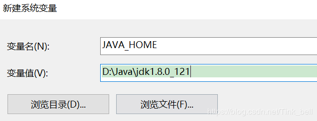
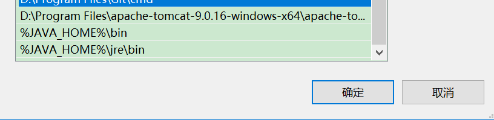
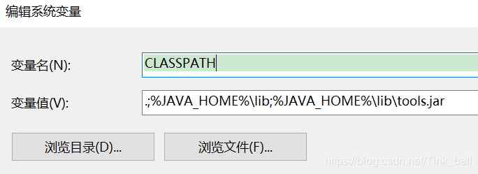
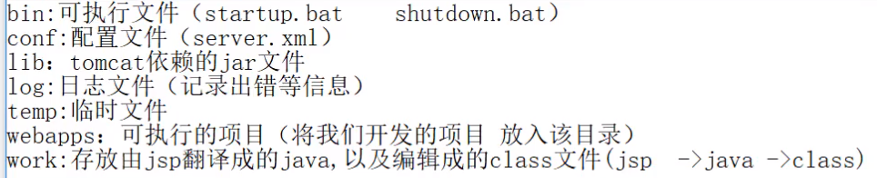
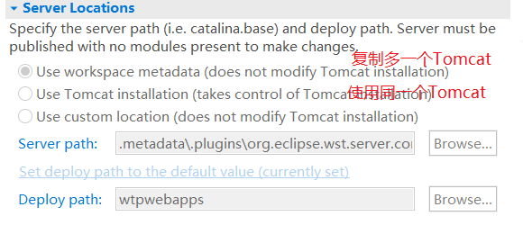
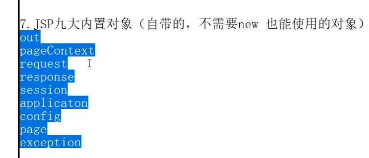
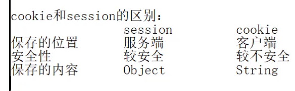

<center><h1>Java</h1></center>
### java操作MySQL

#### 连接数据库

```java
String url = "jdbc:mysql://localhost:3306/runoob?useSSL=false&serverTimezone=UTC&characterEncoding=utf8";
String user = "root";
String password = "root"; 
Class.forName("com.mysql.jdbc.Driver");
//连接数据库
System.out.println("正在连接数据库...");
long start = System.currentTimeMillis();
Connection conn = DriverManager.getConnection(url, user, password);
long end = System.currentTimeMillis();
System.out.println("连接" + conn + "数据库对象耗时：" + (end - start) + "毫秒");
```


#### 插入

```java
//动态插入
System.out.println("\n\n动态插入：");
ps = conn.prepareStatement("insert into websites(name, url, alexa, country) values(?, ?, ?, ?)");
ps.setString(1, "腾讯");
ps.setString(2, "tencent.com");
ps.setInt(3, 3);
ps.setString(4, "CN");
System.out.println("添加结果：" + ps.executeUpdate());
```

#### 删除

```java
//动态删除
System.out.println("\n\n动态删除：");
ps = conn.prepareStatement("delete from websites where id = ?");
ps.setInt(1, 11);
System.out.println("删除结果：" + ps.executeUpdate());
```

#### 更改

```java
//动态更新
System.out.println("\n\n动态更新：");
ps = conn.prepareStatement("UPDATE websites SET name = ? WHERE id = 10 or id = 7");
ps.setString(1, "百度");
System.out.println("更新结果：" + ps.executeUpdate());  //返回整型，修改数据的整型
```

#### 查询

```java
//动态查询
/*
 * 动态查询使用 executeQuery()方法执行查询语句
 * executeUpdate()返回执行insert、update、delete这些无返回内容的语句
*/
PreparedStatement ps = conn.prepareStatement("SELECT * FROM websites where name like ?");
ps.setString(1, "%oo%");
res = ps.executeQuery();
System.out.println("\n\n动态查询：");
while (res.next()) {
    int id = res.getInt("id");
    String name = res.getString("name");
    String urlItem = res.getString("url");
    int alexa = res.getInt("alexa");
    String city = res.getString("country");
    System.out.println("=================================================================");
    System.out.println(id + "\t" + name + "\t" + urlItem + "\t" + alexa + "\t" + city);
}
```


### javaweb

#### 配置java环境变量

（1）系统变量→新建 JAVA_HOME 变量 。



（2）系统变量→寻找 Path 变量→编辑

在变量值最后输入 %JAVA_HOME%\bin;%JAVA_HOME%\jre\bin;



（3）系统变量→新建 CLASSPATH 变量

变量值填写 .;%JAVA_HOME%\lib;%JAVA_HOME%\lib\tools.jar（注意最前面有一点）



（4）打开startup

#### Tomcat

##### 目录解析



##### 修改端口

conf -> server.xml

```
<Connector port="8080" >
```

##### 头文件

需要创建一个 WEB-INF 文件夹

> WEB-INF
>
> ----| web.xml
>
> ----| classes  //编译的java文件
>
> ----| lib  //扩展文件


##### 欢迎文件

WEB-INF -> web.xml

```
<welcome-file-list>
	<welcome-file>index.html</welcome-file>
	<welcome-file>index.jsp</welcome-file>
</welome-file-list>
```

##### 配置多目录

1. 

conf -> server.xml

```xml
<Host name="localhost" appBase="webapps">
	...
    <! -- 添加站点 -->
    <! -- 
    docBase:实际路径
    path:虚拟路径(绝对路径、相对路径,相对于与webapps)
    
    -->
    <Context docBase="E:\jsp\code\OneJsp" path="/OneJsp"/>
</Host>
```

2. 

在 conf -> Catalina -> localhost 里面创建 项目名.xml

```xml
<Context docBase="E:\jsp\code\OneJsp" path="/OneJsp"/>
```

然后访问127.0.0.1:8080/OneJsp会运行E:\jsp\code\OneJsp里的项目

##### 配置多主机

```xml
<Engine name="Catalina" defaultHost="www.test.com">  //设置默认主机
	<Host name="www.test.com" appBase="E:\jsp\code\OneJsp">
		<Context docBase="E:\jsp\code\OneJsp" path="/OneJsp"/>
	</Host>
```

#### eclipse配置Tomcat

1. 下载 Help -> install now software -> xml、web

2. Windows -> preferences -> Server -> Runtime Envionnments -> add ->选择tomcat的版本

   填写tomcat的安装目录和jre版本

3. Windows -> show view -> other -> Server -> Servers 下面会有servers窗口，双击配置

4. 创建部署项目：File -> other -> web -> Dynamic web Project -> 勾选 Generate web.xml

5. 右键 Add and REmove -> 添加部署的项目到 servers



#### jsp语法

1. ```java
   <%
       局部变量、java语句  
   %>
   ```

2. ```java
   <%!
       全局变量、定义方法
   %>
   ```

3. ```java
   <%= 输出表达式 %>
   ```

4. > jsp注释：<%--  我是注释  --%>

##### page

page指定的属性:

language: jsp页面使用的脚本语言

import : 导入类

pageencoding: jsp文件自身编码 jsp -> java

contentType: 浏览器解析jsp的编码

```
<%@ page language="java" contentType="text/html; charset=utf-8"
    pageEncoding="utf-8" import="java.util.Date"%>
```



##### 编码

- GET

  ```java
  String name = request.getParameter("user");  //接收值
  name = new String(name.getBytes("iso-8859-1"), "utf-8");  //new String(久编码, 新编码)将接收的值编码成utf-8
  ```

- POST

  ```java
  request.setCharacterEncoding("utf-8");
  ```

> tomcat 7默认iso-8859-1， tomcat8 默认utf-8

##### request对象

注册练习：

register.jsp

```jsp
	<form action="show.jsp" method="post">
		用户名：<input type="text" name="user"><br>
		密    码：<input type="password" name="pwd"><br>
		年    龄：<input type="text" name="age"><br>
		爱好：<br>
		<input type="checkbox" name="hobbies" value="足球">足球
		<input type="checkbox" name="hobbies" value="蓝球">蓝球
		<input type="checkbox" name="hobbies" value="兵乓球">兵乓球<br>
		<input type="submit" value="注册">
	</form>
```

show.jsp

```jsp
<%
		request.setCharacterEncoding("utf-8");
		String name = request.getParameter("user");
		String pwd = request.getParameter("pwd");
		int age = Integer.parseInt(request.getParameter("age"));
		String[] hobbies = request.getParameterValues("hobbies");  //去数组
	%>
	用户名：<%=name %>
	密 码：<%=pwd %>
	年 龄：<%=age %>
	爱 好：<br>
	<%
		if (hobbies != null) {
			for (String i : hobbies) {
				out.print(i + " ");
			}
		}
		
	%>
```

##### response对象

1. void addCookie(Cookie cookie);  服务端先客户端增加cookie

2. void sendRedirect(String txt) throws IOException;  重定向，页面跳转

3. void setContextType(String type);  设置服务的相应编码

```jsp
if (user.equals("admin") && pwd.equals("admin888")) {
		response.sendRedirect("success.jsp");  //页面跳转数据会丢失
		request.getRequestDispatcher("success.jsp").forward(request, response);  //请求转发,会把数据值一同转发
	} else {
		out.print("登录失败，请检查账号密码");
	}
```

success.jsp

```jsp
欢迎！
<%
String user = request.getParameter("user");
out.print(user);
%>
```

##### session对象

```java
Cookie ck1 = new Cookie("name", "zs");
Cookie ck2 = new Cookie("age", "10");

response.addCookie(ck1);
response.addCookie(ck2);

response.sendRedirect("result.jsp")
```

result.jsp

```java
Cookie[] cks = request.getCookies();
for (Cookie cki : cks) {
    out.print(cki.getName() + "===" + cki.getValue() + "<br>");
}
/*
getName():  取cookie名
getValue():  取cookie值
*/
```

> 除了自己设置的cookie还有一个自带的 “JSESSIONID” 

```jsp
添加session属性
session.setAttribute("name", name);
session.setAttribute("pwd", pwd);

setMaxInactiveInterval(10);  //设置session非活动失效时间，10秒
session.invalidate();  //注销session
```

a.jsp

```java
<%=session.getAttribute("name") %>
```




##### application对象

```jsp
<%="当前项目的虚拟路径：" + application.getContextPath() %>
<%="当前项目的绝对路径：" + application.getRealPath("/") %>
```

范围对象：(小 -> 大)

pageContexxt页面容器对象：本页面有效

request请求对象：本页面与请求页面有效

session会话对象：同一个有效

application全局对象：整个项目有效

