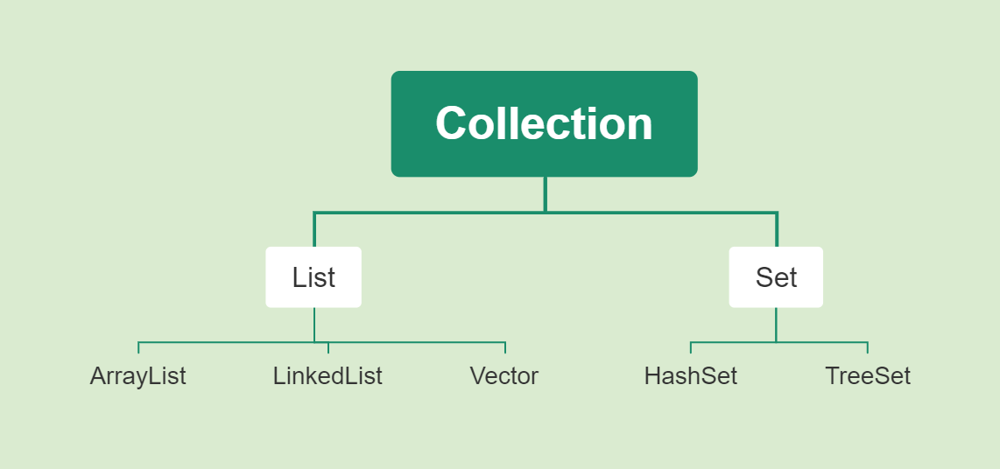
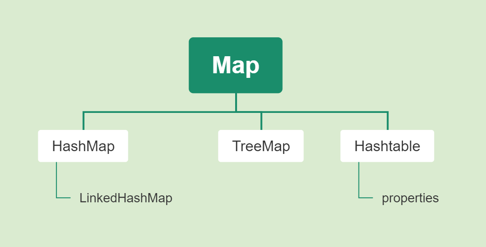

# Java基础

## 异常

### 自定义异常

```java
public class 自定义异常1 {
    public static void main(String[] args) {
        try {
            test(1);
        } catch (MyException e) {
            e.printStackTrace();
        }
    }

    // 手动抛出自定义异常MyException
    private static void test(int i) throws MyException {
        if (i == 1) {
            throw new MyException("i==1");
        }
    }
}
```

MyExceptin.java

自定义异常需要继承Exception类

```java
public class MyException extends Exception {
    public MyException() {
        System.out.println("调用无参构造方法");
    }

    public MyException(String message) {
        System.out.println("调用有参构造方法");
        System.out.println(message);
    }
}
```


## lambda

> Lambda 表达式，也可称为闭包，它是推动 Java 8 发布的最重要新特性。
>
> Lambda 允许把函数作为一个方法的参数（函数作为参数传递进方法中）。
>
> 使用 Lambda 表达式可以使代码变的更加简洁紧凑。

### 语法

```
([数据类型1 参数名1, 数据类型2 参数名2]) ->  {表达式主体}
```


### 案例

- 例子：简单lambda表达式与匿名类

```java
interface Animal {
    void show();
}
public class lambda表达式1 {
    public static void main(String[] args) {
//        匿名类
        myShow(new Animal() {
            @Override
            public void show() {
                System.out.println("你好，我是匿名类");
            }
        });
//        lambda表达式
        myShow(() -> {
            System.out.println("你好，我是lambda表达式");
        });
    }

    public static void myShow(Animal animal) {
        animal.show();
    }
}
```

- 带参数的lambda表达式

如果只有一行那么可以不用大括号和return关键字

```java
interface MyFunction {
    int sum(int x, int y);
}
public class lambda表达式2 {
    public static void main(String[] args) {
        test(2, 5, (int x, int y) -> x + y);
        test(2, 5, (int x, int y) -> {
            return x + y;
        });
    }

    public static void test(int x, int y, MyFunction myFunction) {
        System.out.println(myFunction.sum(x, y));
    }
}
```


### 方法引用和构造器引用

- 引用类静态方法  `类::方法`

```java
import java.lang.Integer;

interface MyFunction {
    int sum(int x, int y);
}
public class lambda表达式2 {
    public static void main(String[] args) {
//        lambda原方法的方式
        test(2, 5, (int x, int y) -> {
            return Integer.sum(x, y);
        });
//        使用方法引用的方式
        test(2, 5, Integer::sum);
    }

    public static void test(int x, int y, MyFunction myFunction) {
        System.out.println(myFunction.sum(x, y));
    }
}
```

- 引用对象名引用方法 `对象名::方法`

```java
interface MyFunction3 {
    String up(String str);
}
class StringUtil {
    public String toUpperCase(String str) {
        return str.toUpperCase();
    }
}
public class lambda表达式3 {
    public static void main(String[] args) {
        StringUtil util = new StringUtil();
//        lambda原方法的方式
        test("Hello", (String str) -> {
            return util.toUpperCase(str);
        });
//        使用方法引用的方式
        test("hello", util::toUpperCase);
    }

    public static void test(String str, MyFunction3 myFunction3) {
        System.out.println(myFunction3.up(str));
    }
}
```

- 构造器引用方法  `类::new`

```java
interface MyFunction4 {
    public Person buildPerson(String name);
}
class Person {
    private String name;
    public Person(String name) {
        this.name = name;
    }

    public String getName() {
        return name;
    }
}
public class lambda表达式4 {
    public static void main(String[] args) {
//        lambda原方法的方式
        test("李明", (String name) -> {
            return new Person(name);
        });
//        使用方法引用的方式
        test("李明", Person::new);
    }

    public static void test(String str, MyFunction4 myFunction4) {
        Person person = myFunction4.buildPerson(str);
        System.out.println(person.getName());
    }
}
```


## 常用类

### String

- 创建String字符串

```java
public class Example01 {
	public static void main(String[] args) {
//		第一种创建字符串
		String str1 = new String();
		System.out.println(str1 + "aa");
		
//		第二种创建字符串
		String str2 = new String("abcd");
		System.out.println(str2);
		
//		第三种创建字符串
		char[] charArray = new char[] {'A', 'B', 'C', 'D'};
		String str3 = new String(charArray);
		System.out.println(str3);
	}
}
```

- 常用方法

| 函数                                                  | 说明                       |
| ----------------------------------------------------- | -------------------------- |
| indexOf(char ch)                                      | 查找ch第一次出现的下标     |
| lastIndexOf(char ch)                                  | 查找ch最后一次出现的下标   |
| char charAt(int pos)                                  | 查找下标pos的字符          |
| boolean contains(String subString)                    | 查看是否包含子串           |
| String replace(String old, String new)                | 将old的子串替换成new的子串 |
| String[] split(String reg)                            | 分割字符串(reg可以是正则)  |
| String trim()                                         | 去除首尾的空格             |
| String substring(开始位置(从0开始), 结束位置(不包括)) | 截取子串                   |


### StringBuffer

> StringBuffer 是可以改变的，String类是final类型的，当添加或者删除时会生成一个新的对象，而StringBuffer可以解决这个问题

StringBuffer拥有String类的方法

- 常用方法

| 函数                                                 | 说明                                                         |
| ---------------------------------------------------- | ------------------------------------------------------------ |
| StringBuffer append(char ch)                         | 添加ch到末尾                                                 |
| StringBuffer insert(int offset, String str)          | 在offset位置插入str子串，从0开始，原来offset位置的字符在新插入的子串后面 |
| StringBuffer delete(int start, int end)              | 删除start到end的字符                                         |
| StringBuffer reverse()                               | 反转字符串                                                   |
| StringBuffer replace(int start, int end, String srt) | 将start到end的字符替换成str                                  |

StringBuilder于StringBuffer功能相似，但StringBuilder是非线程安全的，所有效率较高。


### String相关类的区别

- 字符串里 == 于 equals的区别

区别1：对象不同，内容相同，"=="返回false，equals返回true

区别2：对象相同，“==”和equals都行返回true

区别3：非String类，例如StringBuffer类 没有重写equals方法，所以不比较内容。==和equals都是比较的内存地址

区别4：String类于StringBuffer不能做“==”比较

区别5：String类于StringBuffer内容相同，equals返回false

- String类于StringBuffer的区别

区别1：String时不可变的对象，每次的值进行改变都会新建一个String对象，然后重新赋值

区别2：StringBuffer是一个可变对象,当对他进行修改的时候不会像String那样重新建立对象

区别3：StringBuffer只能通过构造函数来建立

区别4：StringBuffer是线程安全的


### System

- 常用方法

| 函数                                  | 说明                                        |
| ------------------------------------- | ------------------------------------------- |
| static void exit(int status)          | 结束程序，status标识结束状态码，非0表示异常 |
| static void gc()                      | 运行垃圾回收器，并对垃圾进行回收            |
| static long currentTimeMillis()       | 返回以毫秒为单位的当前时间                  |
| static Porperties getProperties()     | 返回当前系统属性                            |
| static String getProperty(String key) | 返回指定键的系统属性                        |

- currentTimeMillis() 练习

```java
long start = System.currentTimeMillis();
long a = 1;
for (int i = 0; i < 10000000; i++) {
    a += i;
}
long end = System.currentTimeMillis();
System.out.println(start - end);
```

- 获取系统属性

```java
 Properties properties = System.getProperties();
// 遍历系统属性的值
for (String key : properties.stringPropertyNames()) {
    System.out.println(key + "====" + System.getProperty(key));
}

// 获取指定属性
String osName = System.getProperty("os.name");
System.out.println(osName);
```

- arraycopy方法

语法：

```
arraycopy(Object src, int srcPos, Object dest, int destPos, int length)
```

- src：源数组
- srcPos：源数组拷贝元素的起始位置

- dest：目标数组
- destPos：目标数组拷贝元素的起始位置
- length：拷贝的个数


- 例：将src的3, 4, 5替换到dest去

```java
int[] src = {1, 2, 3, 4, 5, 6};
int[] dest = {10, 20, 30, 40, 50, 60};

System.arraycopy(src, 2, dest, 2, 3);
for (int i = 0; i < dest.length; i++) {
    System.out.println(dest[i]);
}
```


### Runtime

- 例：获取当前计算机系统信息

```java
Runtime runtime = Runtime.getRuntime();
System.out.println("处理器的个数：" + runtime.availableProcessors());
System.out.println("空闲内存大小：" + runtime.freeMemory() / 1024 / 1024 + "M");
System.out.println("最大可用内存大小：" + runtime.maxMemory() / 1024 / 1024 + "M");
```

- exec() 方法：该方法用于执行一个dos命令

```java
Runtime runtime = Runtime.getRuntime();
Process cmd = runtime.exec("net user");
InputStream is = cmd.getInputStream();
InputStreamReader isr = new InputStreamReader(is);
//用缓冲器读行    
BufferedReader br=new BufferedReader(isr);
String line=null;
//直到读完为止    
while((line=br.readLine())!=null)
{
    System.out.println(line);
}
```

- 例：用dos命令打开记事本，3秒后自动关闭

```java
Runtime runtime = Runtime.getRuntime();
Process notepad = runtime.exec("notepad.exe");
Thread.sleep(3000);  // 暂停3秒
notepad.destroy();
```


### Math

数学类

```java
public static void main(String[] args) {
    System.out.println("绝对值：" + Math.abs(-1));
    System.out.println("平方根：" + Math.sqrt(16));
    System.out.println("立方根：" + Math.cbrt(125));
    System.out.println("次方：" + Math.pow(5, 3));
    System.out.println("向上取整：" + Math.ceil(5.1));
    System.out.println("向下取整：" + Math.floor(5.1));
    System.out.println("四舍五入：" + Math.round(4.5));
    System.out.println("0-1的随机数：" + Math.random());
}
```

> round四舍五入函数返回的是整数类型，ceil、floor返回的是double类型


### Random

功能更强的随机类

```java
public static void main(String[] args) {
    Random random = new Random();
    boolean nextBoolean = random.nextBoolean();
    System.out.println("随机生成的布尔型:" + nextBoolean);

    double nextDouble = random.nextDouble();
    System.out.println("随机生成的double型：" + nextDouble);

    int nextInt = random.nextInt();
    System.out.println("随机生成的整数：" + nextInt);

    int nextInt1 = random.nextInt(50);
    System.out.println("随机生成0-50的整数：" + nextInt1);
}
```

- 生成指定大小的随机数公式，指定包含[n-m]的随机数

```
n + new Random().nextInt(m - n + 1);
```


### 日期时间类

#### Date类

```
new Date()
```

Date类有些方法被弃用了


#### Calendar类

  Calendar类是一个抽象类，不可以被实例化，在程序中需要调用其静态方法getInstance()来得到一个Calendar对象。

| 方法                                                         | 描述                                |
| ------------------------------------------------------------ | ----------------------------------- |
| int get(int field)                                           | 返回指定日历字段的值                |
| void add(int field, int amount)                              | 为指定日历规则增加或减少时间量      |
| void set(int field, int value)                               | 为指定日历设置指定值                |
| void set(int year, int month, int date)                      | 设置年月日三个字段的值              |
| void set(int year, int month, int date, int hour, int minute, int second) | 设置年月日时分秒六个字段的值        |
| void setTime(Date date)                                      | 设置日历的时间为给定的日期 Date对象 |
| Date getTime()                                               | 将Calendar里的时间转成Date对象      |

- 例：将格式化后的日期设置到日历去

```java
public static void main(String[] args) throws ParseException {
        SimpleDateFormat simpleDateFormat = new SimpleDateFormat("yyyy-MM-dd");
        Date date = simpleDateFormat.parse("2020-10-01");
        Calendar calendar = simpleDateFormat.getCalendar();

        System.out.println("年：" + calendar.get(Calendar.YEAR));
        System.out.println("月：" + (calendar.get(Calendar.MONTH) + 1));
        System.out.println("星期：" + (calendar.get(Calendar.DAY_OF_WEEK) - 1));
}
```

- set和get日历

```java
public void test1() {
    Calendar calendar = Calendar.getInstance();
    calendar.set(Calendar.YEAR, 2020);
    calendar.set(Calendar.MONTH, 10 - 1);
    calendar.set(Calendar.DATE, 12);

    System.out.println("年：" + calendar.get(Calendar.YEAR));
    System.out.println("月：" + (calendar.get(Calendar.MONTH) + 1));
    System.out.println("日：" + calendar.get(Calendar.DATE));
}
```

注意：月份是从0开始

- add函数 添加或减少时间

```java
public static void main(String[] args) {
    Calendar calendar = Calendar.getInstance();
    System.out.printf("现在时间：%d年%d月\n", calendar.get(Calendar.YEAR), calendar.get(Calendar.MONTH) + 1);
    calendar.add(Calendar.MONTH, 6);
    System.out.printf("6个月后的时间：%d年%d月\n", calendar.get(Calendar.YEAR), calendar.get(Calendar.MONTH) + 1);
}
```

- Calendar如果设置错误的时间，那么它会自动纠正

```java
public static void main(String[] args) {
    Calendar calendar = Calendar.getInstance();
    calendar.set(Calendar.MONTH, 1);  // 这是二月
    calendar.set(Calendar.DATE, 35);  // 二月的35天
    System.out.printf("月%d-日%d", calendar.get(Calendar.MONTH) + 1, calendar.get(Calendar.DATE));
}
```

输出：

```
月3-日6
```

如果加上`calendar.setLenient(false);` 表示非容错模式，如果设置错误的时间，那么它会抛出异常

```
calendar.setLenient(false);
```


#### Clock

systemUTC：获取一个时钟，该时钟使用最佳可用系统时钟返回当前时刻，并使用UTC时区转换为日期和时间

```java
public static void main(String[] args) {
    Clock clock = Clock.systemUTC();
    Instant instant = clock.instant();
    System.out.println("当前时间：" + instant);
    long millis = clock.millis();
    System.out.println("毫秒：" + millis);
}
```


#### Instant

- plusXxx()       增加时间
- minusXxx()   减少时间

```java
public static void main(String[] args) {
    Instant now = Instant.now();
    System.out.println("当前时间：" + now);
    System.out.println("5分钟后的时间：" + now.plusSeconds(60 * 5));
    System.out.println("5分钟前的时间：" + now.minusSeconds(60 * 5));
}
```


#### LocalDate/LocalTime

LocalDate/LocalTime：获取默认时区的系统日期/时间

LocalDateTime：获取默认时区的系统日期时间

LocalDateTime.plusXxx() ：增加时间

```java
public static void main(String[] args) {
    LocalDate localDate = LocalDate.now();
    LocalTime localTime = LocalTime.now();
    LocalDateTime localDateTime = LocalDateTime.now();
    System.out.println("当前日期：" + localDate);
    System.out.println("当前时间：" + localTime);
    System.out.println("当前日期时间：" + localDateTime);

    LocalDateTime addTime = localDateTime.plusDays(5).plusHours(5);
    System.out.println("5天5小时后的时间： " + addTime);
}
```


#### Year/Month/Day

年月日对象

```java
public static void main(String[] args) {
    Year year = Year.now();
    System.out.println("当前年份：" + year);
    YearMonth yearMonth = YearMonth.now();
    System.out.println("当前年月：" + yearMonth);
    MonthDay monthDay = MonthDay.now();
    System.out.println("当前月日：" + monthDay);
}
```


#### ZoneId

当前系统默认时区对象

```java
public static void main(String[] args) {
    ZoneId zoneId = ZoneId.systemDefault();
    System.out.println("默认时区是：" + zoneId);
}
```


### 日期相关类的区别

- Date于Calendar的区别于联系

内容1：Date类截止到jdk1.7该类中已经有很多方法遭到弃用，剩余的方法不多

内容2：Calendar是一个抽象类，不能实例化，但其提供了了一个工厂方法

内容3：Calendar通过getTime()和setTime()可以导入导出成Date对象


### 格式化类

#### DateFormat

DateFormat是一个抽象类，需要使用instance方法创建实例对象

| 方法                                         | 描述                                     |
| -------------------------------------------- | ---------------------------------------- |
| static DateFormat getDateInstance()          | 创建默认语言环境和格式化风格的日期格式器 |
| static DateFormat getDateInstance(int style) | 创建指定语言环境和格式化风格的日期格式器 |
| String format(Date date)                     | 将一个日期对象格式化为日期时间字符串     |
| Date parse(String source)                    | 将字符串解析成一个日期                   |
| Calendar getCalendar()                       | 转成日历对象                             |

- 例：解析成各种风格的字符串

```java
public static void main(String[] args) {
    Date date = new Date();
    DateFormat df0 = DateFormat.getInstance();
    System.out.println("默认的：" + df0.format(date));

    DateFormat df1 = DateFormat.getDateInstance(DateFormat.FULL);
    System.out.println("Full：" + df1.format(date));

    DateFormat df2 = DateFormat.getDateInstance(DateFormat.LONG);
    System.out.println("Long：" + df2.format(date));

    DateFormat df3 = DateFormat.getDateInstance(DateFormat.MEDIUM);
    System.out.println("Medium：" + df3.format(date));

    DateFormat df4 = DateFormat.getDateInstance(DateFormat.SHORT);
    System.out.println("Short：" + df4.format(date));
}
```

输出：

```
默认的：20-10-14 上午11:56
Full：2020年10月14日 星期三
Long：2020年10月14日
Medium：2020-10-14
Short：20-10-14
```


#### SimpleDateFormat

- 简单用法，解析字符串，生成日期对象

```java
public static void main(String[] args) throws ParseException {
    SimpleDateFormat simpleDateFormat = new SimpleDateFormat("yyyy/MM/dd");
    String str = "2020/10/1";
    System.out.println(simpleDateFormat.parse(str));
}
```


#### DateTimeFormatter

- 解析日期

```java
    public static void main(String[] args) throws ParseException {
//        日期格式字符串
        String str1 = "2020-10-01 19:38:00";
        String str2 = "2020年10月1日 19点38分00秒";

//        解析所用的格式器
        DateTimeFormatter dtf1 = DateTimeFormatter.ofPattern("yyyy-MM-dd HH:mm:ss");
        DateTimeFormatter dtf2 = DateTimeFormatter.ofPattern("yyyy年MM月d日 HH点mm分ss秒");

//        解析
        System.out.println(LocalDateTime.parse(str1, dtf1));
        System.out.println(LocalDateTime.parse(str2, dtf2));
    }
```


## 集合

单列集合：




双列集合：




### Collection接口

> Collection是所有单列集合的根接口

- 常用方法

| 方法                         | 描述                    |
| ---------------------------- | ----------------------- |
| Boolean add(Object o)        | 添加一个元素            |
| Boolean addAll(Collection c) | 添加集合C的全部元素     |
| void clear()                 | 清除所有元素            |
| Boolean remove(Object o)     | 删除指定集合            |
| Boolean contains(Object o)   | 判断本集合是否包含o元素 |
| Iterator iterator()          | 返回迭代器              |
| int size()                   | 返回集合大小            |


### LIst接口

- 常用集合

| 方法                                         | 描述                              |
| -------------------------------------------- | --------------------------------- |
| void add(int 下标, Object o)                 | 插入元素                          |
| Object get(int 下标)                         | 集合[下标]                        |
| Object remove(int 下标)                      | 删除指定下标的元素                |
| Object set(int 下标, Object o)               | 替换下标的元素                    |
| int indexOf(Object o)                        | 返回首次o对象第一次出现的下标     |
| int lastIndexOf(Object o)                    | 返回最后一次o对象第一次出现的下标 |
| List subList(int 开始下标, 结束下标(不包括)) | 返回指定位置的子集合              |
| Object[] toArray()                           | 将集合转成数组                    |
| default void sort(Comparator<?super E> c)    | 根据指定比较器排序                |

