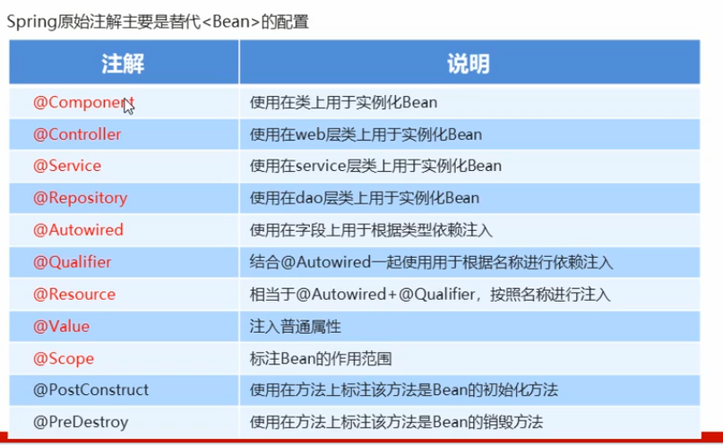
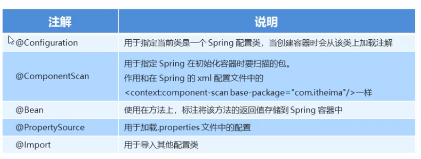
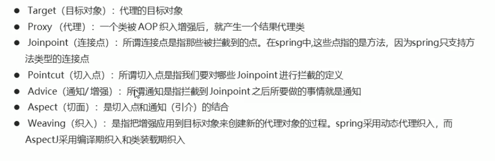
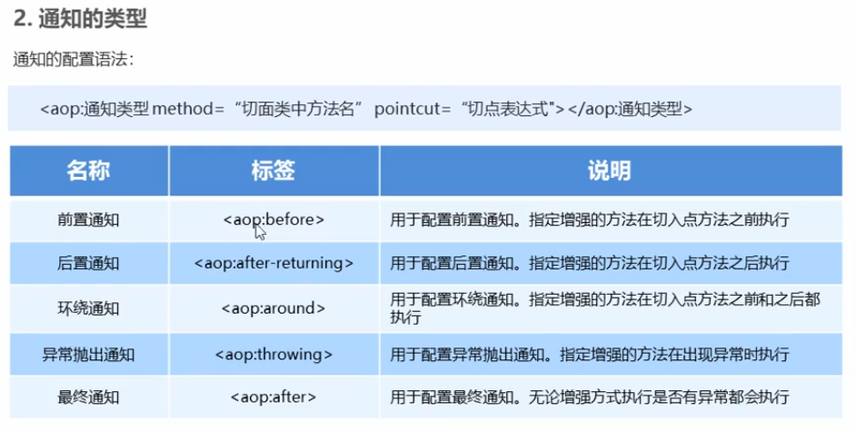
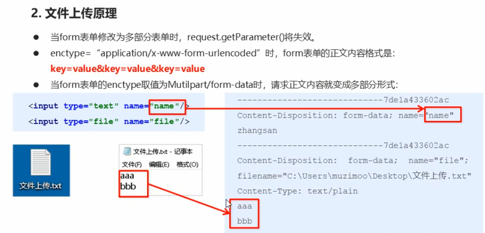
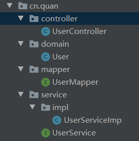
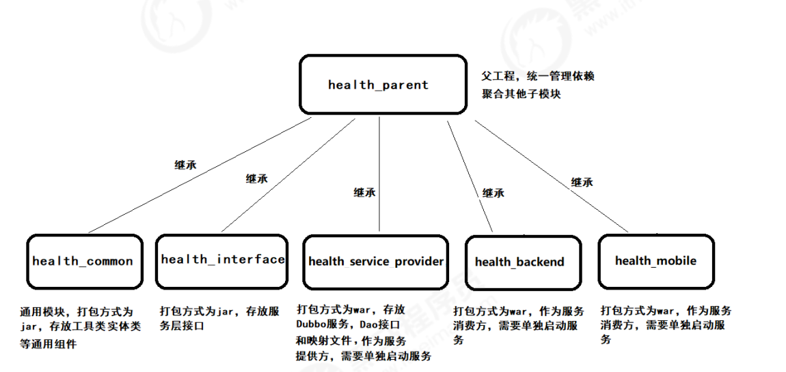

## Java进阶-SSM

### Spring

Spring是分层的Java SE/EE应用full-stack轻量级开源框架，以loC(Inverse of Contro:反转控制)和AOP(Aspect Oriented Programming:面向切面编程)为内核。


### 快速开始

1. 导入Spring坐标

   ```xml
   <dependency>
         <groupId>org.springframework</groupId>
         <artifactId>spring-context</artifactId>
         <version>5.0.5.RELEASE</version>
   </dependency>
   ```

2. 创建UserDao接口、UserDaoImpl类，实现接口

   ```java
   public class UserDaoImpl implements UserDao {
       @Override
       public void login() {
           System.out.println("Hello Spring");
       }
   }
   ```

3. 创建`resources/applicationContext.xml` 配置文件

4. 在配置文件添加bean `<bean id="userDao" class="org.example.Dao.Impl.UserDaoImpl"></bean>`

5. 测试：

   ```java
   @Test
   public void test1() {
       ApplicationContext app = new ClassPathXmlApplicationContext("applicationContext.xml");
       UserDao userDao = (UserDao) app.getBean("userDao");
       userDao.login();
   }
   ```


### 配置文件

applicationContext.xml

#### Bean

用于配置对象交友给spring来创建，默认情况下它调用类的无参构造函数，如果没有无参构造函数则不能创建成功

```xml
<bean id="Bean实例唯一标识" class="Bean的全限定名称"></bean>
```

- scope：指对象的作用范围，取值如下

| 取值范围 | 说明 |
| -------- | ---- |
|**singleton**|默认值，单列的|
|**prototype**|多例的|
|request|web项目中，spring创建一个Bean对象，将对象存入request域中|
|session|web项目中，spring创建一个Bean对象，将对象存入session域中|
|global session|web项目中，应用在portlet环境，如果没有portlet环境那么globalsession应当与session|

- singletom与prototype的作用

```java
@Test
public void test1() {
    ApplicationContext app = new ClassPathXmlApplicationContext("applicationContext.xml");
    UserDao userDao0 = (UserDao) app.getBean("userDao");
    UserDao userDao1 = (UserDao) app.getBean("userDao");
    System.out.println(userDao0);
    System.out.println(userDao1);
}
```

singletom返回的是同一个示例

```xml
<bean id="userDao" class="org.example.Dao.Impl.UserDaoImpl" scope="singletom"></bean>
```

prototype返回的是两个不同的实例

```xml
<bean id="userDao" class="org.example.Dao.Impl.UserDaoImpl" scope="prototype"></bean>
```

```
org.example.Dao.Impl.UserDaoImpl@7d0587f1
org.example.Dao.Impl.UserDaoImpl@5d76b067
```


#### Bean生命周期

1. 当`scope`取值为`singletom`时

    + 对象创建：当应用加载，创建对象时，对象被创建
    + 对象运行：只要容器在，对象就一直活着
    + 对象销毁：当应用卸载，销毁容器时，对象被销毁

2. 当`scope`取值为`prototype`时

    - 对象创建：当使用对象时，创建对象
    - 对象运行：只要对象在使用中，就一直活着
    - 对象销毁：当对象长时间不用时，被Java的垃圾回收器回收了


指定初始化、销毁方法

- `init-method`：指定初始化方法
- `destroy-method`：指定销毁方法

```xml
<bean id="userDao" class="org.example.Dao.Impl.UserDaoImpl" scope="prototype" init-method="init" destroy-method="destroy"></bean>
```

UserDaoImpl.java

```java
public class UserDaoImpl implements UserDao {
    public void init() {
        System.out.println("对象被创建");
    }

    public void destroy() {
        System.out.println("对象被销毁");
    }
}
```


#### Bean依赖注入

web层要调用service(业务层)，然后service需要调用dao(持久层)

> 那这种业务层和持久层的依赖关系，在使用Spring之后，就让Spring来维护了。
> 简单的说，就是坐等框架把持久层对象传入业务层，而不用我们自己去获取。

怎么将UserDao注入到UserService内部呢？


##### 1. 构造方法

1. 创建一个有参构造方法和一个无参构造方法

UserServiceImp.java

```java
public class UserServiceImp implements UserService {
    private UserDao userDao = new UserDaoImpl();

//    构造函数依赖注入
    public UserServiceImp() {
    }

    public UserServiceImp(UserDao userDao) {
        this.userDao = userDao;
    }

	@Override
    public void login() {
        System.out.println("hello , this is 业务层");
        userDao.login();
    }
}
```

2. constructor-arg标签name属性的值时setXxxXxx的xxxXxx，ref属性的值是bean标签持久层的ID值

applicationContext.xml

```xml
<bean id="userDao" class="org.example.Dao.Impl.UserDaoImpl"></bean>
<bean id="userService" class="org.example.Service.Impl.UserServiceImp">
    <constructor-arg name="userDao" ref="userDao"></constructor-arg>
</bean>
```


##### 2. set方法

1. 再外面创建一个成员变量，然后通过set方法设置依赖注入

UserServiceImp.java

```java
public class UserServiceImp implements UserService {
    private UserDao userDao = new UserDaoImpl();
    public void setUserDao (UserDao userDao) {
        this.userDao = userDao;
    }
    
    @Override
    public void login() {
        System.out.println("hello , this is 业务层");
        userDao.login();  // 调用持久层方法
    }
}
```

2. property标签name属性的值时setXxxXxx的xxxXxx，ref属性的值是bean标签持久层的ID值

applicationContext.xml

```xml
<bean id="userDao" class="org.example.Dao.Impl.UserDaoImpl"></bean>
<bean id="userService" class="org.example.Service.Impl.UserServiceImp">
    <property name="userDao" ref="userDao"></property>
</bean>
```


#####  3.测试

```java
@Test
public void test2() {
    ApplicationContext app = new ClassPathXmlApplicationContext("applicationContext.xml");
    UserService userService = (UserService) app.getBean("userService");
    userService.login();
}
```

> 如果不是从Spring容器取到的Service，而是 new UserServiceImpl() 的话会出现空指针异常，因为没有Dao对象


##### 使用P空间实现set方法

1. beans标签里添加属性 `xmlns:p="http://www.springframework.org/schema/p"`
2. 不用property子标签了，直接再bean属性了指定P空间 `p:userDao-ref="userDao"` ref属性的值是bean标签持久层的ID值

```xml
<bean id="userDao" class="org.example.Dao.Impl.UserDaoImpl"></bean>
<bean id="userService" class="org.example.Service.Impl.UserServiceImp" p:userDao-ref="userDao"></bean>
```


##### 普通类型依赖注入

1. UserServiceImp.java

```java
private String username;
private int age;

public void setUsername(String username) {
    this.username = username;
}

public void setAge(int age) {
    this.age = age;
}

public void commonType() {
    System.out.println("姓名：" + this.username + "\n年龄：" + this.age);
}
```

2. 配置文件。property标签的name属性对应`setUsername` `setAge`

```xml
<bean id="userService" class="org.example.Service.Impl.UserServiceImp">
    <property name="username" value="张三"></property>
    <property name="age" value="18"></property>
</bean>
```

3. 测试

```java
@Test
public void testCommon() {
    ApplicationContext app = new ClassPathXmlApplicationContext("applicationContext.xml");
    UserServiceImp userService = (UserServiceImp) app.getBean("userService");
    userService.commonType();
}
```


##### 集合类型依赖注入

1. UserServiceImp.java

```java
private List<String> stringList;  // 字符串类型的list集合
private Map<String, User> userMap;  // 对象类型的map集合
private Properties properties;  // 配置文件类型的Process

public void setStringList(List<String> stringList) {
    this.stringList = stringList;
}

public void setUserMap(Map<String, User> userMap) {
    this.userMap = userMap;
}

public void setProperties(Properties properties) {
    this.properties = properties;
}

public void collectionType() {
    System.out.println(stringList);
    System.out.println(userMap);
    System.out.println(properties);
}
```

2. 配置文件

```xml
<!--    map集合用的User对象1-->
<bean id="u1" class="org.example.domain.User">
    <property name="name" value="张三"/>
    <property name="age" value="18"/>
</bean>
<!--    map集合用的User对象2-->
<bean id="u2" class="org.example.domain.User">
    <property name="name" value="李四"/>
    <property name="age" value="20"/>
</bean>
<bean id="userService" class="org.example.Service.Impl.UserServiceImp">
    <!--        list集合的值-->
    <property name="stringList">
        <list>
            <value>Tom</value>
            <value>John</value>
        </list>
    </property>
    <!--        map集合的值-->
    <property name="userMap">
        <map>
            <entry key="u1" value-ref="u1"/>
            <entry key="u2" value-ref="u2"/>
        </map>
    </property>
    <!--        process集合的值-->
    <property name="properties">
        <props>
            <prop key="username">root</prop>
            <prop key="password">toor</prop>
        </props>
    </property>
</bean>
```

3. 测试

```java
@Test
public void testCollection() {
    ApplicationContext app = new ClassPathXmlApplicationContext("applicationContext.xml");
    UserServiceImp userService = (UserServiceImp) app.getBean("userService");
    userService.collectionType();
}
```


#### 引入其它配置文件(分模块开发)

> 实际开发中，Spring的配置内容非常多，这就导致Spring配置很繁杂且体积很大，所以，可以将部分配置拆解到其他配置文件中，而在Spring主配置文件通过import标签进行加载


##### 语法

```
<import resource="xxxxxxx.xml"/>
```


### Spring相关API

#### 加载配置文件

- `ClassPathXmlApplicationContext`：它是从类的根路径下加载配置文件(推荐用这种)

- `FileSystemXmlApplicationContext`：它是从磁盘路径下加载配置文件，配置文件可以在磁盘的任意位置

  ```java
  ApplicationContext app = new FileSystemXmlApplicationContext("C:\\applicationContext.xml");
  ```

- `AnnotationConfigApplicationContext`：


#### getBean方法

- `getBean(String beanId)`：根据配置文件的那个Bean标签ID获取

- `getBean(Class<T> aClass)`：根据类获取，如果配置文件有两个相同类的Bean的话会报错

  ```java
  UserServiceImp userService = app.getBean(UserServiceImp.class);
  userService.login();
  ```

  

### Spring配置数据源

#### 坐标

```xml
<!--        druid连接池-->
        <dependency>
            <groupId>com.alibaba</groupId>
            <artifactId>druid</artifactId>
            <version>1.1.10</version>
        </dependency>

<!--    c3p0连接池-->
        <dependency>
            <groupId>com.mchange</groupId>
            <artifactId>c3p0</artifactId>
            <version>0.9.5.5</version>
        </dependency>

<!--        MySQL-->
        <dependency>
            <groupId>mysql</groupId>
            <artifactId>mysql-connector-java</artifactId>
            <version>8.0.21</version>
        </dependency>

<!--        Spring jdbcTemplate-->
        <dependency>
            <groupId>org.springframework</groupId>
            <artifactId>spring-jdbc</artifactId>
            <version>5.1.16.RELEASE</version>
        </dependency>
```


applicationContext.xml

#### druid连接池

```xml
<!--    JdbcTemplate druid依赖注入-->
<bean id="druidDataSource" class="com.alibaba.druid.pool.DruidDataSource">
    <property name="url" value="jdbc:mysql://localhost:3306/RUNOOB?useSSL=false&amp;serverTimezone=UTC"/>
    <property name="username" value="root"/>
    <property name="password" value="root"/>
    <property name="driverClassName" value="com.mysql.cj.jdbc.Driver"/>
    <property name="initialSize" value="5"/>
</bean>
<!--    JdbcTemplate-->
<bean id="druidJdbcTemplate" class="org.springframework.jdbc.core.JdbcTemplate">
    <property name="dataSource" ref="druidDataSource"/>
</bean>
```

单元测试

```java
@Test
public void druidTest() {
    ApplicationContext app = new ClassPathXmlApplicationContext("applicationContext.xml");
    JdbcTemplate jt = (JdbcTemplate) app.getBean("druidJdbcTemplate");
    String sql = "select * from myusers";
    List<Map<String, Object>> maps = jt.queryForList(sql);
    for (Map<String, Object> map : maps) {
        System.out.println(map);
    }
}
```


#### c3p0连接池

```xml
<!--    c3p0连接池-->
<bean id="c3p0DateSource" class="com.mchange.v2.c3p0.ComboPooledDataSource">
    <property name="jdbcUrl" value="jdbc:mysql://localhost:3306/RUNOOB?useSSL=false&amp;serverTimezone=UTC"/>
    <property name="user" value="root"/>
    <property name="password" value="root"/>
    <property name="driverClass" value="com.mysql.cj.jdbc.Driver"/>
    <property name="initialPoolSize" value="5"/>
</bean>
<!--    JdbcTemplate c3p0依赖注入-->
<bean id="c3p0JdbcTemplate" class="org.springframework.jdbc.core.JdbcTemplate">
    <property name="dataSource" ref="c3p0DateSource"/>
</bean>
```

单元测试

```java
@Test
public void c3p0Test() {
    ApplicationContext app = new ClassPathXmlApplicationContext("applicationContext.xml");
    JdbcTemplate jt = (JdbcTemplate) app.getBean("c3p0JdbcTemplate");
    String sql = "select * from myusers";
    List<Map<String, Object>> maps = jt.queryForList(sql);
    for (Map<String, Object> map : maps) {
        System.out.println(map);
    }
}
```


#### 配置文件加载properties

**一定要加jdbc.** 不然会报错

1. 添加context空间

    `xmlns:context="http://www.springframework.org/schema/context"`

   `http://www.springframework.org/schema/context  http://www.springframework.org/schema/context/spring-context.xsd`

```xml
<beans xmlns="http://www.springframework.org/schema/beans"
       xmlns:xsi="http://www.w3.org/2001/XMLSchema-instance"
       xmlns:context="http://www.springframework.org/schema/context"
       xsi:schemaLocation="http://www.springframework.org/schema/beans
       http://www.springframework.org/schema/beans/spring-beans.xsd
       http://www.springframework.org/schema/context  http://www.springframework.org/schema/context/spring-context.xsd">
```

2. 加载外部properties

location：properties文件地址，一般将druid.properties放到resource目录下

```xml
<!--    加载外部properties-->
<context:property-placeholder location="classpath:jdbc.properties"/>
```

3. el表达式配置账号密码

```xml
<!--    el表达式赋值-->
<!--    druid连接池-->
<bean id="druidDataSource" class="com.alibaba.druid.pool.DruidDataSource">
    <property name="url" value="${jdbc.url}"/>
    <property name="username" value="${jdbc.username}"/>
    <property name="password" value="${jdbc.password}"/>
    <property name="driverClassName" value="${jdbc.driverClassName}"/>
    <property name="initialSize" value="${jdbc.initialSize}"/>
</bean>
<!--    JdbcTemplate druid依赖注入-->
<bean id="druidJdbcTemplate" class="org.springframework.jdbc.core.JdbcTemplate">
    <property name="dataSource" ref="druidDataSource"/>
</bean>
```

jdbc.properties

```
jdbc.url = jdbc:mysql://localhost:3306/RUNOOB?useSSL=false&serverTimezone=UTC
jdbc.username = root
jdbc.password = root
jdbc.driverClassName = com.mysql.cj.jdbc.Driver
```


### Spring原始注解




#### 依赖注解

1. Dao(持久层) 

`@Component("userDao")` ：括号里面为Bean标签的ID

`@Repository("userDao")` ：Component是表示Bean标签，但Repository比较明确，直接表示Dao层

```java
//@Component("userDao")  Repository更加明确
@Repository("userDao")
public class UserDaoImpl implements UserDao {
    @Override
    public void sayHello() {
        System.out.println("hello world");
    }
}
```

2. Service(业务层)

`@Service("userService")` ：表示Service层

`@Qualifier("userDao")` ：括号里面为依赖的ID

```java
//@Component("userService")
@Service("userService")
public class UserServiceImpl implements UserService {
    private final UserDao userDao;

    public UserServiceImpl(@Qualifier("userDao") UserDao userDao) {
        this.userDao = userDao;
    }

    @Override
    public void sayHello() {
        userDao.sayHello();
    }
}
```

Service(业务层) 也可以用 `@Resource(name = "userDao")` 依赖注入

```java
@Service("userService")
public class UserServiceImpl implements UserService {
    @Resource(name = "userDao")
    private UserDao userDao;

    @Override
    public void sayHello() {
        userDao.sayHello();
    }
}
```

3. 配置文件需要配置组件扫描

先配置context空间，然后配置组件(`component-scan`)扫描 。 `base-package` 需要扫描的包路径

```xml
<context:component-scan base-package="org.example"/>
```

web层(这里用单元测试)

```java
@Test
public void test1() {
    ClassPathXmlApplicationContext app = new ClassPathXmlApplicationContext("applicationContext.xml");
    UserService userService = (UserService) app.getBean("userService");
    userService.sayHello();
}
```


#### 普通类型注解

```java
@Service("userService")
public class UserServiceImpl implements UserService {
    @Value("张三")
    private String username;

    @Override
    public void printUsername() {
        System.out.println("用户名：" + username);
    }
}
```

如果xml配置文件加载了properties文件，可以用el表达式

```java
@Service("userService")
public class UserServiceImpl implements UserService {
    @Value(${mysql.username})
    private String username;

    @Override
    public void printUsername() {
        System.out.println("数据库用户名：" + username);
    }
}
```


### Spring新注解

> 一些像context、数据库配置的信息用原始注解处理不了



1. config/SpringConfiguration.java

```java
// 标志该类是Spring的配置核心类
@Configuration

//<!--    组件扫描-->
//    <context:component-scan base-package="org.example"/>
@ComponentScan("org.example")

//<!--    加载模块-->
//<import resource="applicationContext.xml"/>
@Import({DataSourceConfiguration.class})
public class SpringConfiguration {
}
```

2. config/DataSourceConfiguration.java

```java
//<context:property-placeholder location="classpath:druid.properties"/>  //原来的xml配置加载properties文件
@PropertySource("classpath:druid.properties")
//子模块，数据库的配置
public class DataSourceConfiguration {
    @Value("${mysql.url}")
    private String url;
    @Value("${mysql.username}")
    private String username;
    @Value("${mysql.password}")
    private String password;
    @Value("${mysql.driverClassName}")
    private String driverClassName;
    /*原来的xml配置
    <!--    druid连接池-->
    <bean id="druidDataSource" class="com.alibaba.druid.pool.DruidDataSource">
        <property name="url" value="${mysql.url}"/>
        <property name="username" value="${mysql.username}"/>
        <property name="password" value="${mysql.password}"/>
        <property name="driverClassName" value="${mysql.driverClassName}"/>
    </bean>
     */
    // 新注解配置
    @Bean("dataSource")
    public DataSource getDataSource() {
        DruidDataSource ds = new DruidDataSource();
        ds.setUrl(url);
        ds.setUsername(username);
        ds.setPassword(password);
        ds.setDriverClassName(driverClassName);
        return ds;
    }
}
```

3. 单元测试

语法 `AnnotationConfigApplicationContext(配置类的字节码)`

```java
@Test
public void test2() {
    AnnotationConfigApplicationContext app = new AnnotationConfigApplicationContext(SpringConfiguration.class);
    DataSource dataSource = (DataSource) app.getBean("dataSource");
    JdbcTemplate jt = new JdbcTemplate(dataSource);
    List<Map<String, Object>> maps = jt.queryForList("select * from myusers");
    for (Map<String, Object> map : maps) {
        System.out.println(map);
    }
}
```


### Spring集成Junit

**spring-test坐标要跟spring-context版本一样**

1. 添加坐标

```xml
<dependency>
    <groupId>org.springframework</groupId>
    <artifactId>spring-test</artifactId>
    <version>5.1.16.RELEASE</version>
    <scope>test</scope>
</dependency>
```

2. 单元测试

```java
@RunWith(SpringJUnit4ClassRunner.class)
//@ContextConfiguration("classpath:applicationContext.xml")  xml的话用这个
@ContextConfiguration(classes = {SpringConfiguration.class})  // 类的话用这个
public class SpringTest {
    // Autowired表示要依赖注入测试的对象
    @Autowired
    private UserService userService;

    @Test
    public void test1() {
        userService.sayHello();
    }
}
```


### AOP

> Aspect Oriented Programming，面向切面编程

- 作用：在程序运行期间，在不修改源码的情况下对方法进行功能增强

- 优势：减少重复代码，提高开发效率，并且便于维护




#### xml配置的快速开始

1. 导入AOP坐标

```xml
<dependency>
    <groupId>org.springframework</groupId>
    <artifactId>spring-context</artifactId>
    <version>5.1.16.RELEASE</version>
    <scope>compile</scope>
</dependency>
<dependency>
    <groupId>org.aspectj</groupId>
    <artifactId>aspectjweaver</artifactId>
    <version>1.9.6</version>
</dependency>
```

2. 创建目标接口和目标类

```java
public interface TargetInterface {
    public void save();
}
```

```java
public class Target implements TargetInterface {
    @Override
    public void save() { System.out.println("save run..."); }
}
```

3. 创建切面(增强)类

```java
public class MyAspect {
    public void before() { System.out.println("前置增强，在执行目标函数之前执行"); }
}
```

4. 创建配置文件`resources/applicationContext.xml`

配置aop空间 `xmlns:aop="http://www.springframework.org/schema/aop"`
`http://www.springframework.org/schema/aop http://www.springframework.org/schema/aop/spring-aop.xsd`

```xml
<beans xmlns="http://www.springframework.org/schema/beans"
       xmlns:xsi="http://www.w3.org/2001/XMLSchema-instance"
       xmlns:aop="http://www.springframework.org/schema/aop"
       xsi:schemaLocation="
       http://www.springframework.org/schema/beans http://www.springframework.org/schema/beans/spring-beans.xsd
       http://www.springframework.org/schema/aop http://www.springframework.org/schema/aop/spring-aop.xsd">
    
<!--    目标对象-->
    <bean id="target" class="org.itheima.aop.Target"></bean>
<!--    切面对象-->
    <bean id="myAspect" class="org.itheima.aop.MyAspect"></bean>
<!--    配置织入，告诉Spring框架哪个方法(切面)需要增强(前置、后置)-->
    <aop:config>
<!--    声明切面(aspect)-->
        <aop:aspect ref="myAspect">
<!--        前置增强，在Target.save()前执行myAspect.before()-->
            <aop:before method="before" pointcut="execution(public void org.itheima.aop.Target.save())" />
        </aop:aspect>
    </aop:config>
</beans>
```

5. 单元测试

```java
@RunWith(SpringJUnit4ClassRunner.class)
@ContextConfiguration("classpath:applicationContext.xml")
public class AopTest {
    @Autowired
    private TargetInterface target;

    @Test
    public void test1() {
        target.save();
    }
}
```

输出结果：

```
前置增强，在执行目标函数之前执行
save run...
```


#### 通知(增强)的类型




#### 注解配置的快速开始

1. 切面类 MyAspect.java

```java
@Component("myAspect")
@Aspect //标注当前MyAspect是一个切面类
public class MyAspect {
    //配置前置通知
    @Before("execution(* com.itheima.anno.*.*(..))")  // 表达式
    public void before(){
        System.out.println("前置增强..........");
    }
    /*
前置增强..........
注解-save run...
     */

    @AfterReturning("pointcut()")  // 切点表达式
    public void afterReturning(){
        System.out.println("后置增强..........");
    }
    /*
注解-save run...
后置增强..........
     */

    @Around("pointcut()")
    public Object around(ProceedingJoinPoint pjp) throws Throwable {
        System.out.println("环绕前增强....");
        Object proceed = pjp.proceed();//切点方法
        System.out.println("环绕后增强....");
        return proceed;
    }
    /*
环绕前增强....
注解-save run...
环绕后增强....
     */

    //定义切点表达式
    @Pointcut("execution(* com.itheima.anno.*.*(..))")
    public void pointcut(){}
}
```

` @Pointcut` 将表达式抽取出来，引入时用 `@Xxx("pointcut()")` 就可以了

2. 目标类 Target.java

```java
@Component("target")
public class Target implements TargetInterface {
    @Override
    public void save() {
        System.out.println("注解配置-save run...");
    }
}
```

3. 单元测试

```java
@RunWith(SpringJUnit4ClassRunner.class)
@ContextConfiguration("classpath:applicationContextAnno.xml")
public class AnnoTest {
    @Autowired
    private TargetInterface target;

    @Test
    public void test1() {
        target.save();
    }
}
```

4. 配置文件 applicationContextAnno.xml

```xml
<?xml version="1.0" encoding="UTF-8"?>
<beans xmlns="http://www.springframework.org/schema/beans"
       xmlns:xsi="http://www.w3.org/2001/XMLSchema-instance"
       xmlns:aop="http://www.springframework.org/schema/aop"
       xmlns:context="http://www.springframework.org/schema/context"
       xsi:schemaLocation="
       http://www.springframework.org/schema/beans http://www.springframework.org/schema/beans/spring-beans.xsd
       http://www.springframework.org/schema/aop http://www.springframework.org/schema/aop/spring-aop.xsd
       http://www.springframework.org/schema/context http://www.springframework.org/schema/context/spring-context.xsd
">
    <!--组件扫描-->
    <context:component-scan base-package="com.itheima.anno"/>
    <!--aop自动代理-->
    <aop:aspectj-autoproxy/>
</beans>
```


### JdbcTeamplate

环境：Jdbc + c3p0 + mysql8.0驱动包


#### 快速开始

1. 创建c3p0连接池对象
2. 设置数据库配置信息
3. 创建Jdbc对象，构造函数设置数据源。也可以用`setDataSource()`设置
4. 执行sql语句

```java
public void test1() throws PropertyVetoException {
    ComboPooledDataSource dataSource = new ComboPooledDataSource();  // 1
    
    dataSource.setJdbcUrl("jdbc:mysql://localhost:3306/RUNOOB?useSSL=false&serverTimezone=UTC");  // 2
    dataSource.setUser("root");
    dataSource.setPassword("root");
    dataSource.setDriverClass("com.mysql.cj.jdbc.Driver");

    JdbcTemplate jt = new JdbcTemplate(dataSource);  // 3
    
    List<Map<String, Object>> maps = jt.queryForList("select * from myusers");  // 4
    for (Map<String, Object> map : maps) {
        System.out.println(map);
    }
}
```


#### 将Jdbc放到Context容器中

```xml
<bean id="dataSource" class="com.mchange.v2.c3p0.ComboPooledDataSource">
    <property name="jdbcUrl" value="jdbc:mysql://localhost:3306/RUNOOB?useSSL=false&amp;serverTimezone=UTC"/>
    <property name="user" value="root"/>
    <property name="password" value="root"/>
    <property name="driverClass" value="com.mysql.cj.jdbc.Driver"/>
</bean>

<bean id="jdbcDataSource" class="org.springframework.jdbc.core.JdbcTemplate">
    <property name="dataSource" ref="dataSource"/>
</bean>
```

- 单元测试

1. 获取Context对象
2. 获取bean
3. 执行sql语句

```java
public void test2() {
    ClassPathXmlApplicationContext app = new ClassPathXmlApplicationContext("applicationContext.xml");
    JdbcTemplate jt = (JdbcTemplate) app.getBean("jdbcDataSource");
    List<Map<String, Object>> maps = jt.queryForList("select * from myusers");
    for (Map<String, Object> map : maps) {
        System.out.println(map);
    }
}
```


#### Junit测试Jdbc

```java
@RunWith(SpringJUnit4ClassRunner.class)
@ContextConfiguration("classpath:applicationContext.xml")
public class JdbcTest {
    @Autowired
    private JdbcTemplate jt;

    @Test
    public void test1() {
        List<Map<String, Object>> maps = jt.queryForList("select * from myusers");
        for (Map<String, Object> map : maps) {
            System.out.println(map);
        }
    }
}
```


#### 快速封装Bean对象

语法：`BeanPropertyRowMapper(类的字节码)` 

- 类要设置好set方法

- 如果想要返回数字就是 `queryForObject(sql, Intege.class);`

```java
@Test
public void query1() {
    MyUser myUser = jt.queryForObject("select * from myusers where id = 1", new BeanPropertyRowMapper<>(MyUser.class));
    System.out.println(myUser);
}
```


### 编程式事务控制相关对象

#### PlatformTransactionManager

> PlatformTransactionManager接口时Spring的事务管理器，它里面提供了常用的操作事务的方法

| 方法           | 描述             |
| -------------- | ---------------- |
| getTransaction | 获取事务控制对象 |
| commit         | 提交事务         |
| rollback       | 回滚事务         |


#### TransactionDefinition

> 事务的传播特性和隔离级别

| 方法                   | 说明               |
| ---------------------- | ------------------ |
| getIsoIationLevel      | 获取事务的隔离级别 |
| getPropogationBehavior | 获取事务的传播行为 |
| getTimeout             | 获取超时时间       |
| isReadOnly             | 是否只读           |

更多：https://blog.csdn.net/ystyaoshengting/article/details/86646454


#### TransactionStatus

> TransactionStatus接口提供的是事务具体的运行状态

| 方法             | 说明             |
| ---------------- | ---------------- |
| hasSavepoint     | 是否存储回滚点   |
| isCompleted      | 事务是否完成     |
| isNewTransaction | 事务是否是新事务 |
| isRollbackOnly   | 事务是否回滚     |


#### 案例：转账

**注意看坐标的包名和版本**

**记得导入AOP的坐标**

```xml
<dependency>
    <groupId>org.aspectj</groupId>
    <artifactId>aspectjweaver</artifactId>
    <version>1.9.6</version>
</dependency>
```

1. Dao层

```java
public class AccountDaoImpl implements AccountDao {
    private JdbcTemplate jt;

    public void setJt(JdbcTemplate jt) {  // Spring容器注入JdbcTemplate对象，不用自己new JdbcTemplate()了
        this.jt = jt;
    }

    @Override
    public void in(int id, double money) {
        int rs = jt.update("UPDATE account SET money = money + ? WHERE id = ? ", money, id);
        System.out.println("in结果：" + rs);
    }

    @Override
    public void out(int id, double money) {
        int rs = jt.update("UPDATE account SET money = money - ? WHERE id = ? ", money, id);
        System.out.println("out结果：" + rs);
    }
}
```

2. Service层

手动制造一个错误，这样转出账户就扣了钱但没增加到转入账户去

```java
public class AccountServiceImpl implements AccountService {
    private AccountDao accountDao;

    public void setAccountDao(AccountDao accountDao) {    // Spring容器注入Dao层对象，不用自己new AccountDao了
        this.accountDao = accountDao;
    }

    @Override
    public void transfer(int inId, int outId, double money) {
        accountDao.out(outId, money);
        int r = 3 / 0;  // 手动制造错误
        accountDao.in(inId, money);
    }
}
```

3. applicationContext.xml

1. 要配置事务管理器，然后依赖注入是数据源，因为事务本质是依靠数据库连接对象(Connection)
2. 配置 通知 事务的增强
3. 配置事务的织入

```xml
<beans xmlns="http://www.springframework.org/schema/beans"
       xmlns:xsi="http://www.w3.org/2001/XMLSchema-instance"
       xmlns:tx="http://www.springframework.org/schema/tx"
       xmlns:aop="http://www.springframework.org/schema/aop"
       xsi:schemaLocation="http://www.springframework.org/schema/beans http://www.springframework.org/schema/beans/spring-beans.xsd
http://www.springframework.org/schema/tx http://www.springframework.org/schema/tx/spring-tx.xsd
http://www.springframework.org/schema/aop http://www.springframework.org/schema/aop/spring-aop.xsd">
```

```xml
<!--    c3p0连接池数据源-->
    <bean id="dataSource" class="com.mchange.v2.c3p0.ComboPooledDataSource">
        <property name="jdbcUrl" value="jdbc:mysql://localhost:3306/RUNOOB?useSSL=false&amp;serverTimezone=UTC"/>
        <property name="user" value="root"/>
        <property name="password" value="root"/>
        <property name="driverClass" value="com.mysql.cj.jdbc.Driver"/>
    </bean>

<!--    spring jdbc框架-->
    <bean id="jdbcDataSource" class="org.springframework.jdbc.core.JdbcTemplate">
        <property name="dataSource" ref="dataSource"/>
    </bean>

<!--    配置Dao层-->
    <bean id="accountDao" class="cn.example.Dao.impl.AccountDaoImpl">
        <property name="jt" ref="jdbcDataSource"/>
    </bean>

<!--    配置Service层，也是切点-->
    <bean id="accountService" class="cn.example.Service.impl.AccountServiceImpl">
        <property name="accountDao" ref="accountDao"/>
    </bean>

<!--    配置事务管理器-->
    <bean id="transactionManager" class="org.springframework.jdbc.datasource.DataSourceTransactionManager">
        <property name="dataSource" ref="dataSource"/>
    </bean>

<!--    通知 事务的增强-->
    <tx:advice id="txAdvice" transaction-manager="transactionManager">
        <tx:attributes>
            <tx:method name="*"/>
        </tx:attributes>
    </tx:advice>

<!--    配置事务的织入-->
    <aop:config>
        <aop:advisor advice-ref="txAdvice" pointcut="execution(* cn.example.service.impl.*.*(..))"></aop:advisor>
    </aop:config>
```

4. pom.xml 的坐标

```xml
    <dependency>
      <groupId>junit</groupId>
      <artifactId>junit</artifactId>
      <version>4.13</version>
      <scope>test</scope>
    </dependency>

    <dependency>
      <groupId>org.springframework</groupId>
      <artifactId>spring-jdbc</artifactId>
      <version>5.1.16.RELEASE</version>
    </dependency>

    <dependency>
      <groupId>mysql</groupId>
      <artifactId>mysql-connector-java</artifactId>
      <version>8.0.21</version>
    </dependency>

    <dependency>
      <groupId>com.alibaba</groupId>
      <artifactId>druid</artifactId>
      <version>1.1.10</version>
    </dependency>
<!--    c3p0-->
    <dependency>
      <groupId>c3p0</groupId>
      <artifactId>c3p0</artifactId>
      <version>0.9.1.1</version>
    </dependency>

    <dependency>
      <groupId>org.springframework</groupId>
      <artifactId>spring-context</artifactId>
      <version>5.1.16.RELEASE</version>
    </dependency>

<!--    sprint单元测试-->
    <dependency>
      <groupId>org.springframework</groupId>
      <artifactId>spring-test</artifactId>
      <version>5.1.16.RELEASE</version>
      <scope>test</scope>
    </dependency>

    <dependency>
      <groupId>org.springframework</groupId>
      <artifactId>spring-tx</artifactId>
      <version>5.0.5.RELEASE</version>
    </dependency>

    <dependency>
      <groupId>org.aspectj</groupId>
      <artifactId>aspectjweaver</artifactId>
      <version>1.9.6</version>
    </dependency>
```

单元测试(模拟web层)

```java
@Test
public void test1() {
    ApplicationContext app = new ClassPathXmlApplicationContext("classpath:applicationContext.xml");
    AccountService service = (AccountService) app.getBean("accountService");
    service.transfer(1, 2, 50);  // 将id为1的账户转入50元到id为2的账户去
}
```


#### 案列讲解

`tx:method` 一个方法就是一个事务，`*` 表示所有方法

```xml
<!--    通知 事务的增强-->
<tx:advice id="txAdvice" transaction-manager="transactionManager">
    <tx:attributes>
        <tx:method name="transfer" isolation="REPEATABLE_READ" propagation="REQUIRED" read-only="false"/>
    </tx:attributes>
</tx:advice>
```


#### 用注解的方式配置事务

1. Dao层用 `@Repository("accountDao")`

依赖用 `@Autowired` ，例如 Dao层依赖的JdbcTemplate，注解的方式依赖不用set方法

```
@Autowired
private JdbcTemplate jt;
```

2. Service层用 `@Service("accountService")` ，依赖的Dao同上

织入和增强用 `@Transactional` 

```java
@Override
@Transactional(isolation = Isolation.REPEATABLE_READ, propagation = Propagation.REQUIRED)
public void transfer(int inId, int outId, double money) {
    accountDao.out(outId, money);
    int r = 3 / 0;  // 手动制造错误
    accountDao.in(inId, money);
}
```

3. applicationContext.xml

```java
<!--    数据源-->
    <bean id="dataSource" class="com.mchange.v2.c3p0.ComboPooledDataSource">
        <property name="jdbcUrl" value="jdbc:mysql://localhost:3306/RUNOOB?useSSL=false&amp;serverTimezone=UTC"/>
        <property name="user" value="root"/>
        <property name="password" value="root"/>
        <property name="driverClass" value="com.mysql.cj.jdbc.Driver"/>
    </bean>

<!--    spring jdbc框架-->
    <bean id="jdbcDataSource" class="org.springframework.jdbc.core.JdbcTemplate">
        <property name="dataSource" ref="dataSource"/>
    </bean>

<!--    配置事务管理器-->
    <bean id="transactionManager" class="org.springframework.jdbc.datasource.DataSourceTransactionManager">
        <property name="dataSource" ref="dataSource"/>
    </bean>


<!--    注解要配置组件扫描-->
    <context:component-scan base-package="cn.example"/>
<!--    注解也要配置事务管理器-->
    <tx:annotation-driven transaction-manager="transactionManager"/>
```

单元测试同上


### Spring获取应用上下文

> Spring提供了一个监听器ContextLoaderListener就是对上述功能的封装，该监听器内部加载Spring配置文件，创建应用上下文对象，并存储到ServletContext域中，提供了一个客户端工具WebApplicationContextUtils供使用者获得应用上下文对象。

1. 导入坐标

```xml
<dependency>
    <groupId>org.springframework</groupId>
    <artifactId>spring-web</artifactId>
    <version>5.1.6.RELEASE</version>
</dependency>
```

2. 在web.xml的`web-app`标签内配置全局初始化参数和监听器

```xml
<!--配置应用上下文，全局初始化参数-->
<context-param>
    <param-name>contextConfigLocation</param-name>
    <param-value>classpath:applicationContext.xml</param-value>
</context-param>
<!--配置Spring框架的监听器-->
<listener>
    <listener-class>org.springframework.web.context.ContextLoaderListener</listener-class>
</listener>
```

3. 使用

```java
ServletContext sc = this.getServletContext();  // 1. 获取运行环境对象
WebApplicationContext app = WebApplicationContextUtils.getWebApplicationContext(sc);  // 2. 获取配置对象
// 3. 剩下的跟之前一样,获取Bean呀
JdbcTemplate jt = (JdbcTemplate) app.getBean("jdbcDataSource");
List<Map<String, Object>> maps = jt.queryForList("select * from myusers");
for (Map<String, Object> map : maps) {
    System.out.println(map);
}
```


## Spring MVC

### 快速开始

1. 导入坐标

```xml
<dependency>
    <groupId>org.springframework</groupId>
    <artifactId>spring-webmvc</artifactId>
    <version>5.1.6.RELEASE</version>
</dependency>
```

2. web.xml配置Spring前端控制器，url匹配 `/`

`param-value` ：`dispatcher-servlet.xml`的路径

```xml
<servlet>
    <servlet-name>springMVC</servlet-name>
    <servlet-class>org.springframework.web.servlet.DispatcherServlet</servlet-class>
    <init-param>
        <param-name>contextConfigLocation</param-name>
        <param-value>/WEB-INF/dispatcher-servlet.xml</param-value>
    </init-param>
    <load-on-startup>1</load-on-startup>
</servlet>

<servlet-mapping>
    <servlet-name>springMVC</servlet-name>
    <url-pattern>/</url-pattern>
</servlet-mapping>
```

3. dispatcher-servlet.xml 配置组件扫描，扫描的目录是`controller` 下的所有注解配置

在Spring MVC中`controller`替换了之前的`Dao`

```xml
<context:component-scan base-package="controller"></context:component-scan>
```

4. controller/QuickServlet.java

`@Controller` ：注解配置表示这是个controller层

`@RequestMapping("/quick")` ：url映射，访问`http://localhost:8080/quick` 时执行的是下面的save方法

`return "save.jsp";` ：执行这个方法后会转发到save.jsp文件去

```java
@Controller
public class QuickServlet {
    @RequestMapping("/quick")
    public String save() {
        System.out.println("你好 controller save ...");
        return "save.jsp";
    }
}
```


### Spring MVC注解配置

#### RequestMapping

属性:

- value：指定请求的url，默认值
- method：指定请求的访问
- params：指定请求参数
- produces：返回的类型 `@RequestMapping(produces="text/html;charset=utf-8")` 可以设置返回编码


如果`@RequestMapping` 注解到类上面表示 `http://localhost:8080/user/login` 

`return "/login.jsp";` 这里如果不加`/`表示`/user/login.jsp`

```java
@Controller
@RequestMapping("/user")
public class UserServlet {

    @RequestMapping("/login")
    public String login() {
        System.out.println("用户登录页面");
        return "/login.jsp";
    }
}
```

- method 例：只配置访问方式是post和get，其它的例如DELETE、PUT等方法都不能访问`/login`

```java
@RequestMapping(value = "/login", method = {RequestMethod.POST, RequestMethod.GET})
```

- params

```
params = {"userId"}  表示请求参数必须有userId这个key
params = {"money!100"}  表示请求参数money不是是100
```


#### 组件扫描

`context:component-scan` 可以指定扫描排除或包含

```xml
<context:component-scan base-package="cn.quan">
    <context:exclude-filter />  // 排除cn.quan下的指定目录
    <context:include-filter />  // 包含cn.quan下的指定目录
</context:component-scan>
```


#### xml配置资源视图解析器

```xml
<bean id="viewResolver" class="org.springframework.web.servlet.view.InternalResourceViewResolver">
    <property name="prefix" value="/static/"/>
    <property name="suffix" value=".jsp"/>
</bean>
```

这样把静态资源放到static目录下，就不用`return "/static/login.jsp";`，直接使用 `return "login";` 就可以转发到对应文件了


### SpringMVC数据响应

1. 页面跳转
   - 直接返回字符串（上面的`return "xxx";` 就是这种，它将读取到的文件转成字符串返回给浏览器)
   - 通过ModelAndView对象返回
2. 回写数据
   - 直接返回字符串
   - 返回对象或集合


#### ModelAndView

model：用于封装数据

View：用于展示视图

```java
@RequestMapping(value = "/index", produces="text/html;charset=utf-8")
public ModelAndView index() {
    ModelAndView modelAndView = new ModelAndView();  // 1. 创建对象
    modelAndView.addObject("username", "张三");  // 2. 设置数据
    modelAndView.setViewName("index");  // 3. 设置视图
    return modelAndView;  // 4. 返回对象
}
```

视图用el表达式展示数据

/static/index.jsp

```java
<!doctype html>
<html lang="zh-cn">
<head>
    <meta charset="UTF-8">
    <title>首页</title>
</head>
<body>
    <h1>欢迎 ${username}</h1>
</body>
</html>
```

- 也可以将ModelAndView对象当参数传过来

```java
@RequestMapping(value = "/index")
public ModelAndView index2(ModelAndView modelAndView) {
    modelAndView.addObject("username", "张三");
    modelAndView.setViewName("index");
    return modelAndView;
}
```


#### Request请求对象

熟悉的req、resp对象，在SpringMVC中，如果有形参那么Spring会自动依赖注入传参过去

```java
@RequestMapping(value = "/index3")
public void index3(HttpServletRequest req, HttpServletResponse resp) {
    System.out.println(req);
    System.out.println(resp);
}
```


#### 直接返回字符串

- 第一种方法

1. 在Spring中想要直接返回字符串先将返回值设为 void
2. 形参HttpServletResponse对象

```java
@RequestMapping(value = "/index4")
public void index4(HttpServletResponse resp) throws IOException {
    resp.getWriter().write("<h1>字符串</h1>");
}
```

- 第二种方法

用`@ResponseBody`注解告诉Spring：不要跳转这是个字符串

```java
@RequestMapping(value = "/index5")
@ResponseBody
public String index5() {
    return "<h1>字符串</h1>";
}
```


#### 返回json

1. 导入解析json的坐标

```xml
<dependency>
    <groupId>com.fasterxml.jackson.core</groupId>
    <artifactId>jackson-databind</artifactId>
    <version>2.3.3</version>
</dependency>
<dependency>
    <groupId>com.fasterxml.jackson.core</groupId>
    <artifactId>jackson-annotations</artifactId>
    <version>2.3.3</version>
</dependency>
```

2. 剩下的跟之前一样

```java
@RequestMapping(value = "/index6")
@ResponseBody
public String index6()  {
    // 1. 设置对象
    User user = new User();
    user.setId(1);
    user.setUsername("John");
    user.setMoney(5.6);
    ObjectMapper objectMapper = new ObjectMapper();
    return objectMapper.writeValueAsString(user);
}
```


#### 返回对象或集合

- 第一种方式

跟之前配置前端控制器那样，在applicationContext.xml或其它xml文件 配置RequestMappingHandlerAdapter

```xml
<bean class="org.springframework.web.servlet.mvc.method.annotation.RequestMappingHandlerAdapter">
    <property name="messageConverters">
        <list>
            <bean class="org.springframework.http.converter.json.MappingJackson2HttpMessageConverter"></bean>
        </list>
    </property>
</bean>
```

使用：

```java
@RequestMapping("/json1")
@ResponseBody
public User json1()  {
    User user = new User();
    user.setId(1);
    user.setUsername("John");
    user.setMoney(5.6);
    return user;
}
```

- 第二种方式

1. 加载mvc空间

```xml
xmlns:mvc="http://www.springframework.org/schema/mvc"
http://www.springframework.org/schema/mvc http://www.springframework.org/schema/mvc/spring-mvc.xsd
```

2. dispatcher-servlet.xml或者叫(spring-mvc.xml)

```xml
<mvc:annotation-driven/>
```


### SpringMVC请求数据

#### 获取基础类型参数

```java
@RequestMapping("/req1")
@ResponseBody
public void req1(String username, int age) {
    System.out.println(username);
    System.out.println(age);
}
```

访问：`http://localhost:8080/req1?username=Tom&age=2` 测试


#### 获取封装成对象的参数

1. 对象要设置get/set方法

```java
public class User {
    int id;
    String username;
    double money;
    getter/setter...
}
```

2. 使用

```java
@RequestMapping("/req2")
@ResponseBody
public void req1(User user) {
    System.out.println(user);
}
```

访问：`http://localhost:8080/req2?id=2&username=Tom&money=5.6` 测试

如果不带其中之一参数，值是默认值

例：访问 `http://localhost:8080/req2?id=2`

输出结果：`User{id=2, username='null', money=0.0}`


#### 获取数组类型参数

```java
@RequestMapping("/req3")
@ResponseBody
public void req1(String[] hobby) {
    System.out.println(Arrays.toString(hobby));
}
```

访问：`http://localhost:8080/req3?hobby=eat&hobby=sleep&hobby=play`

输出结果：`[eat, sleep, play]`


#### 获取集合类型参数

html

`name="userList[0]"` 表示Vo对象的成员变量`userList`的第一个元素

```html
<form action="${pageContext.request.contextPath}/req4" method="post">
    br><h2>集合的第一个元素</h2>
    <input type="text" name="userList[0].id" >
    <input type="text" name="userList[0].username"  >
    <input type="text" name="userList[0].money"  >
	<br><h2>集合的第二个元素</h2>
    <input type="text" name="userList[1].id" >
    <input type="text" name="userList[1].username"  >
    <input type="text" name="userList[1].money"  >
    <button type="submit" >提交</button>
</form>
```

后端

```java
@RequestMapping("/req4")
@ResponseBody
public void req1(Vo vo) {
    System.out.println(vo);
}
```

Vo.java

```java
public class Vo {
    List<User> userList;
    setter/getter...
}
```

访问post表单提交，然后会把参数给封装成集合

输出结果：`Vo{userList=[User{id=1, username='xiaomi', money=55.0}, User{id=2, username='redmi', money=96.6}]}`


#### 处理请求静态资源

spring-mvc.xml

1. 第一种方式：如果MVC找不到静态资源就交友tomcat去处理

```xml
<mvc:default-servlet-handler/>
```

2. 第二种方式：映射静态资源，列如下列放行了images目录下的静态资源

```xml
<mvc:resources mapping="/images/**" location="/images/"/>
```

测试：img.jsp

```java

```

如果不处理静态配置的话会显示 `HTTP状态 404 - 未找到`


#### 处理请求编码问题

web.xml

```xml
<!--    配置编码处理过滤器，类是mvc提供的-->
<filter>
    <filter-name>CharacterEncodingFilter</filter-name>
    <filter-class>org.springframework.web.filter.CharacterEncodingFilter</filter-class>
    <init-param>
        <param-name>encoding</param-name>
        <param-value>UTF-8</param-value>
    </init-param>
</filter>
<!--    映射一下过滤器-->
<filter-mapping>
    <filter-name>CharacterEncodingFilter</filter-name>
    <url-pattern>/*</url-pattern>
</filter-mapping>
```


#### RequestParam注解

- value：请求参数名称
- required：指定的请求参数是否必须包含，默认是true
- defaultValue：当没有指定参数时，则使用默认值

例：

- 将参数name映射成nickname变量

```java
@RequestMapping("/req5")
@ResponseBody
public void req5(@RequestParam("name") String nickname) {
    System.out.println(nickname);
}
```


#### Restful风格请求参数

- GET：用户获取资源
- POST：用于新建资源
- PUT：用于更新资源
- DELETE：用于删除资源

```java
@RequestMapping(value = "/req6/{userId}")
@ResponseBody
public void req5(@PathVariable(value = "userId") String userId) {
    System.out.println(userId);
}
```

访问：`localhost:8080/req6/1930502` 得到`1930502`


#### 自定义转换器

SpringMVC中有对日期的参数做转换，但不是全格式的例如`2019-02-63`这种格式转换不了，所有就可以自己制作一个转换器

1. 转换器实现类，要实现SpringMVC的Converter类

```java
import org.springframework.core.convert.converter.Converter;
public class DateConverter implements Converter<String, Date> {
    @Override
    public Date convert(String s) {
        Date date = null;
        SimpleDateFormat simpleDateFormat = new SimpleDateFormat("yyyy-MM-dd");
        try {
            date = simpleDateFormat.parse(s);
        } catch (ParseException e) {
            e.printStackTrace();
        }
        return date;
    }
}
```

2. 配置文件加载转换器 spring-mvc.xml

```xml
<bean id="conversionService(id)" class="org.springframework.context.support.ConversionServiceFactoryBean">
    <property name="converters">
        <list>
            <bean class="converter.DateConverter"/>
        </list>
    </property>
</bean>
```

3. 在之前的注解驱动那里添加bean

```xml
<mvc:annotation-driven conversion-service="conversionService(id)" />
```

4. 使用

```java
@RequestMapping("/req7")
@ResponseBody
public void req5(Date date) {
    System.out.println(date);
}
```

访问：`http://localhost:8080/req7?date=2020-07-27` ，输出了日期对象


#### 获取请求头

@RequestHead

- value：请求头的名称
- required：是否必须携带此请求头

@CookieValue

- value：cookie的名称(key)
- required：是否必须携带此cookie

```java
@RequestMapping("/req8")
@ResponseBody
public void req8(@RequestHeader(value = "user-agent", required = false) String userAgent) {
    System.out.println("浏览器标识：" + userAgent);
}

@RequestMapping("/req9")
@ResponseBody
public void req9(@CookieValue(value = "token") String token) {
    System.out.println("cookie token 的值：" + token);
}
```


#### 文件上传



1. 导入文件上传需要的坐标

```xml
<dependency>
    <groupId>commons-io</groupId>
    <artifactId>commons-io</artifactId>
    <version>2.5</version>
</dependency>
<dependency>
    <groupId>commons-fileupload</groupId>
    <artifactId>commons-fileupload</artifactId>
    <version>1.2.2</version>
</dependency>
```

2. 配置文件上传解析器

```xml
<bean id="multipartResolver" class="org.springframework.web.multipart.commons.CommonsMultipartResolver">
    <property name="defaultEncoding" value="UTF-8"/>
    <property name="maxUploadSize" value="500000"/>
</bean>
```

3. 前端html表单配置成multipart

```html
<form action="/req10" method="post" enctype="multipart/form-data">
    姓名：<input type="text" name="name">
    文件1：<input type="file" name="file1" id="file1">
    文件2：<input type="file" name="file2" id="file2">
    <input type="submit" value="提交">
</form>
```

4. 使用

```java
@RequestMapping("/req10")
@ResponseBody
public void req10(String name, MultipartFile file1, MultipartFile file2) throws IOException {
    System.out.println("name:" + name);
    System.out.println("file:" + file1);
    if (file1 == null) return;
    String fileName1 = file1.getOriginalFilename();
    String fileName2 = file2.getOriginalFilename();
    file1.transferTo(new File("d:\\" + fileName1));
    file2.transferTo(new File("d:\\" + fileName2));
}
```

多文件，`input:name`相同的可以参数那里是数组

```html
<form action="/req11" method="post" enctype="multipart/form-data">
    姓名：<input type="text" name="name">
    文件[0]：<input type="file" name="file" >
    文件[1]：<input type="file" name="file" >
    <input type="submit" value="提交">
</form>
```

```java
@RequestMapping("/req11")
@ResponseBody
public void req11(MultipartFile[] file) throws IOException {
    for (MultipartFile multipartFile : file) {
        System.out.println(multipartFile);
    }
}
```


### SpringMVC拦截器

#### 拦截器和过滤器的区别

| 区别     | 过滤器                                               | 拦截器                                                       |
| -------- | ---------------------------------------------------- | ------------------------------------------------------------ |
| 使用范围 | 是servlet规范中的一部分，任何Java Web 工程都可以使用 | 是SpringMVC框架自己的，只有使用了SpringMVC框柴的工程才能用   |
| 拦截范围 | url-pattern中定义的规则                              | 只会拦截访问的控制器方法，如果访问的是jsp、html、css、js是不会拦截的 |


#### 快速开始

1. 创建一个类实现HandlerInterceptor接口

interceptor/MyDemo.java

```java
import org.springframework.web.servlet.HandlerInterceptor;
public class MyDemo implements HandlerInterceptor {
//    目标方法执行之前
    @Override
    public boolean preHandle(HttpServletRequest request, HttpServletResponse response, Object handler) throws Exception {
        System.out.println("perHandle");
        String uuid = request.getParameter("password");
        if (uuid != null && uuid.equals("2020")) {
            return true;  // 放行
        } else {
            response.getWriter().write("提取码错误");
            return false;
        }
    }

//    目标方法执行之后 视图返回之前
    @Override
    public void postHandle(HttpServletRequest request, HttpServletResponse response, Object handler, ModelAndView modelAndView) throws Exception {
        System.out.println("postHandle");
    }

//    整个流程执行完毕之后
    @Override
    public void afterCompletion(HttpServletRequest request, HttpServletResponse response, Object handler, Exception ex) throws Exception {
        System.out.println("afterHandle");
    }
}
```

2. 配置文件配置拦截器

spring-mvc.xml

` <mvc:mapping path="/**"/>` 拦截所有方法

`<mvc:mapping path="/user/*"/>` 拦截`localhost/user/xxx` 方法

```xml
<mvc:interceptors>
    <mvc:interceptor>
        <!--            mapping对哪些资源做拦截操作，下面是拦截localhost/req12 的  -->
        <mvc:mapping path="/req12"/>
        <bean class="interceptor.MyDemo"/>
    </mvc:interceptor>
</mvc:interceptors>
```


#### 排除方法

```xml
<!-- 排除user/login方法 -->
<mvc:exclude-mapping path="/user/login"/>
```


#### 配置多个拦截器

```xml
<mvc:interceptors>
    <!--        第一个拦截器-->
    <mvc:interceptor>
        <mvc:mapping path="/req12"/>
        <bean class="interceptor.MyDemo"/>
    </mvc:interceptor>
    <!--        第二个拦截器-->
    <mvc:interceptor>
        <mvc:mapping path="/req12"/>
        <bean class="interceptor.MyDemo2"/>
    </mvc:interceptor>
</mvc:interceptors>
```

MyDemo代码同上

MyDemo2.java

```java
@Override
public boolean preHandle(HttpServletRequest request, HttpServletResponse response, Object handler) throws Exception {
    System.out.println("这是第二个拦截器");
    String Zodiac = request.getParameter("Zodiac");
    if (Zodiac != null && Zodiac.equals("鼠")) {
        return true;
    } else {
        response.getWriter().write("只冲破了第一个拦截器");
        return false;
    }
}
```


#### 案列：用户登录权限控制

spring-mvc.xml

```xml
<mvc:interceptors>
    <mvc:interceptor>
        <mvc:mapping path="/**"/>
        <mvc:exclude-mapping path="/user/login"/>
        <bean class="cn.quan.interceptor.Privilege" />
    </mvc:interceptor>
</mvc:interceptors>
```

interceptor/privilege.java

```java
@Override
public boolean preHandle(HttpServletRequest request, HttpServletResponse response, Object handler) throws Exception {
    HttpSession session = request.getSession();
    User user = (User) session.getAttribute("user");
    if (user == null) {
        response.sendRedirect(request.getContextPath() + "/login.jsp");
        return false;
    }
    return true;
}
```


### SpringMVC异常处理

- 简单异常处理器SimpleMappingExceptionResolver
- 自定义异常处理器HandlerExceptionResolver


#### 简单(自带)异常处理器

- 默认异常，不管触发了什么异常都进这里

> 这个error 因为配置了前端控制器所以原型是 /pages/error.jsp

```xml
<bean class="org.springframework.web.servlet.handler.SimpleMappingExceptionResolver">
    <property name="defaultErrorView" value="error"/>
</bean>
```

- 具体异常和自定义异常，什么异常就进对应的value值视图

```xml
<bean class="org.springframework.web.servlet.handler.SimpleMappingExceptionResolver">
    <!-- 具体错误视图-->
    <property name="exceptionMappings">
        <map>
            <!-- 类转换错误视图-->
            <entry key="java.lang.ClassCastException" value="error1"/>
            <!-- 空指针错误视图-->
            <entry key="java.lang.NullPointerException" value="error2"/>
            <!-- 自定义的MyThrow错误视图-->
            <entry key="cn.quan.myThrow.MyThrow" value="error3"/>
        </map>
    </property>
</bean>
```


#### 自定义异常处理器

1. 实现 `org.springframework.web.servlet.HandlerExceptionResolver` 接口

resolver/MyExceptionResolver.java

```java
public class MyExceptionResolver implements HandlerExceptionResolver {
    @Override
    public ModelAndView resolveException(HttpServletRequest httpServletRequest, HttpServletResponse httpServletResponse, Object o, Exception e) {
        ModelAndView modelAndView = new ModelAndView();
        String message = e.getMessage();
        modelAndView.addObject("msg", message);
        modelAndView.setViewName("error");
        return modelAndView;
    }
}
```

2. spring-mvc.xml

```xml
<bean class="cn.quan.resolver.MyExceptionResolver"/>
```


## Spring练习环境

### 初始化步骤

1. 创建工程或模板
2. 导入静态资源(js/css/img)
3. 导入坐标
4. 创建包结构(controller/service/dao/domain/utils)
5. 导入数据库
6. 创建配置文件(applicationContext.xml/spring-mvc.xml/druid.properties/log4j.properties)
7. 配置web.xml

```xml
<?xml version="1.0" encoding="UTF-8"?>
<web-app xmlns="http://xmlns.jcp.org/xml/ns/javaee"
         xmlns:xsi="http://www.w3.org/2001/XMLSchema-instance"
         xsi:schemaLocation="http://xmlns.jcp.org/xml/ns/javaee http://xmlns.jcp.org/xml/ns/javaee/web-app_4_0.xsd"
         version="4.0">

  <!--  应用上下文-->
  <!--  全局的初始化参数-->
  <context-param>
    <param-name>contextConfigLocation</param-name>
    <param-value>classpath:applicationContext.xml</param-value>
  </context-param>
  <!--  Spring的监听器-->
  <listener>
    <listener-class>org.springframework.web.context.ContextLoaderListener</listener-class>
  </listener>

  <!--  Spring MVC的前端控制器-->
  <servlet>
    <servlet-name>DispatcherServlet</servlet-name>
    <servlet-class>org.springframework.web.servlet.DispatcherServlet</servlet-class>
    <init-param>
      <param-name>contextConfigLocation</param-name>
      <param-value>classpath:spring-mvc.xml</param-value>
    </init-param>
    <load-on-startup>1</load-on-startup>
  </servlet>
  <servlet-mapping>
    <servlet-name>DispatcherServlet</servlet-name>
    <url-pattern>/</url-pattern>
  </servlet-mapping>

  <!--    配置编码处理过滤器 -->
  <filter>
    <filter-name>CharacterEncodingFilter</filter-name>
    <filter-class>org.springframework.web.filter.CharacterEncodingFilter</filter-class>
    <init-param>
      <param-name>encoding</param-name>
      <param-value>UTF-8</param-value>
    </init-param>
  </filter>
  <!--    映射一下过滤器-->
  <filter-mapping>
    <filter-name>CharacterEncodingFilter</filter-name>
    <url-pattern>/*</url-pattern>
  </filter-mapping>
</web-app>
```

8. 配置spring-mvc.xml

```xml
<beans xmlns="http://www.springframework.org/schema/beans"
       xmlns:xsi="http://www.w3.org/2001/XMLSchema-instance"
       xmlns:mvc="http://www.springframework.org/schema/mvc"
       xsi:schemaLocation="http://www.springframework.org/schema/beans http://www.springframework.org/schema/beans/spring-beans.xsd
http://www.springframework.org/schema/mvc http://www.springframework.org/schema/mvc/spring-mvc.xsd">
```

```xml
 <!--    0. mvc开启注解驱动，然后再扫描注解组件-->
    <mvc:annotation-driven/>

<!--    1. 组件扫描，主要扫描controller-->
    <context:component-scan base-package="cn.quan.controller"/>

    <!--    2. 配置视图解析器-->
    <bean class="org.springframework.web.servlet.view.InternalResourceViewResolver">
        <property name="prefix" value="/pages"/>
        <property name="suffix" value=".jsp"/>
    </bean>

    <!--    3. 静态资源放行-->
    <mvc:default-servlet-handler/>
```

9. 配置applicationContext.xml

```xml
<!--    1. 加载druid.properties文件-->
    <context:property-placeholder location="classpath:jdbc.properties" />

    <!--    2. 配置数据源对象-->
    <bean id="dataSource" class="com.alibaba.druid.pool.DruidDataSource">
        <property name="url" value="${jdbc.url}"/>
        <property name="username" value="${jdbc.username}"/>
        <property name="password" value="${jdbc.password}"/>
        <property name="driverClassName" value="${jdbc.driverClassName}"/>
    </bean>

    <!--    3. 配置Spring提供的JdbcTemplate-->
    <bean id="jdbcTemplate" class="org.springframework.jdbc.core.JdbcTemplate">
        <property name="dataSource" ref="dataSource"/>
        <property name="queryTimeout" value="15"/>
    </bean>
```

10. 追加结构配置

applicationContext.xml

> xml配置要设置setXXX方法(XXX对应property需要的值)

```xml
<!--    4. Service层、Dao层用xml配置-->
    <bean id="roleDao" class="cn.quan.dao.impl.RoleDaoImpl">
        <property name="jt" ref="jdbcTemplate"/>
    </bean>
    <bean id="roleService" class="cn.quan.service.impl.RoleServiceImpl">
        <property name="roleDao" ref="roleDao"/>
    </bean>
```

spring-mvc.xml

> 注解配置不需要set方法，但要在类那里设置@Controller，成员变量那里设置@Autowired

```xml
<!--    4. Controller层用注解配置，所以要设置组件扫描-->
    <context:component-scan base-package="cn.quan.controller"/>
```


## Mybatis

- mybatis是一个优秀的基于java的持久层框架，它内部封装了jdbc，使开发者只需要关注**sql语句本身**，而不需要花费精力去处理加载驱动、创建连接、创建statement等繁杂的过程。
- mybatis通过xml或注解的方式将要执行的各种statement配置起来，并通过java对象和statement中sql的动态参数进行映射生成最终执行的sql语句。
- 最后mybatis框架执行sq并将结果映射为java对象并返回。采用ORM思想解决了实体和数据库映射的问题，对jdbc进行了封装，屏蔽了jdbcapi底层访问细节，使我们不用与jdbcapi打交道，就可以完成对数据库的持久化操作。


### 快速开始

1. 添加坐标

```xml
<dependency>
    <groupId>org.mybatis</groupId>
    <artifactId>mybatis</artifactId>
    <version>3.4.6</version>
</dependency>
```

2. 语句映射文件(`resources\cn\quan\mapper\UserMapper.xml`)

```xml
<?xml version="1.0" encoding="UTF-8" ?>
<!DOCTYPE mapper PUBLIC "-//mybatis.org//DTD Mapper 3.0//EN" "http://mybatis.org/dtd/mybatis-3-mapper.dtd">

<mapper namespace="userMapper">
    <select id="findAll" resultType="cn.quan.domain.User">
        select * from myusers
    </select>
</mapper>
```

2. 核心配置文件(`resources\SqlMapConfig.xml`)

`environments default` 默认环境

```xml
<?xml version="1.0" encoding="UTF-8" ?>
<!DOCTYPE configuration
        PUBLIC "-//mybatis.org//DTD Config 3.0//EN"
        "http://mybatis.org/dtd/mybatis-3-config.dtd">
<configuration>
    <!--配置别名-->
    <typeAliases>
        <!--指定包名，别名就是类名首字母小写-->
        <package name="cn.quan.domain"/>
    </typeAliases>

    <!--配置分页插件-->
    <plugins>
        <plugin interceptor="com.github.pagehelper.PageHelper">
            <property name="dialect" value="mysql"/>
        </plugin>
    </plugins>

</configuration>
```

3. 单元测试

```java
@Test
public void test1() throws IOException {
    //        1. 获取核心配置文件
    InputStream resourceAsStream = Resources.getResourceAsStream("SqlMapConfig.xml");
    //        2. 获取session工厂对象
    SqlSessionFactory sqlSessionFactory = new SqlSessionFactoryBuilder().build(resourceAsStream);
    //        3. 获得一个session会话对象
    SqlSession sqlSession = sqlSessionFactory.openSession();
    //        4. 执行操作，并返回结果 参数： namespace.id
    List<User> userList = sqlSession.selectList("userMapper.findAll");
    //        5. 打印结果
    for (User user : userList) {
        System.out.println(user);
    }
    //        6. 关闭一个session会话对象
    sqlSession.close();
}
```


#### namespace

在mybatis中，**映射文件中的namespace是用于绑定Dao接口的，即面向接口编程。**

**当你的namespace绑定接口后，你可以不用写接口实现类，mybatis会通过该绑定自动帮你找到对应要执行的SQL语句，**如下：

假设定义了`IArticeDAO`接口

```
public interface IArticleDAO
{
   List<Article> selectAllArticle();
}
1234
```

对于映射文件如下：

```
<mapper namespace="IArticleDAO">
    <select id="selectAllArticle" resultType="article">
            SELECT t.* FROM T_article t WHERE t.flag = '1' ORDER BY t.createtime DESC
     </select>
1234
```

请注意**接口中的方法与映射文件中的SQL语句的ID一一对应 。**


### 简单CURD

#### 插入 

```java
@Test
public void test2() throws IOException {
    //        0. 新建一个要插入的对象
    User user = new User();
    user.setName("张三");
    user.setAge(99);
    user.setGender("男");
    //        1. 获取核心配置文件
    InputStream resourceAsStream = Resources.getResourceAsStream("SqlMapConfig.xml");
    //        2. 获取session工厂对象
    SqlSessionFactory sqlSessionFactory = new SqlSessionFactoryBuilder().build(resourceAsStream);
    //        3. 获得一个session会话对象
    SqlSession sqlSession = sqlSessionFactory.openSession();
    //        4. 执行插入操作 参数： namespace.id 插入的对象
    int rs = sqlSession.insert("userMapper.save", user);
    //        4.1 Mybatis是默认开启事务的，所以要commit一下
    sqlSession.commit();
    //        5. 打印结果
    System.out.println(rs);
    //        6. 关闭一个session会话对象
    sqlSession.close();
}
```

`resources\cn\quan\mapper\UserMapper.xml`配置

```xml
<mapper namespace="userMapper">
<!--    插入操作，parameterType 传进来的参数类型 -->
    <insert id="save" parameterType="cn.quan.domain.User">
        insert into myusers values (default, #{name}, #{gender}, #{age}, #{address}, #{qq}, #{email})
    </insert>
</mapper>
```


#### 修改

```java
@Test
public void test3() throws IOException {
    //        0. 新建一个要更新修改的对象
    User user = new User();
    user.setId(1);
    user.setName("我叫长江一号");
    //        1. 获取核心配置文件
    InputStream resourceAsStream = Resources.getResourceAsStream("SqlMapConfig.xml");
    //        2. 获取session工厂对象
    SqlSessionFactory sqlSessionFactory = new SqlSessionFactoryBuilder().build(resourceAsStream);
    //        3. 获得一个session会话对象
    SqlSession sqlSession = sqlSessionFactory.openSession();
    //        4. 执行更新 参数： namespace.id 更新的对象
    int rs = sqlSession.update("userMapper.updateName", user);
    //        4.1 Mybatis是默认开启事务的，所以要commit一下
    sqlSession.commit();
    //        5. 打印结果
    System.out.println(rs);
    //        6. 关闭一个session会话对象
    sqlSession.close();
}
```

```xml
<update id="updateName" parameterType="cn.quan.domain.User">
    update myusers set name = #{name} where id = #{id}
</update>
```


#### 删除

```java
@Test
public void test4() throws IOException {
    //        1. 获取核心配置文件
    InputStream resourceAsStream = Resources.getResourceAsStream("SqlMapConfig.xml");
    //        2. 获取session工厂对象
    SqlSessionFactory sqlSessionFactory = new SqlSessionFactoryBuilder().build(resourceAsStream);
    //        3. 获得一个session会话对象
    SqlSession sqlSession = sqlSessionFactory.openSession();
    //        4. 执行删除 参数： namespace.id 更新的对象
    int rs = sqlSession.delete("userMapper.delById", 36);
    //        4.1 Mybatis是默认开启事务的，所以要commit一下
    sqlSession.commit();
    //        5. 打印结果
    System.out.println(rs);
    //        6. 关闭一个session会话对象
    sqlSession.close();
}
```

```xml
<delete id="delById" parameterType="java.lang.Integer">
    delete from myusers where id = #{id}
</delete>
```


### 常用配置解析

#### evironments

事务管理器（transactionManager）类型有两种：

- JDBC：这个配置就是直接使用了JDBC的提交和回滚设置，它依赖于从数据源得到的连接来管理事务作用域。
- MANAGED：这个配置几乎没做什么。它从来不提交或回滚一个连接，而是让容器来管理事务的整个生命周期（比如JEE应用服务器的上下文）。默认情况下它会关闭连接，然而一些容器并不希望这样，因此需要将closeConnection属性设置为false来阻止它默认的关闭行为。

数据源（dataSource）类型有三种：

- UNPOOLED：这个数据源的实现只是每次被请求时打开和关闭连接。
- POOLED：这种数据源的实现利用“池”的概念将JDBC连接对象组织起来。
- JNDI：这个数据滤的实现是为了能在如EJB或应用服务器这类容器中使用，容器可以集中或在外部配置数据源，然后放置一个JNDI上下文的引用。


#### mapper

该标签的作用是加载映射的，加载方式有如下几种：

- 使用相对于类路径的资源引用，例如：`<mapper resource="org/mybatis/builder/AuthorMapper.xml"/>`
- 使用完全限定资源定位符（URL），例如：`<mapperurl="file:///var/mappers/AuthorMapper.xml"/>`
- 使用映射器接口实现类的完全限定类名，例：`<mapper class="org.mybatis.builder.AuthorMapper"/>` 注解配置时会用到
- 将包下的映射器接口实现全部注册为映射器，例如：`<package name="org.mybatis.builder"/>`


#### properties

加载properties文件，然后用el表达式填充到数据源初始化参数上

```xml
<?xml version="1.0" encoding="UTF-8" ?>
<!DOCTYPE configuration PUBLIC "-//mybatis.org//DTD Config 3.0//EN" "http://mybatis.org/dtd/mybatis-3-config.dtd">

<configuration>
<!--    加载properties文件-->
    <properties resource="jdbc.properties"/>

    <environments default="development">
        <environment id="development">
            <transactionManager type="JDBC"></transactionManager>
            <dataSource type="POOLED">
                <property name="driver" value="${jdbc.driverClassName}"/>
                <property name="url" value="${jdbc.url}"/>
                <property name="username" value="${jdbc.username}"/>
                <property name="password" value="${jdbc.password}"/>
            </dataSource>
        </environment>
    </environments>

<!--    加载映射文件-->
    <mappers>
        <mapper resource="cn\quan\mapper\UserMapper.xml"></mapper>
    </mappers>
</configuration>
```

jdbc.properties

```
jdbc.url = jdbc:mysql://localhost:3306/RUNOOB?useSSL=false&serverTimezone=UTC
jdbc.username = root
jdbc.password = root
jdbc.driverClassName = com.mysql.cj.jdbc.Driver
```


#### typeAliases

定义别名标签，系统自带的别名有

Integer -> int、Long -> long 等常用普通类型

SqlMapConfig.xml  自定义定义别名，要放在properties标签顺序下

```xml
<!-- 自定义定义别名，把cn.quan.domain.User对象的别名为user-->
<typeAliases>
    <typeAlias type="cn.quan.domain.User" alias="user"/>
</typeAliases>
```

UserMapper.xml 使用别名

```xml
<!-- 这个user相当于是cn.quan.domain.User -->
<update id="updateName" parameterType="user">
    update myusers set name = #{name} where id = #{id}
</update>
```


### Mybatis相应API

#### SqlSessionFactoryBuilder

`SqlSessionFactoryBuilder().build(java.io.InputStream 配置文件的流)` ：通过`Resources.getResourceAsStream("SqlMapConfig.xml");` 读取到的文件流创建一个session工厂对象


#### SqlSession

得到工厂对象后，再从工厂对象中获取一个session对象

- openSession()：会默认开启一个事务，但事务不会自动提交，也就意味着要手动提交事务 
- openSession(boolean autoCommit)：参数为是否自动提交，如果是true，那么不用手动提交

得到session后就可以执行sql操作命令了

- `sqlSession.insert()` 执行插入命令操作
- `sqlSesion.update()` 执行更新命令操作
- `sqlSession.selectList()` 查询命令，查询多条记录，返回一个列表集合
- `sqlSession.selectOne()` 查询命令，查询一条记录，返回一个对象
- .....


### Mybatis的Dao层实现

#### 代理开发方式

  采用Mybatis的代理开发方式实现DAO层的开发，这种方式是我们后面进入企业的主流。
Mapper接口开发方法只需要程序员编写Mapper接口（相当于Dao接口），由Mybatis框架根据接口定义创建接口的动态代理对象，代理对象的方法体同上边Dao接口实现类方法。

接口要求

1、Mapper.xml文件中的namespace与mapper接口的全限定名相同
2、Mapper接口方法名和mapper.xml中定义的每个statement的id相同
3、Mapper接口方法的输入参数类型和mapper.xml中定义的每个sql的parameterType的类型相同
4、Mapper接口方法的输出参数类型和mapper.xml中定义的每个sq的resultType的类型相同


1. UserMapper.xml

- `namespace` 与 `dao\UserMapper.java` 要一致，要把`.java`去掉

```xml
<?xml version="1.0" encoding="UTF-8" ?>
<!DOCTYPE mapper PUBLIC "-//mybatis.org//DTD Mapper 3.0//EN" "http://mybatis.org/dtd/mybatis-3-mapper.dtd">

<mapper namespace="cn.quan.dao.UserMapper">
    <select id="findAll" resultType="cn.quan.domain.User">
        select * from myusers
    </select>
</mapper>
```

- `id(findAll)` 与接口的 `函数名(findAll())` 要一致
- `resultType` 与 `返回值(User)`  要一致

```java
public List<User> findAll() throws IOException;
```

2. 单元测试

```java
InputStream resourceAsStream = Resources.getResourceAsStream("SqlMapConfig.xml");
SqlSessionFactory sqlSessionFactory = new SqlSessionFactoryBuilder().build(resourceAsStream);
SqlSession sqlSession = sqlSessionFactory.openSession();
// 根据 接口.class 获取mapper
UserMapper mapper = sqlSession.getMapper(UserMapper.class);
List<User> users = mapper.findAll();
// 输出
for (User user : users) {
    System.out.println(user);
}
```


### Mybatis动态sql语句

#### 动态where限制语句

想要的效果：`select * from myusers where id = 1 and name = '长江一号' and gdner = '男'`

UserMapper.xml

```xml
<select id="findByCondition" parameterType="user" resultType="user">
    select * from myusers
    <where>
        <if test="id != 0"> and id = #{id}</if>
        <if test="name != null"> and name = #{name}</if>
        <if test="gender != null"> and gender = #{gender}</if>
    </where>
</select>
```

UserServiceImp.java

```java
@Override
public List<User> findByCondition(User user) {
    InputStream resourceAsStream = Resources.getResourceAsStream("SqlMapConfig.xml");
    SqlSessionFactory sqlSessionFactory = new SqlSessionFactoryBuilder().build(resourceAsStream);
    SqlSession sqlSession = sqlSessionFactory.openSession();
    UserMapper mapper = sqlSession.getMapper(UserMapper.class);
    List<User> users = mapper.findByCondition(user);
    return users;
}
```

单元测试

```java
@Test
public void test2() throws IOException {
    //        0. 设置要查询的值，封装成对象
    User reqUser = new User();
    reqUser.setId(1);
    //        reqUser.setName("我叫长江一号");  // 屏蔽这个查询条件
    reqUser.setGender("男");
    UserServiceImp userServiceImp = new UserServiceImp();
    List<User> users = userServiceImp.findByCondition(reqUser);
    for (User user : users) {
        System.out.println(user);
    }
}
```


#### 动态查询 in 

想要的效果： `select * from myusers where id in (1, 2, 3)`

```xml
<select id="findByIds" parameterType="list" resultType="user">
    select * from myusers
    <where>
        <foreach collection="list" open="id in(" close=")" item="myId" separator=",">
            #{myId}
        </foreach>
    </where>
</select>
```

UserServiceImp.java

```java
@Override
public List<User> findByIds(List<Integer> ids) {
    return mapper.findByIds(ids);
}
```

单元测试 得到id为1、3的记录

```java
@Test
public void test3() throws IOException {
    List<Integer> list = new ArrayList<>();
    list.add(1);
    list.add(3);
    UserServiceImp userServiceImp = new UserServiceImp();
    List<User> users = userServiceImp.findByIds(list);
    for (User user : users) {
        System.out.println(user);
    }
}
```


#### sql片段抽取

sql 标签可以定义sql语句，统一管理，然后如果引用该语句用 `include`

```xml
<sql id="selectAll">select * from myusers</sql>
<sql id="selectName">select id, name from myusers</sql>

<!--    动态查询in 里面的-->
<select id="findByIds" parameterType="list" resultType="user">
    <include refid="selectName"></include>
    <where>
        <foreach collection="list" open="id in(" close=")" item="myId" separator=",">
            #{myId}
        </foreach>
    </where>
</select>
```

`<include refid="selectName"></include>` 引用id为`selectName`的语句


### 核心文件配置

#### 自定义类型转换器

1. 继承 `org.apache.ibatis.type.BaseTypeHandler<T>` 接口，T表示要自定义的类型

handle/DateTypeHandle.java

```java
import java.util.Date;

public class DateTypeHandle extends BaseTypeHandler<Date> {

    @Override
    public void setNonNullParameter(PreparedStatement preparedStatement, int i, Date date, JdbcType jdbcType) throws SQLException {
        long time = date.getTime();
        preparedStatement.setLong(i, time);
    }

    @Override
    public Date getNullableResult(ResultSet resultSet, String s) throws SQLException {
        long aLong = resultSet.getLong(s);
        Date date = new Date(aLong);
        return date;
    }

    @Override
    public Date getNullableResult(ResultSet resultSet, int i) throws SQLException {
        long aLong = resultSet.getLong(i);
        Date date = new Date(aLong);
        return date;
    }

    @Override
    public Date getNullableResult(CallableStatement callableStatement, int i) throws SQLException {
        long aLong = callableStatement.getLong(i);
        Date date = new Date(aLong);
        return date;
    }
}
```

SqlMapperConfig.xml  `typeAliases`标签顺序下

```xml
<typeHandlers>
    <typeHandler handler="cn.quan.handle.DateTypeHandle"/>
</typeHandlers>
```


### MyBatis插件plugin

#### 分页助手

> MyBatis可以使用第三方的插件来对功能进行扩展，分页助手PageHelper是将分页的复杂操作进行封装，使用简单的方式即可获得分页的相关数据

1. 导入坐标

```xml
<dependency>
    <groupId>com.github.pagehelper</groupId>
    <artifactId>pagehelper</artifactId>
    <version>3.7.5</version>
</dependency>

<dependency>
    <groupId>com.github.jsqlparser</groupId>
    <artifactId>jsqlparser</artifactId>
    <version>0.9.1</version>
</dependency>
```

2. SqlmapperConfig.xml 配置插件

`dialect` 方言，表示哪个数据库

```xml
<plugins>
    <plugin interceptor="com.github.pagehelper.PageHelper">
        <property name="dialect" value="mysql"/>
    </plugin>
</plugins>
```

3. 单元测试 在原来的查询全部功能下 直接配置 `PageHelper.startPage(第几页, 每页的记录数);`

```java
@Test
public void test1() throws IOException {
    UserServiceImp userServiceImp = new UserServiceImp();
    //        设置分页
    PageHelper.startPage(2, 3);

    List<User> users = userServiceImp.findAll();
    for (User user : users) {
        System.out.println(user);
    }
}
```


#### 分页相关参数

```java
@Test
public void test1() throws IOException {
    UserServiceImp userServiceImp = new UserServiceImp();
    //        设置分页
    PageHelper.startPage(2, 3);

    List<User> users = userServiceImp.findAll();
    for (User user : users) {
        System.out.println(user);
    }

    //        分页信息
    PageInfo<User> pageInfo = new PageInfo<User>(users);  // 新建一个分页对象，参数是上面的User对象列表
    System.out.println("当前页：" + pageInfo.getPageNum());
    System.out.println("每页记录数：" + pageInfo.getPageSize());
    System.out.println("总记录数：" + pageInfo.getTotal());
    System.out.println("总页数：" + pageInfo.getPages());
    System.out.println("上一页：" + pageInfo.getPrePage());
    System.out.println("下一页：" + pageInfo.getNextPage());
    System.out.println("是否是第一页：" + pageInfo.isIsFirstPage());
    System.out.println("是否是最后一页：" + pageInfo.isIsLastPage());
}
```


### Mybatis多表操作

#### 一对一配置实现

1. 配置数据类

Order.java

```java
private int id;
private Date ordertime;
private double total;

//    该订单属于哪个用户
private UUser uuser;
// getter/setter
```

Uuser.java

```java
private int id;
private String username;
private String password;
private Date birthday;
// getter/setter
```

2. OrderMapper.xml  封装resultMap

```xml
<?xml version="1.0" encoding="UTF-8" ?>
<!DOCTYPE mapper PUBLIC "-//mybatis.org//DTD Mapper 3.0//EN" "http://mybatis.org/dtd/mybatis-3-mapper.dtd">

<mapper namespace="cn.quan.dao.OrderMapper">
<!--    封装resultMap-->
<!--    column 数据表的字段名称-->
<!--    property 实体的属性名称-->
    <resultMap id="orderMap" type="order">
        <id column="oid" property="id"/>
        <id column="ordertime" property="ordertime"/>
        <id column="total" property="total"/>
        <id column="uid" property="uuser.id"/>
        <id column="username" property="uuser.username"/>
        <id column="password" property="uuser.password"/>
        <id column="birthday" property="uuser.birthday"/>
    </resultMap>

<!--    查询操作，返回类型是上面封装的resultMap -->
    <select id="findAll" resultMap="orderMap">
        select *, o.id oid from orders o JOIN user u on o.uid = u.id;
    </select>

</mapper>
```

第二种方式封装resultMap

```xml
<resultMap id="orderMap" type="order">
    <id column="oid" property="id"/>
    <id column="ordertime" property="ordertime"/>
    <id column="total" property="total"/>
    <!--        第二种方式-->
    <association property="uuser" javaType="uuser">
        <id column="uid" property="id"/>
        <id column="username" property="username"/>
        <id column="password" property="password"/>
        <id column="birthday" property="birthday"/>
    </association>
</resultMap>
```

单元测试

```java
@Test
public void testOrder() throws IOException {
    InputStream resourceAsStream = Resources.getResourceAsStream("SqlMapConfig.xml");
    SqlSessionFactory sqlSessionFactory = new SqlSessionFactoryBuilder().build(resourceAsStream);
    SqlSession sqlSession = sqlSessionFactory.openSession();
    OrderMapper mapper = sqlSession.getMapper(OrderMapper.class);

    List<Order> users = mapper.findAll();
    for (Order user : users) {
        System.out.println(user);
    }
}
```


#### 一对多配置实现

Uuser.java

```java
private int id;
private String username;
private String password;
private Date birthday;

//    用户对应的订单
private List<Order> orderList;
// setter/getter
```

UuserMapper.xml

```xml
<?xml version="1.0" encoding="UTF-8" ?>
<!DOCTYPE mapper PUBLIC "-//mybatis.org//DTD Mapper 3.0//EN" "http://mybatis.org/dtd/mybatis-3-mapper.dtd">

<mapper namespace="cn.quan.dao.UuserMapper">
    <resultMap id="uuserMap" type="uuser">
        <id column="uid" property="id"/>
        <id column="username" property="username"/>
        <id column="password" property="password"/>
        <id column="birthday" property="birthday"/>
        <!-- property Uuser.java的成员变量-->
        <!-- ofType 类型Order.java 这里用别名-->
        <collection property="orderList" ofType="order">
            <id column="oid" property="id"/>
            <result column="ordertime" property="ordertime"/>
            <result column="total" property="total"/>
        </collection>
    </resultMap>

    <select id="findAll" resultMap="uuserMap">
        select *, o.id oid from orders o JOIN user u on o.uid = u.id;
    </select>
</mapper>
```

单元测试

```java
@Test
public void testUuser() throws IOException {
    InputStream resourceAsStream = Resources.getResourceAsStream("SqlMapConfig.xml");
    SqlSessionFactory sqlSessionFactory = new SqlSessionFactoryBuilder().build(resourceAsStream);
    SqlSession sqlSession = sqlSessionFactory.openSession();
    UuserMapper mapper = sqlSession.getMapper(UuserMapper.class);

    List<UUser> users = mapper.findAll();
    for (UUser user : users) {
        System.out.println(user);
    }
}
```


#### 多对多配置实现

同一对多配置一样，不同的是数据库的结构和sql语句

例如：`SELECT * FROM sys_user u, sys_user_role ur, sys_role r where u.id = ur.userid and ur.roleid = r.id;`


### Mybatis注解开发

**记得要把之前的`.xml`文件删掉**

| 注解     | 说明                                  |
| -------- | ------------------------------------- |
| @Insert  | 实现新增                              |
| @Update  | 实现更新                              |
| @Delete  | 实现删除                              |
| @Select  | 实现查询                              |
| @Resoult | 实现结果集封装                        |
| @Results | 可以与@Result一起使用，封装多个结果集 |
| @One     | 实现一对一结果集封装                  |
| @Many    | 实现一对多结果集封装                  |


#### 快速开始

1. 要配置注解映射

SqlMapperConfig.xml

```xml
<mappers>
    <!--指定接口所在的包-->
    <package name="cn.quan.mapper"></package>
</mappers>
```

或者用 `sqlSessionFactory.getConfiguration().addMapper(OrderMapper.class);` 加载映射mapper

2. 类文件

UserMapper.java

```java
public interface UserMapper {
    @Select(value = "select * from myusers")
    public List<User> findAll();

    @Insert(value = "insert into myusers values (default, #{name}, #{gender}, #{age}, #{address}, #{qq}, #{email})")
    public void save(User user);
}
```

单元测试

```java
@Test
public void testFindAll() throws IOException {
    InputStream resourceAsStream = Resources.getResourceAsStream("SqlMapConfig.xml");
    SqlSessionFactory sqlSessionFactory = new SqlSessionFactoryBuilder().build(resourceAsStream);
    sqlSessionFactory.getConfiguration().addMapper(UserMapper.class);
    SqlSession sqlSession = sqlSessionFactory.openSession();
    UserMapper mapper = sqlSession.getMapper(UserMapper.class);
    
    List<User> users = mapper.findAll();
    for (User user : users) {
        System.out.println(user);
    }
}
```

```java
@Test
public void testSave() throws IOException {
    //        0. 新建对象
    User reqUser = new User();
    reqUser.setName("新来的");
    reqUser.setGender("男");

    InputStream resourceAsStream = Resources.getResourceAsStream("SqlMapConfig.xml");
    SqlSessionFactory sqlSessionFactory = new SqlSessionFactoryBuilder().build(resourceAsStream);
    sqlSessionFactory.getConfiguration().addMapper(UserMapper.class);
    SqlSession sqlSession = sqlSessionFactory.openSession();
    UserMapper mapper = sqlSession.getMapper(UserMapper.class);

    mapper.save(reqUser);
    sqlSession.commit();
}
```


#### 一对一注解配置

OrderMapper.java

```java
public interface OrderMapper {
    @Select(value = "select *, o.id oid from orders o JOIN user u on o.uid = u.id")
    @Results(value = {
            @Result(column = "oid", property = "id"),
            @Result(column = "ordertime", property = "ordertime"),
            @Result(column = "total", property = "total"),
            @Result(column = "uid", property = "uuser.id"),
            @Result(column = "username", property = "uuser.username"),
            @Result(column = "password", property = "uuser.password"),
            @Result(column = "birthday", property = "uuser.birthday"),
    })
    public List<Order> findAll();
}
```

第二种方式

```java
@Select(value = "select * from orders")
@Results(value = {
    @Result(column = "oid", property = "id"),
    @Result(column = "ordertime", property = "ordertime"),
    @Result(column = "total", property = "total"),
    @Result(
        property = "user",
        column = "uid",
        javaType = User.class,
        one = @One(select = "cn.quan.mapper.UserMapper.findOneById")
    )
})
public List<Order> findAll();
```

UserMappper.java

```java
@Select("select * from user where id=#{id}")
public User findOneById(int id);
```

单元测试

```java
public class TempOrderTest {
    private OrderMapper mapper;

    @Before
    public void before() throws IOException {
        InputStream resourceAsStream = Resources.getResourceAsStream("sqlMapConfig.xml");
        SqlSessionFactory sqlSessionFactory = new SqlSessionFactoryBuilder().build(resourceAsStream);
        SqlSession sqlSession = sqlSessionFactory.openSession(true);
        mapper = sqlSession.getMapper(OrderMapper.class);
    }

    @Test
    public void testFindAll() {
        List<Order> orderList = mapper.findAll();
        for (Order order : orderList) {
            System.out.println(order);
        }
    }
}
```


#### 一对多注解配置

OrderMapper.java

```java
@Select("select * from orders where uid=#{uid}")
public List<Order> findAllByUid(int uid);
```

UserMapper.java

```java
@Select("select * from user")
@Results({
    @Result(id = true, column = "id", property = "id"),
    @Result(column = "username", property = "username"),
    @Result(column = "password", property = "password"),
    @Result(column = "birthday", property = "birthday"),
    @Result(
        property = "orderList",
        column = "id",
        javaType = List.class,
        many = @Many(select = "cn.quan.mapper.OrderMapper.findAllByUid")
    )
})
public List<User> findAll();
```

单元测试

```java
public class TempUserTest {
    private UserMapper mapper;

    @Before
    public void before() throws IOException {
        InputStream resourceAsStream = Resources.getResourceAsStream("sqlMapConfig.xml");
        SqlSessionFactory sqlSessionFactory = new SqlSessionFactoryBuilder().build(resourceAsStream);
        SqlSession sqlSession = sqlSessionFactory.openSession(true);
        mapper = sqlSession.getMapper(UserMapper.class);
    }

    @Test
    public void testFindAll() {
        List<User> userList = mapper.findAll();
        for (User user : userList) {
            System.out.println(user);
        }
    }
}
```


#### 多对多注解配置

同一对多类似

RoleMappper.java

```java
@Select("select * from sys_role r join sys_user_role ur on r.id = ur.roleid where ur.userid = #{uid}")
public List<Role> findAllByUid();
```

UserMapper.java

```java
@Select("select * from user")
@Results({
        @Result(id = true, column = "id", property = "id"),
        @Result(column = "username", property = "username"),
        @Result(column = "password", property = "password"),
        @Result(column = "birthday", property = "birthday"),
        @Result(
                property = "roleList",
                column = "id",
                javaType = List.class,
                many = @Many(select = "cn.quan.mapper.RoleMapper.findAllByUid")
        )
})
public List<User> findAllRole();
```

单元测试

```java
@Test
public void testFindAllRole() {
    List<User> allRole = mapper.findAllRole();
    for (User user : allRole) {
        System.out.println(user);
    }
}
```


## SSM整合

### pom.xml

```xml
<properties>
    <project.build.sourceEncoding>UTF-8</project.build.sourceEncoding>
    <maven.compiler.source>1.7</maven.compiler.source>
    <maven.compiler.target>1.7</maven.compiler.target>
    <spring-version>5.0.5.RELEASE</spring-version>
  </properties>

  <dependencies>
    <!--spring相关-->
    <dependency>
      <groupId>org.springframework</groupId>
      <artifactId>spring-context</artifactId>
      <version>${spring-version}</version>
    </dependency>
    <dependency>
      <groupId>org.aspectj</groupId>
      <artifactId>aspectjweaver</artifactId>
      <version>1.8.7</version>
    </dependency>
    <dependency>
      <groupId>org.springframework</groupId>
      <artifactId>spring-jdbc</artifactId>
      <version>${spring-version}</version>
    </dependency>
    <dependency>
      <groupId>org.springframework</groupId>
      <artifactId>spring-tx</artifactId>
      <version>${spring-version}</version>
    </dependency>
    <dependency>
      <groupId>org.springframework</groupId>
      <artifactId>spring-test</artifactId>
      <version>${spring-version}</version>
    </dependency>
    <dependency>
      <groupId>org.springframework</groupId>
      <artifactId>spring-webmvc</artifactId>
      <version>${spring-version}</version>
    </dependency>

    <!--jackson-->
    <dependency>
      <groupId>com.fasterxml.jackson.core</groupId>
      <artifactId>jackson-databind</artifactId>
      <version>2.9.6</version>
    </dependency>
    <dependency>
      <groupId>com.fasterxml.jackson.core</groupId>
      <artifactId>jackson-annotations</artifactId>
      <version>2.9.0</version>
    </dependency>
    <dependency>
      <groupId>com.fasterxml.jackson.core</groupId>
      <artifactId>jackson-core</artifactId>
      <version>2.9.6</version>
    </dependency>

    <!--commons-->
    <dependency>
      <groupId>commons-io</groupId>
      <artifactId>commons-io</artifactId>
      <version>2.4</version>
    </dependency>


    <!--servlet和jsp-->
    <dependency>
      <groupId>javax.servlet</groupId>
      <artifactId>servlet-api</artifactId>
      <version>2.5</version>
    </dependency>
    <dependency>
      <groupId>javax.servlet.jsp</groupId>
      <artifactId>jsp-api</artifactId>
      <version>2.0</version>
    </dependency>

    <!--mybatis相关-->
    <dependency>
      <groupId>org.mybatis</groupId>
      <artifactId>mybatis</artifactId>
      <version>3.4.5</version>
    </dependency>
    <dependency>
      <groupId>org.mybatis</groupId>
      <artifactId>mybatis-spring</artifactId>
      <version>1.3.1</version>
    </dependency>
    <dependency>
      <groupId>mysql</groupId>
      <artifactId>mysql-connector-java</artifactId>
      <version>8.0.21</version>
    </dependency>
    <dependency>
      <groupId>c3p0</groupId>
      <artifactId>c3p0</artifactId>
      <version>0.9.1.2</version>
    </dependency>

    <dependency>
      <groupId>junit</groupId>
      <artifactId>junit</artifactId>
      <version>4.12</version>
    </dependency>
    <dependency>
      <groupId>jstl</groupId>
      <artifactId>jstl</artifactId>
      <version>1.2</version>
    </dependency>
  </dependencies>
```


### applicationContext.xml

```xml
<?xml version="1.0" encoding="UTF-8" ?>
<beans xmlns="http://www.springframework.org/schema/beans"
       xmlns:xsi="http://www.w3.org/2001/XMLSchema-instance"
       xmlns:aop="http://www.springframework.org/schema/aop"
       xmlns:tx="http://www.springframework.org/schema/tx"
       xmlns:context="http://www.springframework.org/schema/context"
       xsi:schemaLocation="http://www.springframework.org/schema/beans
http://www.springframework.org/schema/beans/spring-beans.xsd
http://www.springframework.org/schema/tx
http://www.springframework.org/schema/tx/spring-tx.xsd
http://www.springframework.org/schema/aop
http://www.springframework.org/schema/aop/spring-aop.xsd
http://www.springframework.org/schema/context
http://www.springframework.org/schema/context/spring-context.xsd">

    <!--组件扫描 扫描service和mapper-->
    <context:component-scan base-package="cn.quan">
        <!--排除controller的扫描-->
        <context:exclude-filter type="annotation" expression="org.springframework.stereotype.Controller"></context:exclude-filter>
    </context:component-scan>

    <!--加载propeties文件-->
    <context:property-placeholder location="classpath:jdbc.properties"></context:property-placeholder>

    <!--配置数据源信息-->
    <bean id="dataSource" class="com.mchange.v2.c3p0.ComboPooledDataSource">
        <property name="driverClass" value="${jdbc.driverClassName}"></property>
        <property name="jdbcUrl" value="${jdbc.url}"></property>
        <property name="user" value="${jdbc.username}"></property>
        <property name="password" value="${jdbc.password}"></property>
    </bean>

    <!--配置sessionFactory-->
    <bean id="sqlSessionFactory" class="org.mybatis.spring.SqlSessionFactoryBean">
        <property name="dataSource" ref="dataSource"></property>
        <!--加载mybatis核心文件-->
        <property name="configLocation" value="classpath:sqlMapConfig.xml"></property>
    </bean>

    <!--扫描mapper所在的包 为mapper创建实现类-->
    <bean class="org.mybatis.spring.mapper.MapperScannerConfigurer">
        <property name="basePackage" value="cn.quan.mapper"></property>
    </bean>

    <!--声明式事务控制-->
    <!--平台事务管理器-->
    <bean id="transactionManager" class="org.springframework.jdbc.datasource.DataSourceTransactionManager">
        <property name="dataSource" ref="dataSource"></property>
    </bean>

    <!--配置事务增强-->
    <tx:advice id="txAdvice">
        <tx:attributes>
            <tx:method name="*"/>
        </tx:attributes>
    </tx:advice>

    <!--事务的aop织入-->
    <aop:config>
        <aop:advisor advice-ref="txAdvice" pointcut="execution(* cn.quan.service.impl.*.*(..))"></aop:advisor>
    </aop:config>

</beans>
```


### jdbc.properties

```
jdbc.url = jdbc:mysql://localhost:3306/RUNOOB?useSSL=false&serverTimezone=UTC
jdbc.username = root
jdbc.password = root
jdbc.driverClassName = com.mysql.cj.jdbc.Driver
```


### spring-mvc.xml

```xml
<?xml version="1.0" encoding="UTF-8" ?>
<beans xmlns="http://www.springframework.org/schema/beans"
       xmlns:mvc="http://www.springframework.org/schema/mvc"
       xmlns:context="http://www.springframework.org/schema/context"
       xmlns:xsi="http://www.w3.org/2001/XMLSchema-instance"
       xsi:schemaLocation="http://www.springframework.org/schema/beans
http://www.springframework.org/schema/beans/spring-beans.xsd
http://www.springframework.org/schema/mvc
http://www.springframework.org/schema/mvc/spring-mvc.xsd
http://www.springframework.org/schema/context
http://www.springframework.org/schema/context/spring-context.xsd">

    <!--组件扫描  主要扫描controller-->
    <context:component-scan base-package="cn.quan.controller"></context:component-scan>
    <!--配置mvc注解驱动-->
    <mvc:annotation-driven></mvc:annotation-driven>
    <!--开发静态资源访问权限-->
    <mvc:default-servlet-handler></mvc:default-servlet-handler>

</beans>
```


### sqlMapConfig.xml

```xml
<?xml version="1.0" encoding="UTF-8" ?>
<!DOCTYPE configuration
        PUBLIC "-//mybatis.org//DTD Config 3.0//EN"
        "http://mybatis.org/dtd/mybatis-3-config.dtd">
<configuration>

    <!--定义别名-->
    <typeAliases>
        <package name="cn.quan.domain"></package>
    </typeAliases>
    <!--映射mapper和数据源配置都放到applicationContext.xml里配置了-->

</configuration>
```


### web.xml

```xml
<?xml version="1.0" encoding="UTF-8"?>
<web-app xmlns:xsi="http://www.w3.org/2001/XMLSchema-instance"
         xmlns="http://java.sun.com/xml/ns/javaee"
         xsi:schemaLocation="http://java.sun.com/xml/ns/javaee http://java.sun.com/xml/ns/javaee/web-app_2_5.xsd" id="WebApp_ID" version="2.5">
  <display-name>Archetype Created Web Application</display-name>

  <!--spring 监听器-->
  <context-param>
    <param-name>contextConfigLocation</param-name>
    <param-value>classpath:applicationContext.xml</param-value>
  </context-param>
  <listener>
    <listener-class>org.springframework.web.context.ContextLoaderListener</listener-class>
  </listener>

  <!--springmvc的前端控制器-->
  <servlet>
    <servlet-name>DispatcherServlet</servlet-name>
    <servlet-class>org.springframework.web.servlet.DispatcherServlet</servlet-class>
    <init-param>
      <param-name>contextConfigLocation</param-name>
      <param-value>classpath:spring-mvc.xml</param-value>
    </init-param>
    <load-on-startup>1</load-on-startup>
  </servlet>
  <servlet-mapping>
    <servlet-name>DispatcherServlet</servlet-name>
    <url-pattern>/</url-pattern>
  </servlet-mapping>

  <!--乱码过滤器，请解决请求过来的编码-->
  <filter>
    <filter-name>CharacterEncodingFilter</filter-name>
    <filter-class>org.springframework.web.filter.CharacterEncodingFilter</filter-class>
    <init-param>
      <param-name>encoding</param-name>
      <param-value>UTF-8</param-value>
    </init-param>
  </filter>
  <filter-mapping>
    <filter-name>CharacterEncodingFilter</filter-name>
    <url-pattern>/*</url-pattern>
  </filter-mapping>
</web-app>
```


### 目录结构



UserMapper.java

```java
public interface UserMapper {
    @Select("select * from myusers")
    public List<User> findAll();
}
```


### 代码目录

`IdeaProjects\SSM\SSM_integration`


## SSM项目

### 传智健康

> 传智健康管理系统是一款应用于健康管理机构的业务系统，实现健康管理机构工作内容
> 可视化、会员管理专业化、健康评估数字化、健康干预流程化、知识库集成化，从而提
> 高健康管理师的工作效率，加强与会员间的互动，增强管理者对健康管理机构运营情况
> 的了解。  


#### 代码目录

IdeaProjects\SSM\itcast_health


#### 项目结构




#### health_parent

定义依赖版本

pom.xml

```xml
<?xml version="1.0" encoding="UTF-8"?>
<project xmlns="http://maven.apache.org/POM/4.0.0"
         xmlns:xsi="http://www.w3.org/2001/XMLSchema-instance"
         xsi:schemaLocation="http://maven.apache.org/POM/4.0.0 http://maven.apache.org/xsd/maven-4.0.0.xsd">
    <modelVersion>4.0.0</modelVersion>

    <groupId>com.itheima</groupId>
    <artifactId>health_parent</artifactId>
    <version>1.0-SNAPSHOT</version>
    <packaging>pom</packaging>

    <!-- 集中定义依赖版本号 -->
    <properties>
        <junit.version>4.12</junit.version>
        <spring.version>5.0.5.RELEASE</spring.version>
        <pagehelper.version>4.1.4</pagehelper.version>
        <servlet-api.version>2.5</servlet-api.version>
        <dubbo.version>2.6.0</dubbo.version>
        <zookeeper.version>3.4.7</zookeeper.version>
        <zkclient.version>0.1</zkclient.version>
        <mybatis.version>3.4.5</mybatis.version>
        <mybatis.spring.version>1.3.1</mybatis.spring.version>
        <mybatis.paginator.version>1.2.15</mybatis.paginator.version>
        <mysql.version>5.1.32</mysql.version>
        <druid.version>1.0.9</druid.version>
        <commons-fileupload.version>1.3.1</commons-fileupload.version>
        <spring.security.version>5.0.5.RELEASE</spring.security.version>
        <poi.version>3.14</poi.version>
        <jedis.version>2.9.0</jedis.version>
        <quartz.version>2.2.1</quartz.version>
    </properties>
    <!-- 依赖管理标签  必须加 -->
    <dependencyManagement>
        <dependencies>
            <!-- Spring -->
            <dependency>
                <groupId>org.springframework</groupId>
                <artifactId>spring-context</artifactId>
                <version>${spring.version}</version>
            </dependency>
            <dependency>
                <groupId>org.springframework</groupId>
                <artifactId>spring-beans</artifactId>
                <version>${spring.version}</version>
            </dependency>
            <dependency>
                <groupId>org.springframework</groupId>
                <artifactId>spring-web</artifactId>
                <version>${spring.version}</version>
            </dependency>
            <dependency>
                <groupId>org.springframework</groupId>
                <artifactId>spring-webmvc</artifactId>
                <version>${spring.version}</version>
            </dependency>
            <dependency>
                <groupId>org.springframework</groupId>
                <artifactId>spring-jdbc</artifactId>
                <version>${spring.version}</version>
            </dependency>
            <dependency>
                <groupId>org.springframework</groupId>
                <artifactId>spring-aspects</artifactId>
                <version>${spring.version}</version>
            </dependency>
            <dependency>
                <groupId>org.springframework</groupId>
                <artifactId>spring-jms</artifactId>
                <version>${spring.version}</version>
            </dependency>
            <dependency>
                <groupId>org.springframework</groupId>
                <artifactId>spring-context-support</artifactId>
                <version>${spring.version}</version>
            </dependency>
            <dependency>
                <groupId>org.springframework</groupId>
                <artifactId>spring-test</artifactId>
                <version>${spring.version}</version>
            </dependency>
            <!-- dubbo相关 -->
            <dependency>
                <groupId>com.alibaba</groupId>
                <artifactId>dubbo</artifactId>
                <version>${dubbo.version}</version>
            </dependency>
            <dependency>
                <groupId>org.apache.zookeeper</groupId>
                <artifactId>zookeeper</artifactId>
                <version>${zookeeper.version}</version>
            </dependency>
            <dependency>
                <groupId>com.github.sgroschupf</groupId>
                <artifactId>zkclient</artifactId>
                <version>${zkclient.version}</version>
            </dependency>
            <dependency>
                <groupId>junit</groupId>
                <artifactId>junit</artifactId>
                <version>4.12</version>
            </dependency>
            <dependency>
                <groupId>com.alibaba</groupId>
                <artifactId>fastjson</artifactId>
                <version>1.2.47</version>
            </dependency>
            <dependency>
                <groupId>javassist</groupId>
                <artifactId>javassist</artifactId>
                <version>3.12.1.GA</version>
            </dependency>
            <dependency>
                <groupId>commons-codec</groupId>
                <artifactId>commons-codec</artifactId>
                <version>1.10</version>
            </dependency>
            <dependency>
                <groupId>com.github.pagehelper</groupId>
                <artifactId>pagehelper</artifactId>
                <version>${pagehelper.version}</version>
            </dependency>
            <!-- Mybatis -->
            <dependency>
                <groupId>org.mybatis</groupId>
                <artifactId>mybatis</artifactId>
                <version>${mybatis.version}</version>
            </dependency>
            <dependency>
                <groupId>org.mybatis</groupId>
                <artifactId>mybatis-spring</artifactId>
                <version>${mybatis.spring.version}</version>
            </dependency>
            <dependency>
                <groupId>com.github.miemiedev</groupId>
                <artifactId>mybatis-paginator</artifactId>
                <version>${mybatis.paginator.version}</version>
            </dependency>
            <!-- MySql -->
            <dependency>
                <groupId>mysql</groupId>
                <artifactId>mysql-connector-java</artifactId>
                <version>${mysql.version}</version>
            </dependency>
            <!-- 连接池 -->
            <dependency>
                <groupId>com.alibaba</groupId>
                <artifactId>druid</artifactId>
                <version>${druid.version}</version>
            </dependency>
            <!-- 文件上传组件 -->
            <dependency>
                <groupId>commons-fileupload</groupId>
                <artifactId>commons-fileupload</artifactId>
                <version>${commons-fileupload.version}</version>
            </dependency>
            <dependency>
                <groupId>org.quartz-scheduler</groupId>
                <artifactId>quartz</artifactId>
                <version>${quartz.version}</version>
            </dependency>
            <dependency>
                <groupId>org.quartz-scheduler</groupId>
                <artifactId>quartz-jobs</artifactId>
                <version>${quartz.version}</version>
            </dependency>
            <dependency>
                <groupId>com.sun.jersey</groupId>
                <artifactId>jersey-client</artifactId>
                <version>1.18.1</version>
            </dependency>
            <dependency>
                <groupId>com.qiniu</groupId>
                <artifactId>qiniu-java-sdk</artifactId>
                <version>7.2.0</version>
            </dependency>
            <!--POI报表-->
            <dependency>
                <groupId>org.apache.poi</groupId>
                <artifactId>poi</artifactId>
                <version>${poi.version}</version>
            </dependency>
            <dependency>
                <groupId>org.apache.poi</groupId>
                <artifactId>poi-ooxml</artifactId>
                <version>${poi.version}</version>
            </dependency>
            <dependency>
                <groupId>redis.clients</groupId>
                <artifactId>jedis</artifactId>
                <version>${jedis.version}</version>
            </dependency>
            <!-- 安全框架 -->
            <dependency>
                <groupId>org.springframework.security</groupId>
                <artifactId>spring-security-web</artifactId>
                <version>${spring.security.version}</version>
            </dependency>
            <dependency>
                <groupId>org.springframework.security</groupId>
                <artifactId>spring-security-config</artifactId>
                <version>${spring.security.version}</version>
            </dependency>
            <dependency>
                <groupId>org.springframework.security</groupId>
                <artifactId>spring-security-taglibs</artifactId>
                <version>${spring.security.version}</version>
            </dependency>
            <dependency>
                <groupId>com.github.penggle</groupId>
                <artifactId>kaptcha</artifactId>
                <version>2.3.2</version>
                <exclusions>
                    <exclusion>
                        <groupId>javax.servlet</groupId>
                        <artifactId>javax.servlet-api</artifactId>
                    </exclusion>
                </exclusions>
            </dependency>
            <dependency>
                <groupId>dom4j</groupId>
                <artifactId>dom4j</artifactId>
                <version>1.6.1</version>
            </dependency>
            <dependency>
                <groupId>xml-apis</groupId>
                <artifactId>xml-apis</artifactId>
                <version>1.4.01</version>
            </dependency>
        </dependencies>
    </dependencyManagement>
    <dependencies>
        <dependency>
            <groupId>javax.servlet</groupId>
            <artifactId>servlet-api</artifactId>
            <version>${servlet-api.version}</version>
            <scope>provided</scope>
        </dependency>
    </dependencies>
    <build>
        <plugins>
            <!-- java编译插件 -->
            <plugin>
                <groupId>org.apache.maven.plugins</groupId>
                <artifactId>maven-compiler-plugin</artifactId>
                <version>3.2</version>
                <configuration>
                    <source>1.8</source>
                    <target>1.8</target>
                    <encoding>UTF-8</encoding>
                </configuration>
            </plugin>
        </plugins>
    </build>
</project>
```


#### health_common

pom.xml

```xml
<?xml version="1.0" encoding="UTF-8"?>
<project xmlns="http://maven.apache.org/POM/4.0.0"
         xmlns:xsi="http://www.w3.org/2001/XMLSchema-instance"
         xsi:schemaLocation="http://maven.apache.org/POM/4.0.0 http://maven.apache.org/xsd/maven-4.0.0.xsd">
    <parent>
        <artifactId>health_parent</artifactId>
        <groupId>com.itheima</groupId>
        <version>1.0-SNAPSHOT</version>
    </parent>
    <modelVersion>4.0.0</modelVersion>

    <artifactId>health_common</artifactId>

    <dependencies>
        <dependency>
            <groupId>com.github.pagehelper</groupId>
            <artifactId>pagehelper</artifactId>
        </dependency>
        <!-- Mybatis -->
        <dependency>
            <groupId>org.mybatis</groupId>
            <artifactId>mybatis</artifactId>
        </dependency>
        <dependency>
            <groupId>org.mybatis</groupId>
            <artifactId>mybatis-spring</artifactId>
        </dependency>
        <dependency>
            <groupId>com.github.miemiedev</groupId>
            <artifactId>mybatis-paginator</artifactId>
        </dependency>
        <!-- MySql -->
        <dependency>
            <groupId>mysql</groupId>
            <artifactId>mysql-connector-java</artifactId>
        </dependency>
        <!-- 连接池 -->
        <dependency>
            <groupId>com.alibaba</groupId>
            <artifactId>druid</artifactId>
        </dependency>
        <dependency>
            <groupId>commons-fileupload</groupId>
            <artifactId>commons-fileupload</artifactId>
        </dependency>
        <!-- Spring -->
        <dependency>
            <groupId>org.springframework</groupId>
            <artifactId>spring-context</artifactId>
        </dependency>
        <dependency>
            <groupId>org.springframework</groupId>
            <artifactId>spring-beans</artifactId>
        </dependency>
        <dependency>
            <groupId>org.springframework</groupId>
            <artifactId>spring-web</artifactId>
        </dependency>
        <dependency>
            <groupId>org.springframework</groupId>
            <artifactId>spring-webmvc</artifactId>
        </dependency>
        <dependency>
            <groupId>org.springframework</groupId>
            <artifactId>spring-jdbc</artifactId>
        </dependency>
        <dependency>
            <groupId>org.springframework</groupId>
            <artifactId>spring-aspects</artifactId>
        </dependency>
        <dependency>
            <groupId>org.springframework</groupId>
            <artifactId>spring-jms</artifactId>
        </dependency>
        <dependency>
            <groupId>org.springframework</groupId>
            <artifactId>spring-context-support</artifactId>
        </dependency>
        <dependency>
            <groupId>org.springframework</groupId>
            <artifactId>spring-test</artifactId>
        </dependency>
        <!-- dubbo相关 -->
        <dependency>
            <groupId>com.alibaba</groupId>
            <artifactId>dubbo</artifactId>
        </dependency>
        <dependency>
            <groupId>org.apache.zookeeper</groupId>
            <artifactId>zookeeper</artifactId>
        </dependency>
        <dependency>
            <groupId>com.github.sgroschupf</groupId>
            <artifactId>zkclient</artifactId>
        </dependency>
        <dependency>
            <groupId>junit</groupId>
            <artifactId>junit</artifactId>
        </dependency>
        <dependency>
            <groupId>com.alibaba</groupId>
            <artifactId>fastjson</artifactId>
        </dependency>
        <dependency>
            <groupId>javassist</groupId>
            <artifactId>javassist</artifactId>
        </dependency>
        <dependency>
            <groupId>commons-codec</groupId>
            <artifactId>commons-codec</artifactId>
        </dependency>
        <dependency>
            <groupId>org.apache.poi</groupId>
            <artifactId>poi</artifactId>
        </dependency>
        <dependency>
            <groupId>redis.clients</groupId>
            <artifactId>jedis</artifactId>
        </dependency>
        <dependency>
            <groupId>com.qiniu</groupId>
            <artifactId>qiniu-java-sdk</artifactId>
        </dependency>
        <dependency>
            <groupId>com.sun.jersey</groupId>
            <artifactId>jersey-client</artifactId>
        </dependency>
        <dependency>
            <groupId>org.apache.poi</groupId>
            <artifactId>poi-ooxml</artifactId>
        </dependency>
        <dependency>
            <groupId>org.springframework.security</groupId>
            <artifactId>spring-security-web</artifactId>
        </dependency>
        <dependency>
            <groupId>org.springframework.security</groupId>
            <artifactId>spring-security-config</artifactId>
        </dependency>
        <dependency>
            <groupId>org.springframework.security</groupId>
            <artifactId>spring-security-taglibs</artifactId>
        </dependency>
    </dependencies>

</project>
```


#### health_interface

pom.xml

```xml
<!--    依赖common，就不用重复那么多了-->
    <dependencies>
        <dependency>
            <groupId>com.itheima</groupId>
            <artifactId>health_common</artifactId>
            <version>1.0-SNAPSHOT</version>
        </dependency>
    </dependencies>
```


#### health_service_provider

这个是要打包成war包的所以勾选`weapp`架构

```xml
<?xml version="1.0" encoding="UTF-8"?>

<project xmlns="http://maven.apache.org/POM/4.0.0" xmlns:xsi="http://www.w3.org/2001/XMLSchema-instance"
         xsi:schemaLocation="http://maven.apache.org/POM/4.0.0 http://maven.apache.org/xsd/maven-4.0.0.xsd">
    <parent>
        <artifactId>health_parent</artifactId>
        <groupId>com.itheima</groupId>
        <version>1.0-SNAPSHOT</version>
    </parent>
    <modelVersion>4.0.0</modelVersion>

    <artifactId>health_service_provider</artifactId>
    <packaging>war</packaging>

    <name>health_service_provider Maven Webapp</name>
    <!-- FIXME change it to the project's website -->
    <url>http://www.example.com</url>


    <properties>
        <project.build.sourceEncoding>UTF-8</project.build.sourceEncoding>
        <maven.compiler.source>1.7</maven.compiler.source>
        <maven.compiler.target>1.7</maven.compiler.target>
    </properties>

    <dependencies>
        <dependency>
            <groupId>com.itheima</groupId>
            <artifactId>health_interface</artifactId>
            <version>1.0-SNAPSHOT</version>
        </dependency>
    </dependencies>

<!--    tomcat插件-->
    <build>
        <plugins>
            <plugin>
                <groupId>org.apache.tomcat.maven</groupId>
                <artifactId>tomcat7-maven-plugin</artifactId>
                <configuration>
                    <!-- 指定端口 -->
                    <port>81</port>
                    <!-- 请求路径 -->
                    <path>/</path>
                </configuration>
            </plugin>
        </plugins>
    </build>
</project>
```

web.xml

```xml
<!DOCTYPE web-app PUBLIC
        "-//Sun Microsystems, Inc.//DTD Web Application 2.3//EN"
        "http://java.sun.com/dtd/web-app_2_3.dtd" >

<web-app>
  <display-name>Archetype Created Web Application</display-name>
  <!-- 加载spring容器 -->
  <context-param>
    <param-name>contextConfigLocation</param-name>
    <param-value>classpath*:spring*.xml</param-value>
  </context-param>
  <listener>
    <listener-class>org.springframework.web.context.ContextLoaderListener</listener-class>
  </listener>
</web-app>
```


#### health_backend

也是勾选`webapp`

```xml
<?xml version="1.0" encoding="UTF-8"?>

<project xmlns="http://maven.apache.org/POM/4.0.0" xmlns:xsi="http://www.w3.org/2001/XMLSchema-instance"
         xsi:schemaLocation="http://maven.apache.org/POM/4.0.0 http://maven.apache.org/xsd/maven-4.0.0.xsd">
    <parent>
        <artifactId>health_parent</artifactId>
        <groupId>com.itheima</groupId>
        <version>1.0-SNAPSHOT</version>
    </parent>
    <modelVersion>4.0.0</modelVersion>

    <artifactId>health_backend</artifactId>
    <packaging>war</packaging>

    <name>health_backend Maven Webapp</name>
    <!-- FIXME change it to the project's website -->
    <url>http://www.example.com</url>

    <properties>
        <project.build.sourceEncoding>UTF-8</project.build.sourceEncoding>
        <maven.compiler.source>1.7</maven.compiler.source>
        <maven.compiler.target>1.7</maven.compiler.target>
    </properties>

   <dependencies>
       <dependency>
           <groupId>com.itheima</groupId>
           <artifactId>health_interface</artifactId>
           <version>1.0-SNAPSHOT</version>
       </dependency>
   </dependencies>

    <build>
        <plugins>
            <plugin>
                <groupId>org.apache.tomcat.maven</groupId>
                <artifactId>tomcat7-maven-plugin</artifactId>
                <configuration>
                    <!-- 指定端口 -->
                    <port>82</port>
                    <!-- 请求路径 -->
                    <path>/</path>
                </configuration>
            </plugin>
        </plugins>
    </build>
</project>
```

web.xml

```xml
<!DOCTYPE web-app PUBLIC
        "-//Sun Microsystems, Inc.//DTD Web Application 2.3//EN"
        "http://java.sun.com/dtd/web-app_2_3.dtd" >

<web-app>
  <display-name>Archetype Created Web Application</display-name>
  <!-- 解决post乱码 -->
  <filter>
    <filter-name>CharacterEncodingFilter</filter-name>
    <filter-class>org.springframework.web.filter.CharacterEncodingFilter</filter-class>
    <init-param>
      <param-name>encoding</param-name>
      <param-value>utf-8</param-value>
    </init-param>
    <init-param>
      <param-name>forceEncoding</param-name>
      <param-value>true</param-value>
    </init-param>
  </filter>
  <filter-mapping>
    <filter-name>CharacterEncodingFilter</filter-name>
    <url-pattern>/*</url-pattern>
  </filter-mapping>
  <servlet>
    <servlet-name>springmvc</servlet-name>
    <servlet-class>org.springframework.web.servlet.DispatcherServlet</servlet-class>
    <!-- 指定加载的配置文件 ，通过参数contextConfigLocation加载 -->
    <init-param>
      <param-name>contextConfigLocation</param-name>
      <param-value>classpath:springmvc.xml</param-value>
    </init-param>
    <load-on-startup>1</load-on-startup>
  </servlet>
  <servlet-mapping>
    <servlet-name>springmvc</servlet-name>
    <url-pattern>*.do</url-pattern>
  </servlet-mapping>
</web-app>
```


#### Power Designer

> Power Designer 是[Sybase](https://baike.baidu.com/item/Sybase)公司的CASE工具集，使用它可以方便地对[管理信息系统](https://baike.baidu.com/item/管理信息系统)进行分析设计，他几乎包括了[数据库](https://baike.baidu.com/item/数据库/103728)模型设计的全过程。[利用](https://baike.baidu.com/item/利用)Power Designer可以制作数据[流程图](https://baike.baidu.com/item/流程图)、概念数据模型、物理数据模型，还可以为数据仓库制作结构模型，也能对团队设计模型进行控制。他可以与许多流行的[软件开发工具](https://baike.baidu.com/item/软件开发工具)，例如PowerBuilder、[Delphi](https://baike.baidu.com/item/Delphi)、VB等相配合使开发时间缩短和使[系统设计](https://baike.baidu.com/item/系统设计)更优化。

太老了，弃...


#### Element

> Element，一套为开发者、设计师和产品经理准备的基于 Vue 2.0 的桌面端组件库

因为是基于Vue的所以使用前要引入Vue.js


##### 表格

`el-table` 表格 ， `:data="变量"` 表格的数据

`el-table-column` 列 ， `prop` data数据的key ，`lable` 表示显示的key

```html
<!DOCTYPE html>
<html lang="zh-CN">
  <head>
    <meta charset="UTF-8" />
    <meta name="viewport" content="width=device-width, initial-scale=1.0" />
    <title>elementUI</title>
    <script src="./vue_v2.6.11.js"></script>
    <!-- 引入样式 -->
    <link rel="stylesheet" href="https://unpkg.com/element-ui/lib/theme-chalk/index.css" />
    <!-- 引入组件库 -->
    <script src="https://unpkg.com/element-ui/lib/index.js"></script>
  </head>
  <body>
    <div id="app">
      <el-table :data="tableData">
        <el-table-column prop="data" label="日期"></el-table-column>
        <el-table-column prop="name" label="用户名"></el-table-column>
        <el-table-column prop="gender" label="性别"></el-table-column>
        <el-table-column label="操作" align="center">
          <template slot-scope="scope">
            <el-button type="primary" size="mini" @click="handleUpdate(scope.row)" >编辑</el-button>
            <el-button type="danger" size="mini" @click="handleDelete(scope.row)">删除</el-button>
          </template>
        </el-table-column>
      </el-table>
    </div>

    <script>
      var app = new Vue({
        el: "#app",
        data: {
          tableData: [
            { data: "2016-05-02", name: "李华", gender: "男" },
            { data: "2016-05-02", name: "黎明", gender: "男" },
            { data: "2016-05-03", name: "陈红", gender: "女" },
          ],
        },
        methods: {
          handleUpdate(row) {
            //   row 是一行的数据对象
            console.log(row.data);
          },
          handleDelete(row) {
            console.log(row);
          },
        },
      });
    </script>
  </body>
</html>
```


##### 分页

```html
<!DOCTYPE html>
<html lang="zh-CN">
  <head>
    <meta charset="UTF-8" />
    <meta name="viewport" content="width=device-width, initial-scale=1.0" />
    <title>elementUI</title>
    <script src="./vue_v2.6.11.js"></script>
    <!-- 引入样式 -->
    <link rel="stylesheet" href="https://unpkg.com/element-ui/lib/theme-chalk/index.css" />
    <!-- 引入组件库 -->
    <script src="https://unpkg.com/element-ui/lib/index.js"></script>
  </head>
  <body>
    <div id="app">
      <el-pagination
        @current-change="handleCurrentChange"
        background
        layout="total, prev, pager, next, jumper, sizes"
        :total="350"
      >
      </el-pagination>
    </div>

    <script>
      var app = new Vue({
        el: "#app",
        methods: {
          handleCurrentChange(page) {
            //   page: 当前页数(数值型)
            console.log(page);
          },
        },
      });
    </script>
  </body>
</html>
```


##### 消息框

```html
<!DOCTYPE html>
<html lang="zh-CN">
  <head>
    <meta charset="UTF-8" />
    <meta name="viewport" content="width=device-width, initial-scale=1.0" />
    <title>elementUI</title>
    <script src="./vue_v2.6.11.js"></script>
    <!-- 引入样式 -->
    <link rel="stylesheet" href="https://unpkg.com/element-ui/lib/theme-chalk/index.css" />
    <!-- 引入组件库 -->
    <script src="https://unpkg.com/element-ui/lib/index.js"></script>
  </head>
  <body>
    <div id="app">
      <el-button :plain="true" @click="open1">普通</el-button>
      <el-button :plain="true" @click="open2">成功</el-button>
      <el-button :plain="true" @click="open3">警告</el-button>
      <el-button :plain="true" @click="open4">错误</el-button>
    </div>
    <script>
      var app = new Vue({
        el: "#app",
        methods: {
          open1() {
            this.$message("这是一条没指定类型的信息");
          },
          open2() {
            this.$message({
              message: "这是一条成功的信息",
              type: "success",
            });
          },
          open3() {
            this.$message({
              message: "警告哦，这是一条警告消息",
              type: "warning",
            });
          },
          open4() {
            this.$message.error("错了哦，这是一条错误消息");
          },
        },
      });
    </script>
  </body>
</html>
```


##### 选项卡

`el-tabs` 

|--`el-tab-pane`

```html
  <body>
    <div id="app">
      <h3>常规</h3>
      <el-tabs>
        <el-tab-pane label="用户管理" name="user"></el-tab-pane>
        <el-tab-pane label="配置管理" name="config"></el-tab-pane>
        <el-tab-pane label="角色管理" name="role"></el-tab-pane>
      </el-tabs>
      <h3>卡片化</h3>
      <el-tabs value="role" type="border-card">
        <el-tab-pane label="用户管理" name="user"></el-tab-pane>
        <el-tab-pane label="配置管理" name="config"></el-tab-pane>
        <el-tab-pane label="角色管理" name="role"></el-tab-pane>
      </el-tabs>
    </div>
    <script>
      var app = new Vue({
        el: "#app",
      });
    </script>
  </body>
```


##### 表单

`rules` 验证规则

```html
  <body>
    <div id="app">
      <el-form
        :model="ruleForm"
        :rules="rules"
        ref="ruleForm"
        label-width="100px"
        class="demo-ruleForm"
      >
        <el-form-item label="学号" prop="name">
          <el-input v-model="ruleForm.name"></el-input>
        </el-form-item>
        <el-form-item label="密码" prop="pwd">
          <el-input
            type="password"
            v-model="ruleForm.pwd"
            autocomplete="off"
          ></el-input>
        </el-form-item>

        <el-form-item>
          <el-button type="primary" @click="submitForm('ruleForm')"
            >立即创建</el-button
          >
          <el-button @click="resetForm('ruleForm')">重置</el-button>
        </el-form-item>
      </el-form>
    </div>
    <script>
      var app = new Vue({
        el: "#app",
        data: {
          ruleForm: {
            name: "",
            pwd: "",
          },
          rules: {
            name: [
              { required: true, message: "请输入学号", trigger: "blur" },
              {
                min: 6,
                max: 20,
                message: "长度在 6 到 20 个字符",
                trigger: "blur",
              },
            ],
            pwd: { required: true, min: 6, message: "请输入密码" },
          },
        },

        methods: {
          submitForm(formName) {
            this.$refs[formName].validate((valid) => {
              if (valid) {
                alert("submit!");
              } else {
                console.log("error submit!!");
                return false;
              }
            });
          },
        },
      });
    </script>
  </body>
</html>
```


#### zookeeper

运行：bin/zkServer.cmd

运行之前要将`conf/zoo_example.cfg` 改成 `conf/zoo.cfg`


#### 运行

- 注意本项目的分页助手是4.x的，不然启动不了
- 如果有乱码的话可以 `<property name="url" value="jdbc:mysql://localhost:3306/health?characterEncoding=UTF-8" />`

项目结构：

controller -- backend

service  -- service_provider

dao -- service_provider


#### 自增ID获取

1. xml

`useGeneratedKeys="true" keyProperty="id"  keyColumn="id" `

```xml
<insert id="add" useGeneratedKeys="true" keyProperty="id"  keyColumn="id" parameterType="com.itheima.POJO.CheckGroup">
    insert into t_checkgroup (code, name, helpCode, sex, remark, attention)
    values (#{code}, #{name}, #{helpCode}, #{sex}, #{remark}, #{attention})
</insert>
```

2. service

先执行dao的add方法，然后它会把自增的ID返回给参数对象，然后再调用getId函数即可

```java
CheckGroup checkGroup = dao.add(addCheckGroup);
int id = checkGroup.getId();
```


#### 文件上传

文件上传需要在springMVC配置这个

```xml
<!--文件上传组件-->
<bean id="multipartResolver"
      class="org.springframework.web.multipart.commons.CommonsMultipartResolver">
    <property name="maxUploadSize" value="104857600" />
    <property name="maxInMemorySize" value="4096" />
    <property name="defaultEncoding" value="UTF-8"/>
</bean>
```

- controller 使用七牛云将浏览器传过来的图片字节传到七牛云去

```java
@RequestMapping("/upload")
public Result upload(@RequestParam("imgFile") MultipartFile imgFile) {
    String filename = imgFile.getOriginalFilename();
    assert filename != null;
    int index = filename.lastIndexOf(".");
    String extendName = filename.substring(index - 1);
    String newFileName = UUID.randomUUID().toString() + extendName;
    try {
        QiniuUtils.upload2Qiniu(imgFile.getBytes(), newFileName);
        return new Result(true, MessageConstant.PIC_UPLOAD_SUCCESS, newFileName);
    } catch (IOException e) {
        e.printStackTrace();
        return new Result(false, MessageConstant.PIC_UPLOAD_FAIL);
    }
}
```


#### xml导入其它配置

```xml
<!--导入redis的配置-->
<import resource="spring-redis.xml"/>
```


#### 引入Redis依赖

```java
@RestController
@RequestMapping("/setMeal")
public class SetMealController {
    @Autowired
    private JedisPool jedisPool;
    .....
```


#### 定时任务组件

> Quartz是Job scheduling（作业调度）领域的一个开源项目，Quartz既可以单独使用也可以跟spring框
> 架整合使用，在实际开发中一般会使用后者。使用Quartz可以开发一个或者多个定时任务，每个定时任
> 务可以单独指定执行的时间，例如每隔1小时执行一次、每个月第一天上午10点执行一次、每个月最后
> 一天下午5点执行一次等。  

- 依赖

```xml
<dependency>
    <groupId>org.springframework</groupId>
    <artifactId>spring-context-support</artifactId>
    <version>5.0.5.RELEASE</version>
</dependency>
<dependency>
    <groupId>org.springframework</groupId>
    <artifactId>spring-tx</artifactId>
    <version>5.0.5.RELEASE</version>
</dependency>
<dependency>
    <groupId>org.quartz-scheduler</groupId>
    <artifactId>quartz</artifactId>
    <version>2.2.1</version>
</dependency>
<dependency>
    <groupId>org.quartz-scheduler</groupId>
    <artifactId>quartz-jobs</artifactId>
    <version>2.2.1</version>
</dependency>
```

- 快速开始

1. 新建一个模块，于health_parent同级
2. 创建com.itheima.job.JobDemo类

```java
public class JobDemo {
    public void run() {
        System.out.println("自定义job执行了" + new Date());
    }
}
```

3. 在resource里创建spring-job.xml

```java
<?xml version="1.0" encoding="UTF-8"?>
<beans xmlns="http://www.springframework.org/schema/beans"
       xmlns:xsi="http://www.w3.org/2001/XMLSchema-instance"
       xmlns:context="http://www.springframework.org/schema/context"
       xmlns:dubbo="http://code.alibabatech.com/schema/dubbo"
       xmlns:mvc="http://www.springframework.org/schema/mvc"
       xsi:schemaLocation="http://www.springframework.org/schema/beans
                  http://www.springframework.org/schema/beans/spring-beans.xsd
                  http://www.springframework.org/schema/mvc
                  http://www.springframework.org/schema/mvc/spring-mvc.xsd
                  http://code.alibabatech.com/schema/dubbo
                  http://code.alibabatech.com/schema/dubbo/dubbo.xsd
                  http://www.springframework.org/schema/context
                  http://www.springframework.org/schema/context/spring-context.xsd">
    <!-- 注册自定义Job -->
    <bean id="jobDemo" class="com.itheima.job.JobDemo"></bean>
    <!-- 注册JobDetail,作用是负责通过反射调用指定的Job -->
    <bean id="jobDetail"
          class="org.springframework.scheduling.quartz.MethodInvokingJobDetailFactoryBean">
        <!-- 注入目标对象 -->
        <property name="targetObject" ref="jobDemo"/>
        <!-- 注入目标方法 -->
        <property name="targetMethod" value="run"/>
    </bean>
    <!-- 注册一个触发器，指定任务触发的时间 -->
    <bean id="myTrigger" class="org.springframework.scheduling.quartz.CronTriggerFactoryBean">
        <!-- 注入JobDetail -->
        <property name="jobDetail" ref="jobDetail"/>
        <!-- 指定触发的时间，基于Cron表达式 -->
        <property name="cronExpression">
            <value>0/10 * * * * ?</value>
        </property>
    </bean>
    <!-- 注册一个统一的调度工厂，通过这个调度工厂调度任务 -->
    <bean id="scheduler" class="org.springframework.scheduling.quartz.SchedulerFactoryBean">
        <!-- 注入多个触发器 -->
        <property name="triggers">
            <list>
                <ref bean="myTrigger"/>
            </list>
        </property>
    </bean>
</beans>
```

4. com.itheima.App 测试

```java
public class App {
    public static void main(String[] args) {
        new ClassPathXmlApplicationContext("spring-jobs.xml");
    }
}
```


#### Cron表达式

| 名称 | 是否必须 | 允许值        | 特殊字符      |
| ---- | -------- | ------------- | ------------- |
| 秒   | 是       | 0-59          | , - * /       |
| 分   | 是       | 0-59          | , - * /       |
| 时   | 是       | 0-23          | , - * /       |
| 日   | 是       | 1-31          | , - * / L W C |
| 月   | 是       | 1-12          | , - * /       |
| 周   | 是       | 1-7           | , - * / L C # |
| 年   | 否       | 空或1970-2099 | , - * /       |

- 逗号（,）：指定一个值列表，例如使用在月域上1,4,5,7表示1月、4月、5月和7月
- 横杠（-）：指定一个范围，例如在时域上3-6表示3点到6点（即3点、4点、5点、6点）
- 星号（*）：表示这个域上包含所有合法的值。例如，在月份域上使用星号意味着每个月都会触发
- 斜线（/）：表示递增，例如使用在秒域上0/15表示每15秒
- 问号（?）：只能用在日和周期上，但是不能在这两个域上同时使用。表示不指定(比如指定了日就不能指定星期)
- 井号（#）：只能使用在周域上，用于指定月份中的第几周的哪一天，例如6#3，意思是某月的第三个
  周五 (6=星期五，3意味着月份中的第三周)
- L：(last),某域上允许的最后一个值。只能使用在日和周域上。当用在日域上，表示的是在月域上指定的月份
  的最后一天。用于周域上时，表示周的最后一天，就是星期六
- W：W 字符代表着工作日 (星期一到星期五)，只能用在日域上，它用来指定离指定日的最近的一个工作
  日  

在线生成：https://cron.qqe2.com/


#### 定时清理图片

1. 创建一个webapp模块，父模块是health_parent

2. health_jobs/pom.xml

```xml
<?xml version="1.0" encoding="UTF-8"?>

<project xmlns="http://maven.apache.org/POM/4.0.0" xmlns:xsi="http://www.w3.org/2001/XMLSchema-instance"
         xsi:schemaLocation="http://maven.apache.org/POM/4.0.0 http://maven.apache.org/xsd/maven-4.0.0.xsd">
    <parent>
        <artifactId>health_parent</artifactId>
        <groupId>com.itheima</groupId>
        <version>1.0-SNAPSHOT</version>
    </parent>
    <modelVersion>4.0.0</modelVersion>

    <artifactId>health_jobs</artifactId>
    <packaging>war</packaging>

    <name>health_jobs Maven Webapp</name>
    <!-- FIXME change it to the project's website -->
    <url>http://www.example.com</url>

    <properties>
        <project.build.sourceEncoding>UTF-8</project.build.sourceEncoding>
        <maven.compiler.source>1.7</maven.compiler.source>
        <maven.compiler.target>1.7</maven.compiler.target>
    </properties>

    <dependencies>
        <dependency>
            <groupId>com.itheima</groupId>
            <artifactId>health_interface</artifactId>
            <version>1.0-SNAPSHOT</version>
        </dependency>
        <dependency>
            <groupId>org.quartz-scheduler</groupId>
            <artifactId>quartz</artifactId>
        </dependency>
        <dependency>
            <groupId>org.quartz-scheduler</groupId>
            <artifactId>quartz-jobs</artifactId>
        </dependency>
    </dependencies>

    <build>
        <plugins>
            <plugin>
                <groupId>org.apache.tomcat.maven</groupId>
                <artifactId>tomcat7-maven-plugin</artifactId>
                <configuration>
                    <!-- 指定端口 -->
                    <port>83</port>
                    <!-- 请求路径 -->
                    <path>/</path>
                </configuration>
            </plugin>
        </plugins>
    </build>
</project>
```

2. web.xml

```xml
<!DOCTYPE web-app PUBLIC
        "-//Sun Microsystems, Inc.//DTD Web Application 2.3//EN"
        "http://java.sun.com/dtd/web-app_2_3.dtd" >

<web-app>
  <display-name>Archetype Created Web Application</display-name>
  <!-- 加载spring容器 -->
  <context-param>
    <param-name>contextConfigLocation</param-name>
    <param-value>classpath*:applicationContext*.xml</param-value>
  </context-param>
  <listener>
    <listener-class>org.springframework.web.context.ContextLoaderListener</listener-class>
  </listener>
</web-app>
```


#### 各种坑

- mybatis参数是String

如果是传String类型给mybatis的xml映射文件，那么xml里是固定的`value` 关键字 ，这里的value其实是`String.getValue` 方法获取到的值

```xml
<!--    分页列表-->
    <select id="pageQuery" parameterType="String" resultType="com.itheima.POJO.CheckItem">
        select * from t_checkitem
        <if test="value != null and value.length > 0">
            where name = #{value} or code = #{value}
        </if>
    </select>
```

- health_Mobile添加servlet依赖要加范围标签`scope`

```xml
<dependency>
  <groupId>javax.servlet</groupId>
  <artifactId>javax.servlet-api</artifactId>
  <version>4.0.1</version>
  <scope>provided</scope>
</dependency>
```


#### Java操作Excel

POI介绍

apache POI是用Java编写的免费开源的跨平台的Java API，apache POI提供API给Java程序对Microsoft office格式读写的功能，其中使用最多的就是使用POI操作Excel文件。

1. 依赖

```xml
<!--POI报表-->
<dependency>
    <groupId>org.apache.poi</groupId>
    <artifactId>poi</artifactId>
    <version>${poi.version}</version>
</dependency>
<dependency>
    <groupId>org.apache.poi</groupId>
    <artifactId>poi-ooxml</artifactId>
    <version>${poi.version}</version>
</dependency>
```

2. 结构

```
HSSF － 提供读写Microsoft Excel XLS格式档案的功能
XSSF － 提供读写Microsoft Excel OOXML XLSX格式档案的功能
HWPF － 提供读写Microsoft Word DOC格式档案的功能
HSLF － 提供读写Microsoft PowerPoint格式档案的功能
HDGF － 提供读Microsoft Visio格式档案的功能
HPBF － 提供读Microsoft Publisher格式档案的功能
HSMF － 提供读Microsoft Outlook格式档案的功能

new XXXXWorkbook()
```

- 例子

```
new XSSFWorkbook();  // 创建excel对象
new HWPFWorkbook();  // 创建word对象
```


- 读取案例

```java
//        打开excel文件
        XSSFWorkbook sheets = new XSSFWorkbook(new FileInputStream(new File("E:\\天翼云盘下载\\阶段04-会员版(2.1)-医疗-传智健康\\源码\\day05-第5章：预约管理-预约设置\\素材\\预约设置模板文件\\ordersetting_template.xlsx")));
        XSSFSheet sheet = sheets.getSheetAt(0);  // 获取第一个sheet标签页
        int lastRowNum = sheet.getLastRowNum();  // 最后一行，行号从0开始
        for (int i = 0; i <= lastRowNum; i++) {
            XSSFRow row = sheet.getRow(i);  // 根据行号获取当前行，这里循环获取每一行
            short lastCellNum = row.getLastCellNum();  // 获取当前行的最后一个单元格索引
            for (int j = 0; j < lastCellNum; j++) {
                XSSFCell cell = row.getCell(j);  // 根据单元格索引获取当前框框
                
                System.out.print(cell.getStringCellValue() + " ");
            }
            System.out.println();
        }
//        关闭资源
        sheets.close();
```

- 写入案列

```java
//        1. 创建一个excel对象
        XSSFWorkbook sheets = new XSSFWorkbook();
        XSSFSheet sheetName = sheets.createSheet("sheetName");  // 设置Sheet标签的名称
//        创建第一行对象
        XSSFRow title = sheetName.createRow(0);
        title.createCell(0).setCellValue("姓名");  // setCellValue 设置单元格值
        title.createCell(1).setCellValue("地址");
        title.createCell(2).setCellValue("年龄");
//        创建第二行对象
        XSSFRow data1 = sheetName.createRow(1);
        data1.createCell(0).setCellValue("小明");
        data1.createCell(1).setCellValue("北京");
        data1.createCell(2).setCellValue("20");

//        创建一个空文件对象
        FileOutputStream out = new FileOutputStream(new File("c:\\javaTest.xlsx"));
        sheets.write(out);  // 将excel对象写出到文件对象去
        out.flush();  // 刷新
```


#### Mybatis多表查询

- 案例：获取一个“套餐”数据，“套餐”数据里面有多个“检查组”，一个“检查组”里面有多个“检查项”

套餐类：

```java
private Integer id;
private String name;
private String code;
private String helpCode;
private String sex;//套餐适用性别：0不限 1男 2女
private String age;//套餐适用年龄
private Float price;//套餐价格
private String remark;
private String attention;
private String img;//套餐对应图片存储路径
private List<CheckGroup> checkGroupList;  // 体检套餐对应的检查组
```

检查组类：

```java
private Integer id;//主键
private String code;//编码
private String name;//名称
private String helpCode;//助记
private String sex;//适用性别
private String remark;//介绍
private String attention;//注意事项
private List<CheckItem> checkItemList;  // 包含的检查项
```

检查项类：

```java
private Integer id;//主键
private String code;//项目编码
private String name;//项目名称
private String sex;//适用性别
private String age;//适用年龄（范围），例如：20-50
private Float price;//价格
private String type;//检查项类型，分为检查和检验两种类型
private String remark;//项目说明
private String attention;//注意事项
```

1. 套餐

Service.java

```java
@Override
public Setmeal findMobileOneById(Integer id) {
    // mybatis多表
    return setMealDao.testFindOneById(id);
}
```

Dao.java

```java
public Setmeal findMobileOneById(Integer id);
```

Dao.xml

```xml
<!--测试多表查询-->
<resultMap id="testFindCheckGroupsBySetMealId" type="com.itheima.POJO.Setmeal">
    <id column="id" property="id"/>
    <id column="name" property="name"/>
    <id column="code" property="code"/>
    <id column="helpCode" property="helpCode"/>
    <id column="sex" property="sex"/>
    <id column="age" property="age"/>
    <id column="price" property="price"/>
    <id column="remark" property="remark"/>
    <id column="attention" property="attention"/>
    <id column="img" property="img"/>
    <collection property="checkGroupList"
                javaType="ArrayList"
                ofType="com.itheima.POJO.CheckGroup"
                column="id"
                select="com.itheima.dao.CheckGroupDao.findCheckGroupsBySetMealId"/>
</resultMap>

<select id="testFindOneById" parameterType="integer" resultMap="testFindCheckGroupsBySetMealId">
    select * from t_setmeal where id = #{id}
</select>
```


2. 检查组

Dao.java

```java
// 测试多表
public List<CheckGroup> findCheckGroupsBySetMealId(Integer setMealId);
```

Dao.xml

```java
<!--测试多表-->
<resultMap id="testFindCheckItemsByCheckGroupId" type="com.itheima.POJO.CheckGroup">
    <id column="id" property="id" />
    <id column="code" property="code"/>
    <id column="name" property="name"/>
    <id column="helpCode" property="helpCode"/>
    <id column="sex" property="sex"/>
    <id column="remark" property="remark"/>
    <id column="attention" property="attention"/>
    <collection property="checkItemList"
                javaType="ArrayList"
                ofType="com.itheima.POJO.CheckItem"
                column="id"
                select="com.itheima.dao.CheckItemDao.findCheckItemsByCheckGroupId"/>
</resultMap>
<select id="findCheckGroupsBySetMealId" resultMap="testFindCheckItemsByCheckGroupId">
    select * from t_checkgroup where id in
    (select checkgroup_id from t_setmeal_checkgroup where setmeal_id = #{setMealId})
</select>
```


3. 检查项

Dao.java

```java
// 测试多表
public List<CheckItem> findCheckItemsByCheckGroupId(Integer checkGroupId);
```

Dao.xml

```xml
<!--测试多表-->
<select id="findCheckItemsByCheckGroupId" resultType="com.itheima.POJO.CheckItem">
    select * from t_checkitem where id in
    (select checkitem_id from t_checkgroup_checkitem where checkgroup_id = #{checkGroupId})
</select>
```


#### 阿里云短信

工具类

```java
public class SMSUtils {
   public static final String VALIDATE_CODE = "SMS_159620392";//发送短信验证码   模板Code
   public static final String ORDER_NOTICE = "SMS_159771588";//体检预约成功通知  模板Code
    ......
```


### 页面静态化

- Freemarker 

> FreeMarker是一个用Java 语言编写的模板引擎，它基于模板来生成文本输出。FreeMarker与Web容器无关，即在Web运行时，它并不知道 Servlet或HTTP。它不仅可以用作表现层的实现技术，而且还可以用于生成XML，JSP或Java等。

- 作用：

FreeMarker 是一个用Java 语言编写的模板引擎，它基于模板来生成文本输出。FreeMarker与Web容器无关，即在Web运行时，它并不知道Servlet或HTTP。它不仅可以用作表现层的实现技术，而且还可以用于生成XML，JSP或Java等。

- 依赖：

```xml
<dependency>
  <groupId>org.freemarker</groupId>
  <artifactId>freemarker</artifactId>
  <version>2.3.28</version>
</dependency>
```

- 模板文件中有四种元素：
  1、文本，直接输出的部分
  2、注释，即<#--  xxx  -->格式不会输出
  3、插值（Interpolation）：即${...}部分，将使用数据模型中的部分替代输出

  4、FTL指令：FreeMarker指令，和HTML标记类似，名字前加#予以区分，不会输出Freemarker的模板文件后缀可以任意，一般建议为ftl。 

#### 快速入门

1. test.ftl

```
<html>
<head>
  <meta charset="utf-8">
</head>
<body>
  <#-- 我是一个注释，不会有任何输出 -->
  ${name} 你好，${msg}
<body>
</html>
```

2. test.java

```java
public static void main(String[] args) throws IOException, TemplateException {
//        1. 创建配置类
        Configuration configuration = new Configuration(Configuration.getVersion());
//        2. 设置目录
        configuration.setDirectoryForTemplateLoading(new File("E:\\code\\ftl\\template"));
//        3. 设置编码
        configuration.setDefaultEncoding("utf-8");
//        4. 加载模板文件
        Template template = configuration.getTemplate("test.ftl");
//        5. 创建数据对象
        HashMap<String, String> map = new HashMap<>();
        map.put("name", "陈");
        map.put("msg", "早上好");
//        6. 创建导出文件输出流类
        FileWriter fileWriter = new FileWriter("E:\\code\\ftl\\static\\test.html");
//        7. 写入数据导出
        template.process(map, fileWriter);
//        8. 关闭文件输出流类
        fileWriter.close();
    }
```


#### 指令

- assign

1. 简单类型

```
<#assign linkman="周先生">
联系人：${linkman}
```

2. 对象类型

```
<#assign user={"name": "陈", "age": 18}>
姓名：${user.name}
年龄：${user.age}
```

- include

  引入其它模板

```
<#include "head.ftl">
```

- if

  注意：最后的 `if` 要斜杠。判断中，可以使用单等号，也可以是双等号

```
<#if gender==1>
  <span>男</span>
<#elseif gender==2>
  <span>女</span>
<#else>
  <span>保密<span>
</#if>
```

- list

语法：

```
<#list 集合 as 单项>
</#list>
```

例子：

```html
<#list user as users>
	姓名：${user.name}
	年龄：${user.age}
	<br>
</#list>
```

后台数据代码

```java
HashMap data = new HashMap<>();
// 添加性别对象
data.put("gender", 0);
// 生成遍历对象
ArrayList users = new ArrayList();
HashMap user1 = new HashMap();
user1.put("name", "小明");
user1.put("age", "18");
users.add(user1);
HashMap user2 = new HashMap();
user2.put("name", "小红");
user2.put("age", "18");
users.add(user2);
// 添加遍历对象
data.put("users", users);
```

**注意map的key和ftl的要对应好！**


#### 解决null

在插值后面加入 `!`

```
${user.name!} 你好，${user.age!}
```


#### 生成静态代码

- 当套餐数据发生改变时，需要生成静态页面，即我们通过后台系统修改套餐数据（包括新增、删除、编辑）时。
- 如果是在开发阶段可以将文件生成到项目工程中，如果上线后可以将文件生成到移动端系统运行的tomcat中。
- 套餐列表只需要一个页面就可以了，在这个页面中展示所有的套餐列表数据即可。套餐详情页面需要有多个，即一个套餐应该对应一个静态页面。

在health_service_provider工程的WEB-INF目录创建tl目录，在ftl目录中创建模板文件mobile_setmeal.ftl和mobile_setmeal_detail.ftl文件，前者是用于生成套餐列表页面的模板文件，后者是生成套餐详情页面的模板文件


#### 传智健康页面静态化

1. 创建health_service_provider\src\main\resources\freemarker.properties

```
out_put_path=C:\\Users\\48536\\IdeaProjects\\SSM\\itcast_health\\health_parent\\health_mobile\\src\\main\\webapp\\pages
```

2. health_service_provider\src\main\resources\spring-service.xml里配置freemarker

```xml
<!--    freemarker配置-->
    <bean id="freemarkerConfig"
          class="org.springframework.web.servlet.view.freemarker.FreeMarkerConfigurer">
<!--        指定模板地址-->
        <property name="templateLoaderPath" value="/WEB-INF/ftl"/>
<!--        指定编码格式-->
        <property name="defaultEncoding" value="UTF-8"/>
    </bean>
<!--    加载属性文件-->
    <context:property-placeholder location="classpath:freemarker.properties"/>
```

3. SetMealServiceImpl.java

```java
@Autowired
private FreeMarkerConfigurer freeMarkerConfigurer;

@Value("${out_put_path}")
private String outPutPath;

public Result add\update\delete() {
    ....
    this.generateMobileStaticHtml();  // 添加、更新、删除套餐时生成静态页面
}
   
//    生成静态页面方法，公开的，数据有改变就调用这个函数
    public void generateMobileStaticHtml() {
        List<Setmeal> setmealList = this.getSetMeal();
//        生成套餐静态页面
        generateMobileSetMealListHtml(setmealList);
//        生成套餐详情页面
        generateMobileSetMealDetailHtml(setmealList);
    }

    private void generateMobileSetMealDetailHtml(List<Setmeal> setmealList) {
        for (Setmeal setmeal : setmealList) {
            Integer id = setmeal.getId();
            HashMap<String, Object> map = new HashMap<>();
            Setmeal one = this.findMobileOneById(id);
            map.put("setMeal", one);
            this.generateHtml("setmeal_detail.ftl", "setmeal_detail_" + id + ".html", map);
        }
    }

    private void generateMobileSetMealListHtml(List<Setmeal> setmealList) {
        HashMap<String, Object> map = new HashMap<>();
        map.put("setMealList", setmealList);
        this.generateHtml("setmeal.ftl", "setmeal.html", map);
    }

    private void generateHtml(String templateName, String outName, HashMap<String, Object> map) {
        Configuration configuration = freeMarkerConfigurer.getConfiguration();
        Writer out = null;
        try {
            Template template = configuration.getTemplate(templateName);
            FileWriter fileWriter = new FileWriter(outPutPath + "\\" + outName);
            template.process(map, fileWriter);
            fileWriter.close();
        }catch (Exception e) {
            e.printStackTrace();
        }
    }
```


#### Redis使用有效期集合

- 设置

```
Reids.getResources.setex(key, 秒, value);
```

- 获取

```
Redis.getResource.get(key);
```


### 权限控制

