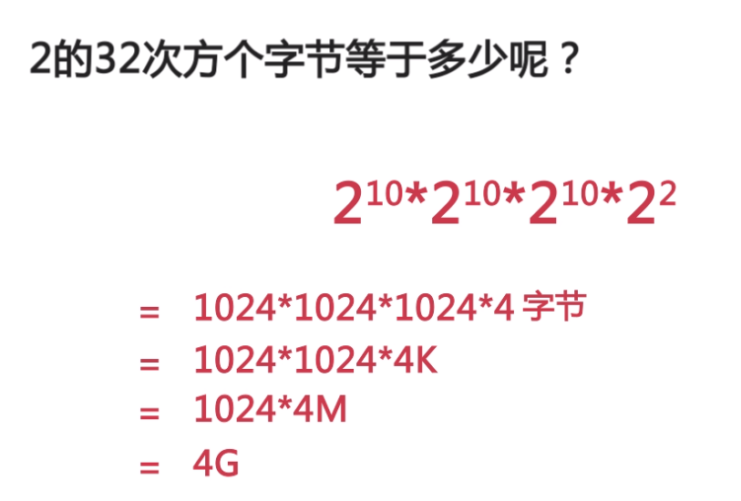

<h1><center>Linux C语言</center></h1>
#### makeFile的编写

- 介绍：

> 一个工程中的源文件不计数，其按**类型、功能、模块**分别放在若干个目录中，makefile定义了一系列的规则来指定，哪些文件需要先编译，哪些文件需要后编译，哪些文件需要重新编译，甚至于进行更复杂的功能操作，因为makefile就像一个Shell脚本一样，其中也可以执行[**操作系统**]的命令。makefile带来的好处就是——“自动化编译”，一旦写好，只需要一个make命令，整个工程完全**自动编译**

- 编写

  ```makefile
  #this is make file
  hello.out:max.o min.o hello.c
  	gcc max.o min.o hello.c -o hello.o    //这里只能用tab键6个空格
  max.o:max.c
  	gcc -c max.c
  min.o:min.c
  	gcc -c min.c
  ```

  - 补充

    ```
    gcc one.c -o one.out  //C语言编译
    g++ two.cpp -o two.out  //c++编译
echo $?  //查看上一个指令的返回码  0 表示成功
    ```
    
    > **1 关于程序的编译和链接**
    >
    >   在此，我想多说关于程序编译的一些规范和方法，一般来说，无论是C、C++、还是pas，首先要把源文件编译成**中间代码文件**，在**Windows**下也就是**.obj**文件，**UNIX**下是**.o**文件，即**Object File**，这个动作叫做**编译（compile）**。然后再把大量的**Object File合成执行文件**，这个动作叫作**链接**（link）。  


#### main函数中的参数

```
int main(int argv, char* argc[])
{
	printf("argv is %d\n", argv);  //打印参数数量
	//打印参数详情
	for(int i = 0; i < argv; i++)
	{
		printf("%s\n", argc[i]);
	}
	return 0;
}
```


#### 输入输出流

- 输出重定向到文件

  ```shell
  ls > a.txt  //覆盖
  ls >> a.txt  //追加
  ```

- 输入重定向

  ```shell
  ./a.out < input.txt
  ```

- 错误流

  ```
  ./a.out 1>t.txt 2>error.txt
  //标准输出流会导入t.txt  错误流会导入error.txt
  ```

- 管道原理及应用

  ```shell
  ls /etc | grep ab
  // "|" 管道符号，把ls的输出流存放到管道去，然后管道输入到grep里查找处理后再输出到屏幕
  ```

  

#### gdb调试

```
gdb hello.c  //调试命令
l  //查看代码，回车查看更多
start  //单步调试
n  //下一步
s  //进入函数里面
p num  //查看num常量的值
f 0  //切换函数
```


#### 内存管理

- 32系统只支持4G内存



> 指针、常量在32位里占**4**个字节在64位里占**8**个字节
>
> 举例地址：0x7fffffffde14

```c
char str[] = "hello";
char *str2 = "world";
char str3[10];
scanf("%s", str);  //然后输入aaaaaaaaaaaaaaaa
//str只有6个单位，但输入了那么多个a，会把str3的也变成了a，还不够，其他的也被占用了，极其不安全
```

```c
char str[] = "hello";
str[3] = '\0';
printf("%s", str);  //输出hel
for(int i = 0; i < 8; i++)
{
    printf("%c", str[i]);  //输出hel o   ;
}
// “%s”会把“\0”会截断，但原变量里面的值不会截断
//还有循环比str的长度还有长的话会输出内存的其他值
```


<h1><center>C语言结构体</center></h1>
#### 预处理

- 预处理

  

```
gcc -o hello.i hello.c -E  //生成预处理文件，-E表示让gcc只进行预处理
```

- 预处理之宏函数

  ```c
  #define ADD(a, b) a + b
  printf("%d", ADD(3, 5) * ADD(2, 5));
  //但宏定义只是替换，不会运算
  3 + 5 * 2 + 5
  ```

- 预处理之typedef

  ```c
  typedef int tni;  //将int起个别名为tni，tni n = 5；
  ```


#### 结构体

- 结构体初始化

  ```c
  //结构体可以数组
  struct dong{
      char name[20];
      int age;
  }
  struct dong dong1 = {"dog", 2};
  struct dong dong2[2] = {{"dog", 2}, {"cat", 3}};
  printf("%s %d\n", dong2[0].name, dong2[1].age);
  ```

- 结构体指针

  ```c
  //同上
  struct dong * p_d;
  p_d = &dong1;
  printf("name = %s\n", (*p_d).name);  //这里要括号括住，因为 . 的运算符比较高
  //也可以
  printf("name = %s\n", p_d->name);  // -> 指针指向运算符
  ```

  