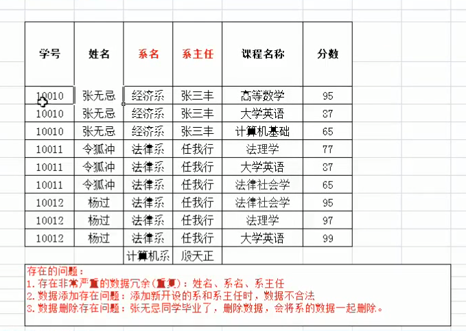
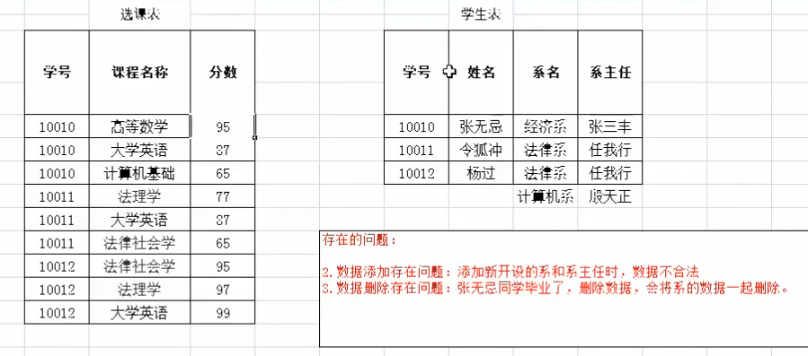
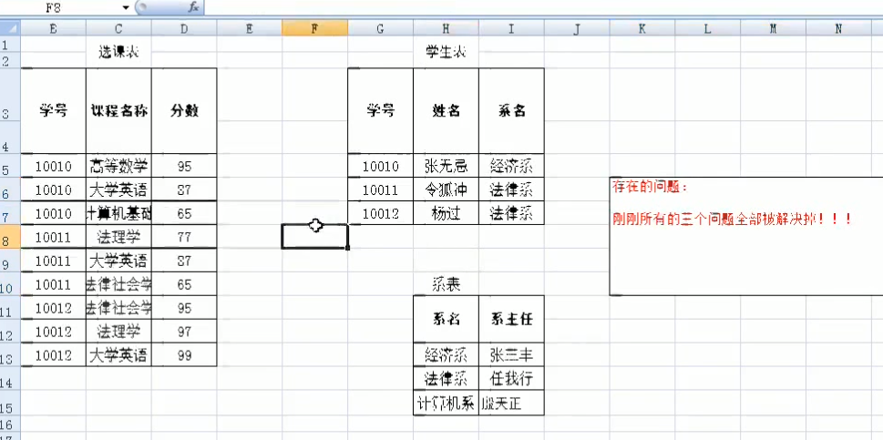
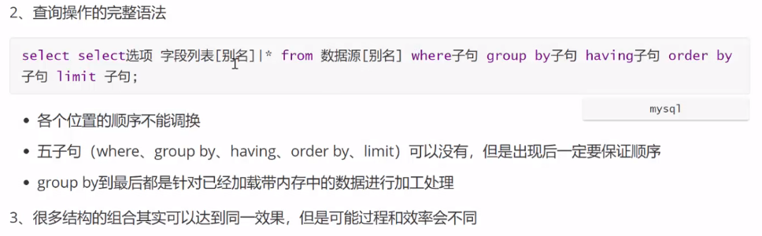

# MySQL数据库基础

### 数据库概述

#### DDL

> 数据库定义语言，Data definition language
>
> 定义结构

- 创建数据库 create database
- 创建表格 crate table
- 修改表格 alter table
- 删除表格 drop table
- 创建视图 crate view
- 修改视图 alter view
- 删除视图 drop view
- 删除表数据 truncate table


#### DML

> 数据操纵语言，Data Manipulation Language
>
> 对数据操作

- 插入操作
- 删除操作
- 修改操作
- 排序操作
- 检索操作


#### DCL

> 数据库控制语言，Data Control Language
>
> 控制用户权限

- Grant
- Revoke


### 数据库操作

#### 查看数据库

- 查看当前的所以的数据库

    ```mysql
    show databases;
    ```

- 查看数据库创建时的属性

  ```mysql
  show create 数据库名;
  ```


#### 创建数据库

```mysql
create database[if not exists ]mytest[character set utf8mb4];
```

设置默认创建数据库编码

my.ini

```
character-set-server=utf8mb4
```


#### 删除数据库

```mysql
drop database mytest;
```


#### 修改数据库属性

```mysql
alter database mytest character set gdk;
```


### 表操作

#### 查看表

- 查看表的结构

    ```mysql
    desc 表名;
    show columns from 表名;
    ```


#### 创建表

```mysql
CREATE TABLE table_name (列名 数据类型);
```

- 实列1：创建tb_student表，里面包含id，name，sex，age列

```mysql
create table tb_student(
    id int unsigned,
    name varchar(20),
    sex varchar(2),
    age int unsigned COMMENT  '年龄'
);
```

- 创建一个无符号的类型

```mysql
create table aa(f1 tinyint, f2 int unsigned);
```

- 复制表

```mysql
create table newTable like oldTable;
```

- 例子：外键 级联更新、级联删除

```mysql
create table tb_student(
    id int unsigned,
    mid int unsigned,
    name varchar(20),
    sex varchar(2),
    age int unsigned COMMENT '年龄',
    primary key(id, mid),
    foreign key(mid) references tb_mark(mid) on delete cascade on update cascade
);
```


#### 修改表

##### 修改表名

```mysql
alter table 表名 rename to 新表名;
```

- 例：将tb_grade表修改成tb_mark

```mysql
alter table tb_grade rename to tb_mark;
```


##### 添加字段

```mysql
alter table 表名 add column 字段名 列类型[ after 字段名];
after 表示添加到指定字段后面
```

- 例：添加edate字段到ename字段后面

```mysql
alter table tb_student add column edate date comment '入学日期' after sanme;
```


##### 删除字段

```mysql
alter table 表名 drop column 字段名;
```


##### 修改字段类型

```mysql
alter table 表名 modify 字段名 字段类型;
```

- 例：将name字段修改成varchar类型

```mysql
alter table tb_student modify name varchar(15);
```


#### 插入数据

- values

```mysql
insert into tb_student(id, name, sex, age) values(1920501, '小明', '男', 18);
```

- set

```mysql
insert into tb_student set sno=1920501, sname='小明', ssex=default,sage=18;
```

- 多条数据

```mysql
insert into aa values(11,'monica'),(12,'ross');
```

- 插入查询到的语句

```mysql
insert into newTable select * from oldTable;
```

- 如果有重复的主键就忽略 ignore

```mysql
INSERT ignore INTO `ani_bangumi` VALUES (20210002, '工作细胞 第二季', '《工作细胞》', '', '');
```


#### 删除数据

##### 删除全部

```mysql
truncate table 表名;
```

> TRUNCATE TABLE 在功能上与不带 WHERE 子句的 DELETE 语句相同：二者均删除表中的全部行。但 TRUNCATE TABLE 比 DELETE 速度快，且使用的系统和事务日志资源少。
> 
>delete * from 是一条一条数据删除，在事务日志中要记录每道一条记录的删除


##### 删除指定

```mysql
delete from tb_studnet[where name='小明'];
```


#### 更新数据

```mysql
update tb_studnet set name='小红', age=19 where id=1920501;
```

- 修改多个表    修改 t1 表id是1001的 f1 为 aa 表的 f1

```mysql
update t1,aa set t1.f1=aa.f1 where id=1001;
```


#### 查询数据

```mysql
select * from tb_student[where id<1920601];
```


### 用户管理

#### 查看所有用户

```mysql
SELECT DISTINCT CONCAT('User: ''',user,'''@''',host,''';') AS query FROM mysql.user;
```

- 原型

```mysql
select user, host from mysql.user;
```


#### 创建用户

```mysql
create user 'CJQ'@'localhost' identified by 'toor';
```


#### 删除用户

```mysql
drop user 'CJQ'@'localhost';
```


#### 修改用户

- 修改用户名称

  ```mysql
  rename user 'CJQ'@'localhost' to 'CJQ1'@'localhost';
  ```

- 修改用户密码

  ```mysql
  set password for root@localhost = password('root');
  ```


#### 授权

```sql
show grants for root@localhost;  # 查看权限
# 给予权限
grant select, insert on stumarkdb.tb_student to 'test1'@'localhost';
# 收回权限
revoke insert on stumarkdb.tb_student from 'test1'@'localhost';
```

权限列表：

- all privileges：所有权限。
- select：读取权限。
- delete：删除权限。
- update：更新权限。
- create：创建权限。
- drop：删除数据库、数据表权限。

授权内容：

- dbName.*;               授予dbName数据库所有表的权限

- dbName.dbTable;   授予数据库dbName中dbTable表的权限。


#### mysql.user用户表详解

##### host列

| host      | 描述                                                         |
| --------- | ------------------------------------------------------------ |
| %         | 表示可以远程登录，并且是除服务器外的其他任何终端，%表示任意IP都可登录。 |
| localhost | 只可以本机登录                                               |
| 127.0.0.1 | 也是只可以本机登录                                           |
| sv01      | 只能主机名为sv01的登录                                       |


##### 权限列

权限列决定了用户的权限，描述了用户在全局范围内允许对数据库和数据库表进行的操作，字段类型都是枚举Enum，值只能是Y或N，Y表示有权限，N表示没有权限。

| 权限字段名称  | 备注说明                                                     |
| ------------- | ------------------------------------------------------------ |
| Select_priv   | 确定用户是否可以通过SELECT命令选择数据                       |
| Insert_priv   | 确定用户是否可以通过INSERT命令插入数据                       |
| Delete_priv   | 确定用户是否可以通过DELETE命令删除现有数据                   |
| Update_priv   | 确定用户是否可以通过UPDATE命令修改现有数据                   |
| Create_priv   | 确定用户是否可以创建新的数据库和表                           |
| Drop_priv     | 确定用户是否可以删除现有数据库和表                           |
| Reload_priv   | 确定用户是否可以执行刷新和重新加载MySQL所用各种内部缓存的特定命令,包括日志、权限、主机、查询和表重新加载权限表 |
| Shutdown_priv | 确定用户是否可以关闭MySQL服务器在将此权限提供给root账户之外的任何用户时,都应当非常谨慎 |
| Process_priv  | 确定用户是否可以通过SHOW PROCESSLIST命令查看其他用户的进程   |
| File_priv     | 确定用户是否可以执行SELECT INTO OUTFILE和LOAD DATA INFILE命令 |


##### 其它

##### 权限列

权限列决定了用户的权限，描述了用户在全局范围内允许对数据库和数据库表进行的操作，字段类型都是枚举Enum，值只能是Y或N，Y表示有权限，N表示没有权限。

| 权限字段名称          | 备注说明                         |
| --------------------- | -------------------------------- |
| password_expired      | 密码是否过期                     |
| password_last_changed | 上次修改密码的时间               |
| account_locked        | 账号是否锁定，一般系统账号才锁定 |


### 数值类型

- 整型

  TINY INT, SMALL INT, MEDIUM INT, INT, BIG INT

- 浮点型

  FLOAT, DOUBLE

- 字符串型

  CHAR:固定长度字符串

  VARCHAR:可变长度字符串

  BINARY:无字符集的字符串

  VARBINARY:同上，可变

  BLOB/TEXT:已对象类型保存，足够大的数据

  ENUM:枚举

  SET:集合

- 日期与时间型

  DAY

  DAY_HOUR： 日期:小时

  DAY_MINUTE：日期:小时:分钟

  DAY_SECOND：日期:小时:分钟:秒

  HOUR：小时

  HOUR_MINUTE：小时:分钟

  HOUR_SECOND：小时:分钟:秒


### 约束

| 名称                       | 说明                                                         |
| -------------------------- | ------------------------------------------------------------ |
| PRIMARY KEY  (/ˈpraɪmeri/) | 主键（唯一不可空），一个表只能有一个                         |
| AUTO_INCREMENT             | 自增长                                                       |
| FOREIGN KEY  (/ˈfɔːrən/)   | 外键 FOREIGN KEY(这个表的外键列) REFERENCES 另一个表(列一个表的列) |
| NOT NULL                   | 非空                                                         |
| DEFAULT '男'               | 默认值                                                       |
| UNIQUE                     | 唯一但可空，一个表可以用多个                                 |
| COMMENT                    | 备注                                                         |


#### 创建/删除约束

1. 创建表时创建
2. 使用alter

- 主键约束

```mysql
alter table 表名 add primary key(字段);  -- 创建主键约束
alter table 表名 drop primary key;       -- 删除主键约束
```

- 外键约束

```mysql
alter table 表名 add constraint 外键约束名 foreign key(字段名) references 另一个表(另一个表的列);  -- 创建外键约束
alter table 表名 drop foreign key 外键约束名;  -- 删除外键约束
```

- 非空约束

```mysql
alter table 表名 modify 列名 数据类型 not null;  -- 创建非空约束
alter table 表名 modify 列名 数据类型 null;      -- 删除非空约束
```

- 唯一约束

```mysql
alter table 表名 add unique 约束名(字段);
alter table 表名 drop key 约束名;
```


#### 修改约束

```mysql
alter table 表名 add CONSTRAINT 约束(列名);
```

- 修改f2为主键

  ```mysql
  alter table 表名 add constraint primary key(f2);
  ```


#### 查看约束

```mysql
show create table 表名;
```


#### 级联操作

> 附属与外键

ON DELETE CASCADE 级联删除
ON UPDATE CASCADE 级联更新

```mysql
alter table 表名 add constraint 约束名 foreign key(字段名) references 另一表(另一表列) on update cascade on delete cascade;
```

> 这样修改另一表时关联的表也会跟着操作


### 一对多表案列

#### 创建dept、emp表

  ```mysql
create table dept(
    deptno char(4) COMMENT '部门编号',
    dname varchar(30) COMMENT '部门名称',
    dmanager varchar(10) COMMENT '部门经理',
    tel varchar(20) COMMENT '电话号码',
    PRIMARY KEY(deptno),
    NOT NULL(dname)
);

create table emp(
    id int COMMENT '员工编号' PRIMARY KEY,
    ename varchar(10) COMMENT '员工姓名' NOT NULL,
    hiredate date COMMENT '入职日期',
    esex char(2) DEFAULT '男' COMMENT '姓名',
    sal int COMMENT '工资',
    job varchar(30) COMMENT '工种' DEFAULT '程序员' NOT NULL,
    deptno char(4) COMMENT '部门编号',
    FOREIGN KEY(deptno) REFERENCES dept(deptno)
);
  ```


### 数据库范式

  目前关系数据库有六种范式：第一范式（1NF）、第二范式（2NF）、第三范式（3NF）、巴斯-科德范式（BCNF）、第四范式(4NF）和第五范式（5NF，又称完美范式）。


示例表：



#### 第一范式

数据库表的每一列都是不可分割的原子数据项，简而言之，第一范式就是无重复的域（字段）


#### 第二范式

在1NF的基础上，非码属性必须完全依赖于候选码（在1NF基础上消除非主属性对主码的部分函数依赖）

* 几个概念
  + 函数依赖：如果通过A属性（属性组）的值，可以确定唯一B属性的值。则称B依赖与A
    例如：学号--> 姓名：通过学号可以得出姓名
  
  + 完全函数依赖：如果A是一个属性组，则B属性需要依赖A属性组中全部的属性组
    例如：(学号， 课程名称)--> 分数：必须通过这两个字段才能确定分数，但凭学号或课程名称不能得到分数
  + 部分函数依赖：如果A是一个属性组，则B属性组只需要依赖A属性组中的任意一些值即可
    例如：(学号， 课程名称)--> 姓名：通过这个组中的学号字段就可以得到姓名值了
  + 传递函数依赖：如果通过A属性（属性组）的值，确定B属性的值，然后再通过B属性（属性组）的值确定C的值，则称 C 传递函数依赖与 A
    例如：A-->B B-->C  学号-->系名 系名-->系主任
  + 码：如果在一张表中，一个属性或属性组被其它所有属性完全依赖，则称这个属性（属性组）为该表的码
    例如：该表的码为：（学号， 课程名称）
      + 主属性：码属性组中的所有属性
      + 非主属性：除过码属性组的属性


**经过第二范式后得到的表：**




#### 第三范式

在2NF基础上，任何非主属性不依赖与其它非主属性（在2NF基础上**消除传递依赖**）

**经过第三范式后得到的表：**




### 查询

#### 常规查询

- 列名查询

```sql
select 列段1， 列段2 from 表名;
```

- 别名使用

```sql
select 列段1 as 别名, 列段2 空格 别名 from 表名
```

- 替换显示

  1. 简单函数

  ```mysql
  select sno, ssex,
  case ssex
  when '女' then '女士'
  when '男' then '先生'
  -- when op1 and/or op2 then op3
  else '其他'
  end 别名
  from tb_student;
  ```

  2. 搜索函数

  ```mysql
  select sno, sname, edate,
  case 
  when year(edate) > 2019 and ssex = '男' then '师弟'
  when year(edate) > 2019 and ssex = '女' then '师妹'
  when year(edate) < 2019 and ssex = '男' then '师兄'
  when year(edate) < 2019 and ssex = '女' then '师姐'
  else '同学'
  end 称呼
  from tb_student;
  ```

  


#### 数据源

- 查询多张表

```sql
select * from 表1, 表2;
```

- 子查询数据源

```sql
select * from (select * from 子表1[， 子表2]) as 表;  # 子查询需要指定别名
```

- where子句

```sql
select * from 表 where 列段 运算操作 值
select * from bigdata where id=55;
```


#### 运算符

\> 、< 、 =  、>= 、 <=

between a and b ：a 与 b之间

in (data1, data2) ：在data数据里面

like 'value' ： 模糊匹配

and 、or 、 not

is null 、is not null

- where in

```mysql
-- 查询cno为指定的数据
select * from tb_student where sno in (select sno, cno from tb_mark where cno='指定');
```

- not in

```mysql
select * from tb_student where sno not in (select sno, cno from tb_mark where cno='指定');
```


#### 条件查询

- ALL

  大于全部返回的数据

```mysql
select * from tb_student
where sage > all(
select sage from tb_student
    where classname='19软件4班'
);
```

- ANY  

  大于任意一个返回的数据

```mysql
select * from tb_student
where sage > any(
select sage from tb_student
    where classname='19软件4班'
);
```


#### 联合查询union

- UNION ALL : 保留所有记录
- UNION DESTINCT ： 去除重复记录【默认】

> 结构要一样，UNION 内部的 SELECT 语句必须拥有相同数量的列。列也必须拥有相似的数据类型。同时，每条 SELECT 语句中的列的顺序必须相同。

```mysql
-- 查询性别为女的数据，但联合查询where只会限制最近的select语句，所以用两个where
select * from tb_student
where ssex='女'
union
select * from tb_lxstudent
where ssex='女'
```

- 联合排序

```mysql
(select * from 表1 order by 字段 limit 9999) union (select * from 表1 order by 字段 desc limit 9999);
```

> 如果是对select排序的话需要括号（select里的必须用limit才会生效）
>
> 如果是对union联合之后的话在后面用order by既可


#### 不重复查询distinct

```mysql
select distinct classname from tb_student where classname is not null;
```


#### 模糊查询like

% 表示0个或多个字符

_表示单个字符

```mysql
-- 用两个_下划线表示匹配两个
select * from tb_student where sname like '王__'
```

```mysql
-- 用#号表示转义，需要在后面添加escape
select * from tb_course where cname like '%#_%' escape '#';
```


#### 排序查询order by

> 排序，根据指定字段进行排序

- ASC 升序【默认】
- DESC 降序
- 单字段排序

```mysql
select * from ani_bangumi order by bid;
```

- 多字段排序

```mysql
-- 根据性别排序后根据年龄排序
select * from student order by ssex, sage;
```

- ROLLUP  可以实现统计每一组 且 加上每一个组的数

```mysql
select * from student group by classname with rollup;
```


#### 限制查询limit

> limit用来限制获取数量

limit 数量N： 现在获取N条数据

limit 起始位置, 数量N： 从起始位置获取N条数据

```mysql
-- 查询第4名到第6名
select * from tb_mark where con='c001' order by grade desc limit 3, 3;
```


#### 聚合函数

- group_concat(): 将组里的某个字段全部保留
- any_value(): 不属于分组字段的任意一个组里的值
- count(): 统计数量
  - count(字段名): 统计指定字段值的数量（null不统计）
  - count(*): 统计全部记录的数量
- sum(): 求和
- max()/min(): 求最大/最小值
- avg(): 求平均值


#### 分组查询 group by

> group by子句可以用来统计细分，先分大组然后分小组
>
> 分组统计需要统计函数

- 统计每个班的人数count()

```sql
select count(*), class_name from 表名 group by class_name;
```

- 统计anime_data数据库的vurl有多少个

```sql
select count(vurl) from ani_video;
```

+-------------+
| count(vurl) |
+-------------+
|        1247 |
+-------------+


#### having子句

> having子句类似与where子句，用来分组后数据筛选
>
> having子句必须出现在group by子句之后（如果同上存在）
>
> having几乎能做where的所有事，但where不一定

- 根据班级分组，然后统计每一个班里的人小于3

```sql
select count(*) as 'count', class_name, group_concat(name) from 表名 group by class_name having 'count' < 3;
# count这里用了别名，不然having那里不方便
```

- 根据bid(番剧ID)分组，然后刷选bid(番剧ID)大于2019000(也就是19年的新番)

```sql
select * from ani_video group by(bid) having bid > 20190000;
```

> tip: having的效率没where高，能用where的的绝不用having


#### 连接查询 join

##### [inner] join 内连接

两个表中字段匹配关系的记录

ON 连接的条件

```mysql
select s.*, m.*
from tb_student s join tb_mark m
on s.sno = m.sno;
```


##### left [outer] join 左连接

获取左表所有记录，即使右表没有对应匹配的记录。

```mysql
select s.*, m.*
from tb_student s left outer join tb_mark m
on s.sno = m.sno;
```


##### right [outer] join 右连接

与 LEFT JOIN 相反，用于获取右表所有记录，即使左表没有对应匹配的记录。

```mysql
select s.*, m.*
from tb_student s right outer join tb_mark m
on s.sno = m.sno;
```


##### 多表连接

```
select * from (表1 join 表2) join 表3;
```

```mysql
select s.sno 学号, s.sname 姓名, s.ssex 性别, c.cno 课程号, c.cname 课程名, c.credit 学分, m.grade 成绩
from (tb_student s join tb_mark m on s.sno=m.sno) join tb_course c
on c.cno=m.cno;
```


#### 小结




### 事务

- 查看自动提交事务是否状态

```mysql
show variables like 'autocommit';
```

- 设置自动提交事务

```mysql
set autocommit = 1;  # 开启 ON
set autocommit = 0;  # 关闭 OFF，要自己手动commit才能结束事务
```


- 开启事务

```mysql
begin;  # 开启事务
...........
...........
commit;  # 提交事务
rollback;  # 回滚事务
```

```mysql
begin;
update dept, (select deptno as deptno2, count(*) as people from emp group by deptno) as new_emp set dept.dcount = new_emp.people where dept.deptno=new_emp.deptno2;
rollback;
```


### 索引

#### 索引分类

##### btree索引

- 普通索引 index
- 唯一索引 unique
- 主键索引  primary key
- 全文索引 fulltext

##### hash索引

#### 查看索引

```mysql
show index from 表名;
```


#### 创建索引

1. 

```mysql
create index 索引名 on 表名(列名);
```

2. 

```mysql
alter table 表名 add index 索引名(列名);
```

3. 创建表的时候创建索引

```mysql
create table xx(
    id int,
    name varchar(20),
    primary key(id),
    index name_in(name)  -- 创建name列的索引
);
```

- 例：创建学号列的前5个字符建立一个升序索引

```mysql
create index xh_xs on xs(学号(5) asc);
```

- 例：创建一个复合索引

```mysql
create index xskc_in on xs_kc(学号, 课程号);
```


#### 删除索引

1. 

```mysql
drop index name_in on 表名;
```

2. 

```mysql
alter table 表名 drop index 索引名;
```

> alter table 表名 add/drop/modify   列名/索引名  目标;

### 分区

#### range 分区

range型只能int型

- int型

```mysql
create table 表名 (
	userid int unsigned,
    content text
)
partition by range(userid) (
    partition part1 values less than(5000000),
    partition part2 values less than(10000000),
    partition part3 values less than(maxvalue)
);
```


- date型，但 用year() 得到的是int型

```mysql
create table 表名 (
	userid int unsigned,
    日期列名 date
)
partition by range(year(日期列名)) (
    partition part1 values less than(2000),
    partition part2 values less than(2010),
    partition part3 values less than(maxvalue)
);
```


- 多列分区

```mysql
create table 表名 (
	userid int unsigned,
    日期列名 date
)
partition by range columns(userid, year(日期列名)) (
    partition part1 values less than(5000, 2000),
    partition part2 values less than(5000, 2010),
	partition part1 values less than(10000, 2000),
	partition part1 values less than(10000, 2010),
    partition part3 values less than(maxvalue, maxvalue)
);
```

> columns型支持其他类型


#### list 分区

> LIST分区和RANGE分区非常的相似，主要区别在于LIST是枚举值列表的集合，RANGE是连续的区间值的集合。二者在语法方面非常的相似。同样建议LIST分区列是非null列，否则插入null值如果枚举列表里面不存在null值会插入失败，这点和其它的分区不一样，RANGE分区会将其作为最小分区值存储，HASH\KEY分为会将其转换成0存储，主要LIST分区只支持整形，非整形字段需要通过函数转换成整形；5.5版本之后可以不需要函数转换使用LIST COLUMN分区支持非整形字段


```mysql
create table 表名2 (
	userid int unsigned,
    pubtime date
)
partition by list(month(pubtime)) (
	partition part1 values in(1, 3, 4),  -- 只存储月份1，3，4的数据
    partition part2 values in(2, 5, 6),
    partition part3 values in(null)
);
```


#### hash分区

> hash分区整数是靠取模来分区的
>
> 只允许一列


#### key分区

> key分区允许多列
>
> 有主键的话可以不指定列


### 视图

> 将不同的语句封装
>
> 是个虚拟表

#### 创建视图

- 语法

```mysql
crate [or replace] view 视图名[(列1,...)]
as select 列1 from 表名
[with check option];
```

> or replace：如果这个视图名有了就替换
>
> with check option： 限制这个视图只能查询，不能插入或更新

- 列子

```mysql
create view 查询视图 as select sname, sage, classname from tb_student where classname='19软件5班';
```


#### 修改视图

```mysql
alter view 视图名[(列1,...)]
as select 列1 from 表名
[with check option];
```


#### 查看视图

跟表一样的操作

```mysql
show tables;
desc 视图名;
```

```mysql
show full tables where table_type='view';
```

#### 删除视图

```mysql
drop view 视图名;
```


#### 视图：插入数据

```mysql
insert into 视图名 values (data1[, data2]);
```


#### 视图：更新数据

```mysql
update 视图名 set 列名 = data1;
```


视图：删除数据

```mysql
delete from 视图名 [where=data1];
```


### 存储过程

#### 创建

```mysql
create procedure 名称(in|out|inout 参数名 数据类型)
begin
-- code
end
```


#### 执行

```mysql
call 存储过程名();
```


#### 删除

```mysql
drop procedure 存储过程名;
```


#### 查看

- 查看当前存储过程

```mysql
show procedure status [where db='stumarkdb'/where name like '%get%'];
```

- 查看详细代码

```mysql
show create procedure 存储过程名;
```


#### 存储过程参数

##### 定义变量

```mysql
declare 变量名 变量类型 [约束];
```

- 例

```mysql
declare ii int default 10;
```


- 获取学生总数

```mysql
delimiter //
create procedure getPeople()
begin
  select count(*) 人数 from tb_student;
end//
delimiter ;

call getPeople();  -- 调用，然后查询
```

> delimiter  修改结束符，不然和里面的代码块有冲突


##### in

> 带输入参数的存储过程

```mysql
delimiter //
create procedure delStudent(in stu_id char(7))
begin
  delete from tb_student where sno = stu_id;
end//
delimiter ;

call delStudent('1930502');
```


##### out

> 带输出参数的存储过程

```mysql
delimiter //
create procedure getName(in stu_id char(7), out out_name varchar(12))
begin
  select sname into out_name from tb_student where sno = stu_id;
end//
delimiter ;

call getName('1930502', @var);  -- 变量用@定义
select @var;                    -- 查询变量值
```

- 例子: 传入两个数，返回较大的数

```mysql
delimiter //
create procedure getMaxNum(in a int, in b int, out res int)
begin
  set res = a;
  if b > res then
  set res = b;
  end if;
end//
delimiter ;

call getMaxNum(3, 6, @var);  -- 变量用@定义
select @var;                    -- 查询变量值
```


##### inout

> 可以输入输出参数的存储过程

```mysql
delimiter //
create procedure getMaxNum2(in a int, inout b int)
begin
  if a > b then
  set b = a;
  end if;
end//
delimiter ;

set @n1 = 56;
set @n2 = 96;
call getMaxNum2(@n1, @n2);  -- 变量用@定义
select @n2;                    -- 查询变量值
```

- 根据班级获取年龄最大最小的年龄差

```mysql
delimiter //
create procedure getAgeNum(in cla_name varchar(20), out age_num int)
begin
  declare max, min int;  -- 定义两个变量
  select sage into max from tb_student where classname=cla_name order by sage desc limit 1;
  select sage into min from tb_student where classname=cla_name order by sage limit 1;
  set age_num = max - min;
end//
delimiter ;

call getAgeNum('19软件5班', @age_num); 
select @age_num;
```


### 流程控制语句

#### if

```mysql
if 条件 then 语句
elseif 条件 then 语句
else 语句
end if;
```


#### case

1. 

```mysql
case 目标
    when 值1 then 语句
    when 值2 then 语句
    else 语句
end case;
```

2. 

```mysql
case
    when 条件 then 语句
    when 条件 then 语句
    else 语句
end case;
```


#### while

```mysql
[标志名:]while 条件 do
    // code
    leave 标志名;  -- 跳出循环，要用标志名
end while[ 标志名];
```

- 例子

```mysql
delimiter //
create procedure ins_blog(cnt int)
begin
  declare i int default 1;
  declare bid int;
  select max(id) into bid from tb_blog;
  
  if bid is null then set bid = 0;
  end if;
  
  while i <= cnt do
    set bid = bid + 1;
    insert into tb_blog values(bid, i, concat('title', i), concat('content', i), now());
    set i = i + 1;
  end while;
end//

delimiter ;


call ins_blog(10);
```


#### repeat

```mysql
[标签名:]repeat
  // code
  until 条件
end repeat [标签名]
```


#### loop

```mysql
[标签名:]loop
  // code
  leave [标签名];
end loop [标签名];
```


```mysql
delimiter //
create procedure get_details(name varchar(10))
begin
  select e.sal, d.dname from emp e join dept d on e.deptno = d.deptno where e.ename = name; 
end//
delimiter ;


call get_details('王雪');
```

```mysql
delimiter //
create procedure get_details3(in name varchar(10), out res_sal int, out res_depart varchar(30))
begin
  select e.sal, d.dname into res_sal, res_depart from emp e join dept d on e.deptno = d.deptno where e.ename = name; 
  select res_sal;
end//
delimiter ;

call get_details3('王雪', @res_sal, @res_depart);

select @res_sal, @res_depart;
```


```mysql
delimiter //
create procedure get_details6(in name varchar(10), out res_sub int, out res_cou double)
begin
  select count(m.cno),avg(m.grade) into res_sub, res_cou from tb_mark m join tb_student s
  on m.sno = s.sno
  where s.sname = name
  group by m.sno ;
end//
delimiter ;

call get_details6('张宇', @res_sub, @res_cou);

select @res_sub, @res_cou;
```


```mysql
-- drop procedure get_details;
delimiter //
create procedure get_details(in name varchar(10), out res_sal int, out res_dname varchar(30))
begin
  declare status int;
  select COUNT(*) into status from emp where ename = name;
	if status = 1 then select e.sal, d.dname into res_sal, res_dname from emp e join dept d on e.deptno = d.deptno where e.ename = name; 
	elseif status >= 2 then select -1, "此姓名有重名员工" into res_sal, res_dname;
	else select 0, "不存在此员工" into res_sal, res_dname;
	end if;
end//
delimiter ;

call get_details('张三', @res_sal, @res_dname);
select @res_sal, @res_dname;
```


### 函数

#### concat()

> 字符串拼接函数

```
concat(str1[, str2, str3]);
```


#### replace()

> 字符串替换函数

```
replace(字符串, 被替换的字符串, 替换的字符串);
```


#### substring()

> 截取子串函数

```
substring(字符串, 截取位置[, 截取长度]);
如果不填截取长度就从截取位置截到最后
```


#### ceiling()

> 向上取整函数

```
ceilling(数字);
```


#### floor()

> 向下取整函数

```
floor(数字);
```


#### rand()

> 随机数函数，0-1的小数


#### round()

> 四舍五入函数

- 例子：随机0-20

```mysql
delimiter //
create procedure rand_number()
begin
  declare i int;
  set i = 0;
	while i < 20 do
	  select floor(rand()*100);
		set i = i + 1;
	end while;
end//
delimiter ;

call rand_number();
```


#### current_date()

> 当前日期函数


#### cureent_time()

> 当前时间函数


### 触发器trigger

#### 创建触发器

```mysql
create trigger 触发器名 trigger_time trigger_event on 表名 for each row trigger_stmt

trigger_time:   触发时机：after / before
trigger_event:  触发事件：insert / delete /update
for each row:   匹配每一次触发
trigger_stmt:   触发器结构体
```

```mysql
delimiter //
create trigger 触发器名 after/before insert/delete/update on 表名 for each row
begin
  -- code
end //
delimiter ;
```

- 例子：添加员工时，部门人数+1

```mysql
delimiter //
create trigger tri_peoinsert after insert on emp for each row
begin
  declare dcu int;
  set dcu = (select dcount from dept where deptno = new.deptno);
  update dept set dcount = dcu + 1 where deptno = new.deptno;
end //
delimiter ;

insert into emp VALUE(15, "流星", "2018-6-9", "男", 11000, "市场人员", "d003");  -- 测试添加
```

- 例子：修改员工部门时，旧部门人数-1，新部门人数+1

```mysql
delimiter //
create trigger tri_Update after update on emp for each row
begin
  update dept set dcount = dcount - 1 where deptno = old.deptno;
  update dept set dcount = dcount + 1 where deptno = new.deptno;
end //
delimiter ;

update emp set sal = 12000, job = "新职业", deptno = 'd001' where id = 13;
```

- 例子：删除员工时，部门人数-1

```mysql
delimiter //
create trigger tri_Delete after update on emp for each row
begin
  update dept set dcount = dcount - 1 where deptno = old.deptno;
end //
delimiter ;

delete from emp where id = 13;
```


#### 删除触发器

```
dorp trigger 触发器名;
```


#### 查看触发器

```mysql
show triggers;
```


### 备份与恢复

#### 系统自带备份命令

- 例子：备份hrdb数据库

```mysql
mysqldump -uroot -proot hrdb>hrdbBak.sql;
```

- 例子：备份hrdb数据库的emp表

```mysql
mysqldump -uroot -proot hrdb emp > empBak.sql;
```

- 例子：备份全部数据库

```mysql
mysqldump -uroot -proot --all-database > all.sql;
```


#### 系统自带恢复命令

```
source xxx.sql;
```

